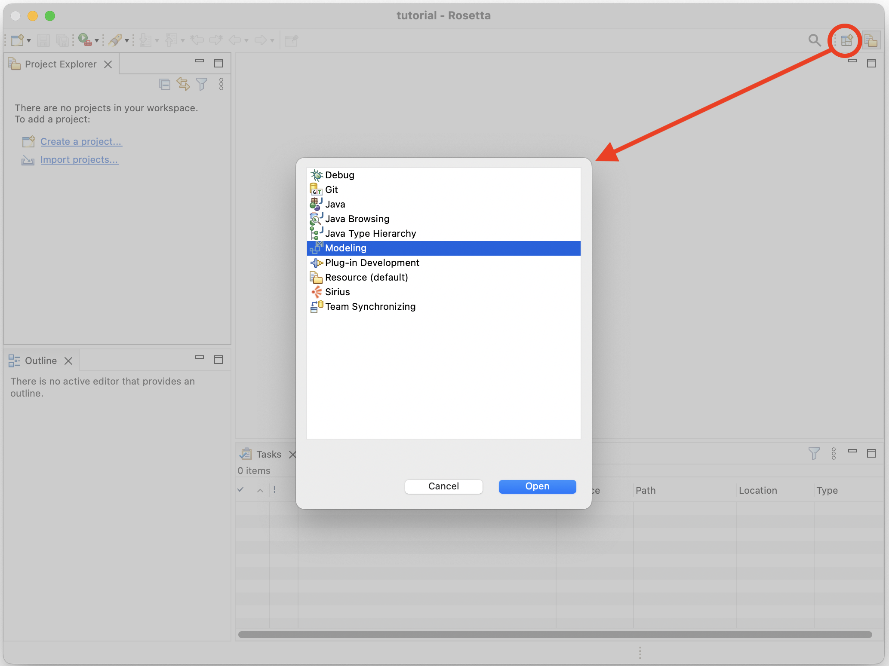
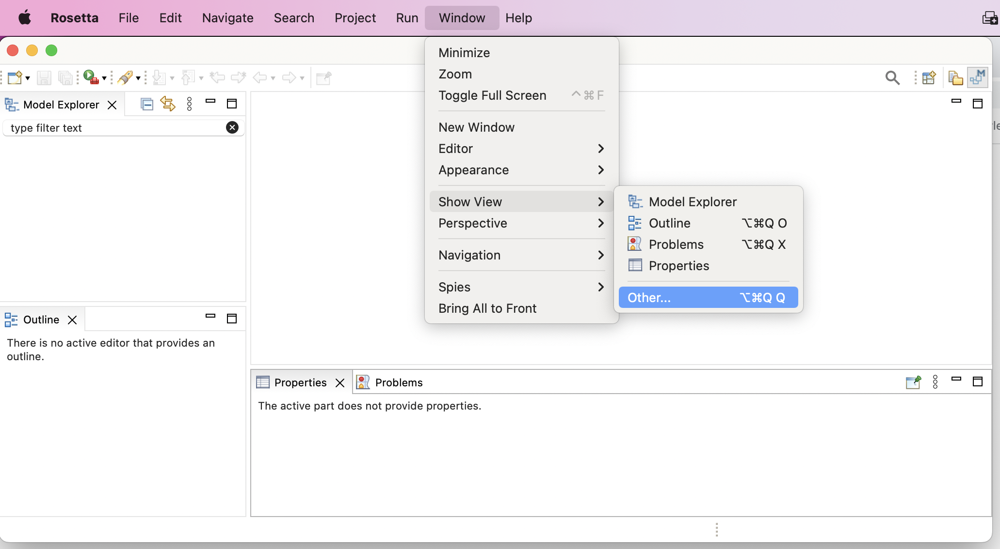
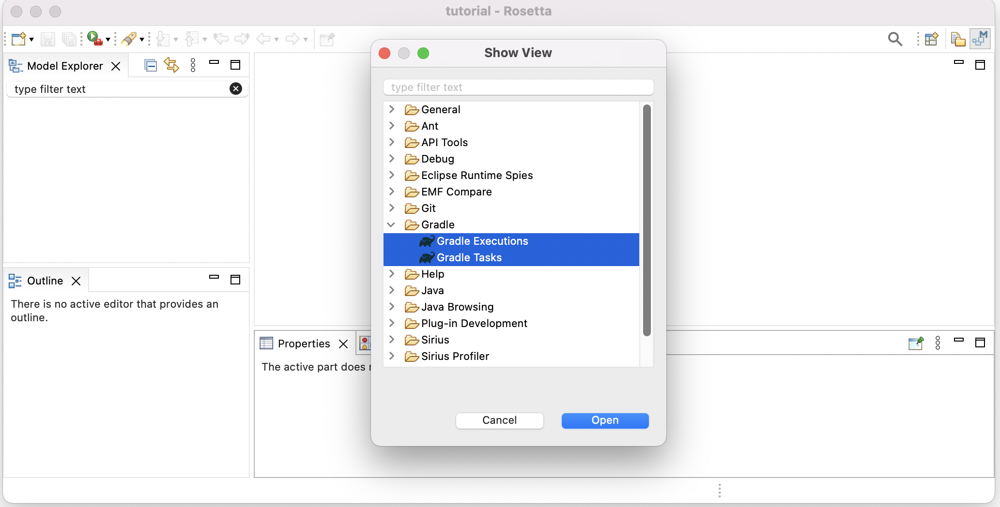
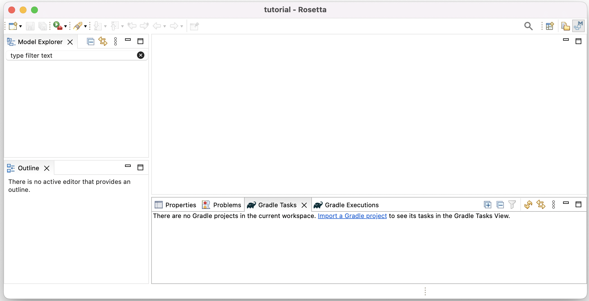

# Getting Ready # {#getting-ready}

## Install Rosetta Workbench ## {#install-rosetta-workbench}

### Install Locally ### {#install-locally}

1. Download the latest release of the Rosetta Workbench archive that matches your OS from [oml-rosetta](https://github.com/opencaesar/oml-rosetta/releases/latest).

    

1. Unzip the archive on your local drive to get the Rosetta app.
    
    > On Mac OS, subsequently run the following command in Terminal.

     ```javascript
      $xttr -cr <path/to/Rosetta.app>
     ```

### Install from Docker Image ### {#install-from-docker-image}

> TBD

## Run Rosetta Workbench ## {#run-rosetta-workbench}

1. Navigate to the Rosetta app icon and double click it to open.

    

1. When prompted to choose a workspace, create a new one in your local file system.

    

1. Once the workspace opens, switch to the Modeling Perspective.

    

1. Once the Modeling Perspective opens, show the two Gradle views.

    
    

1. This is how the Modeling Perspective should look like now.

    
