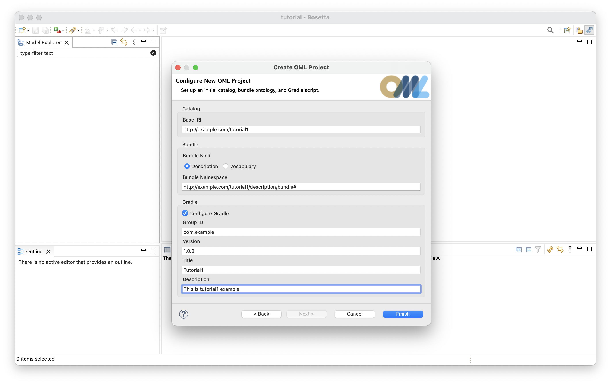
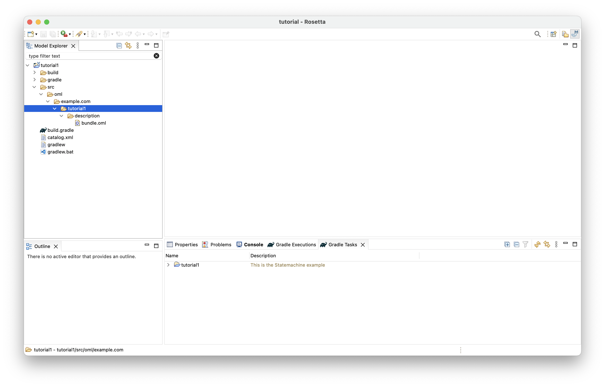
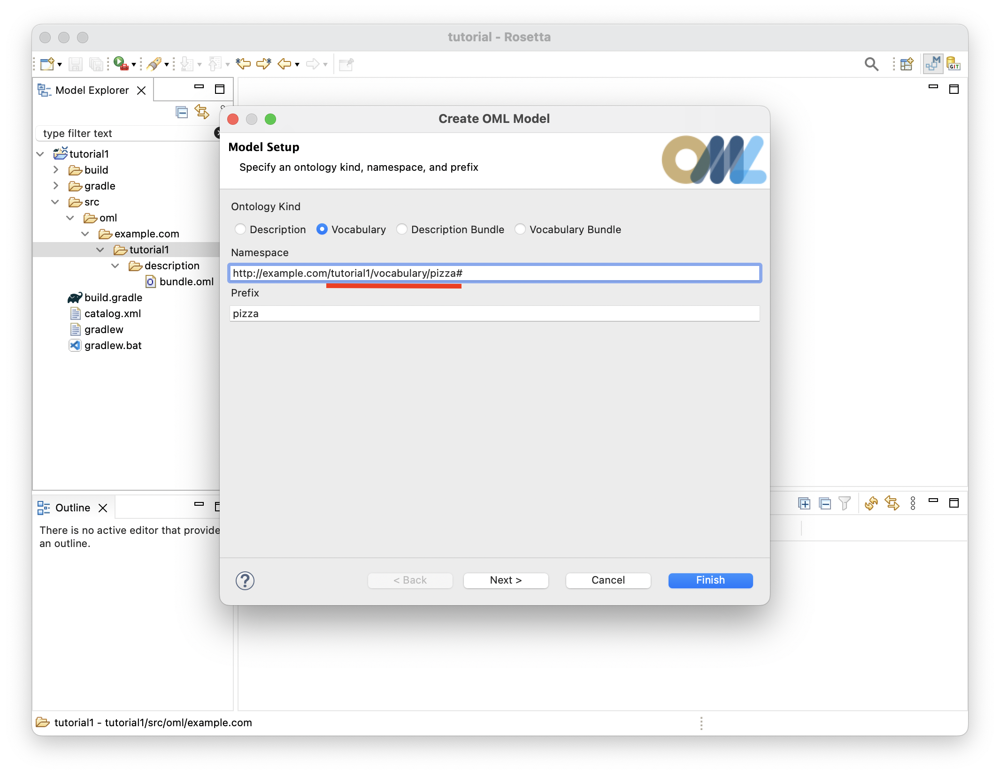
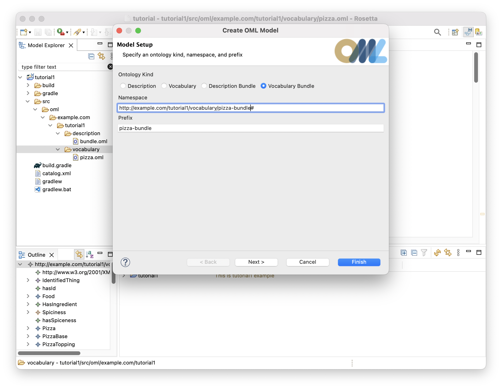
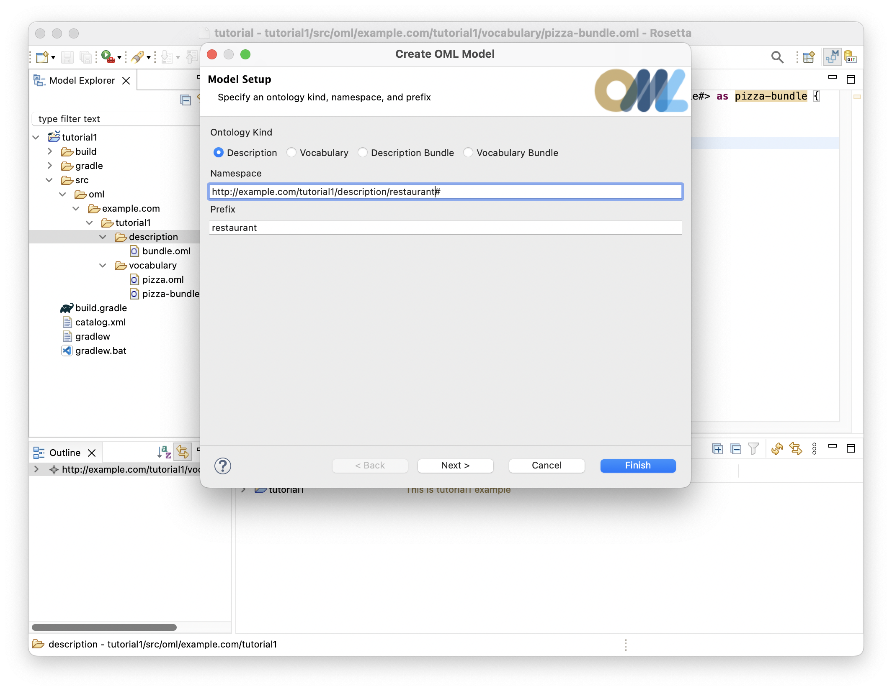
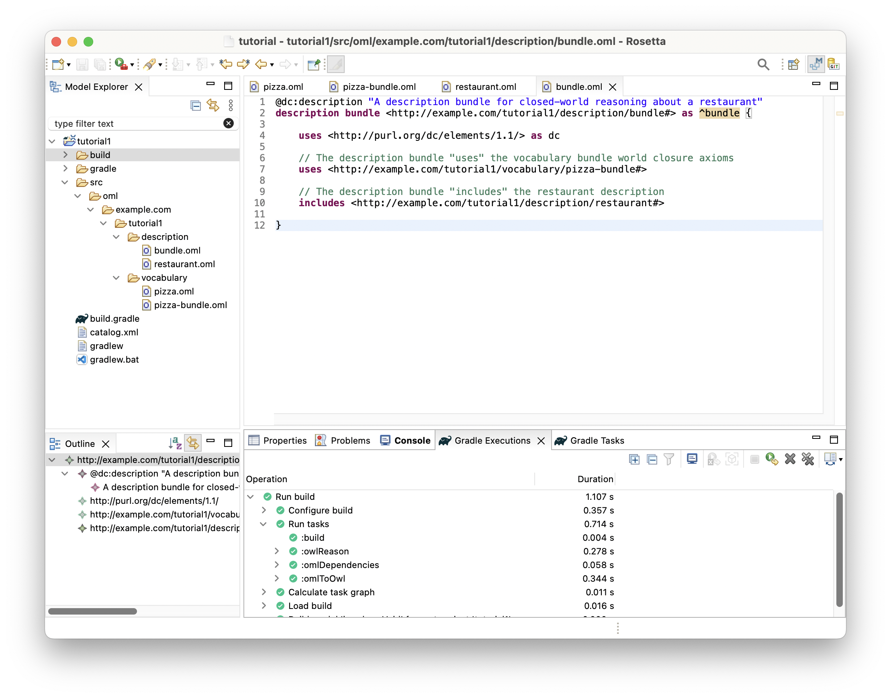
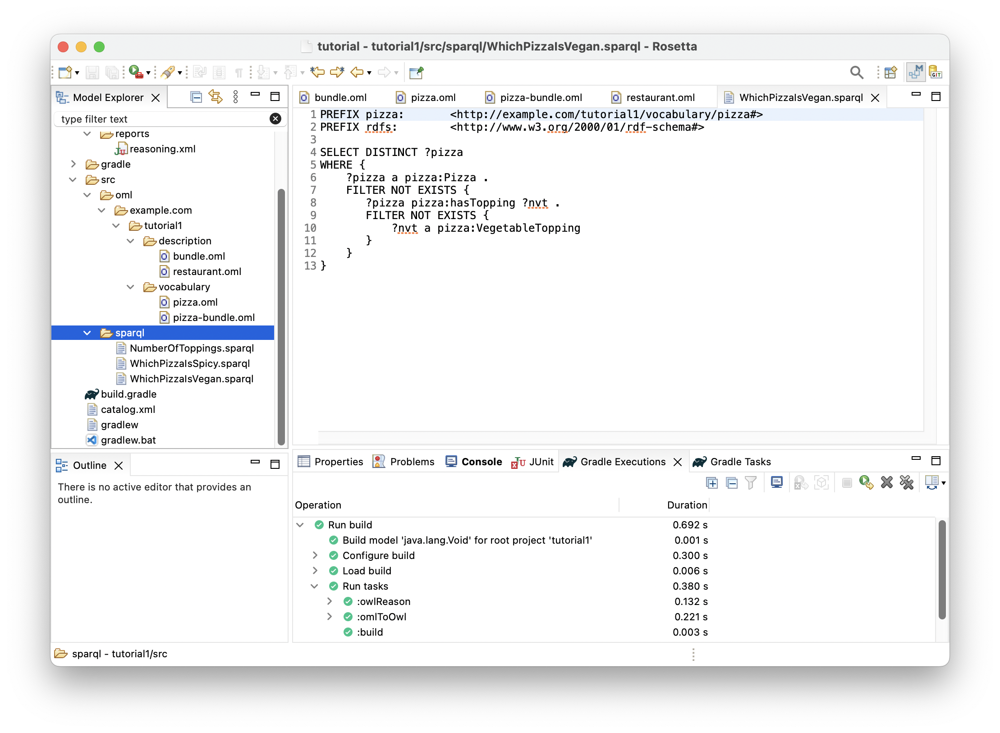
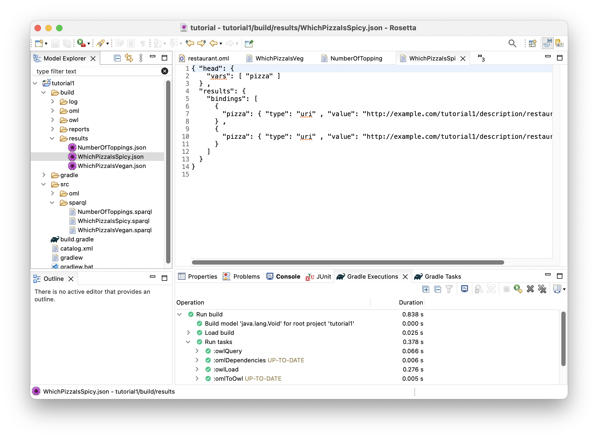
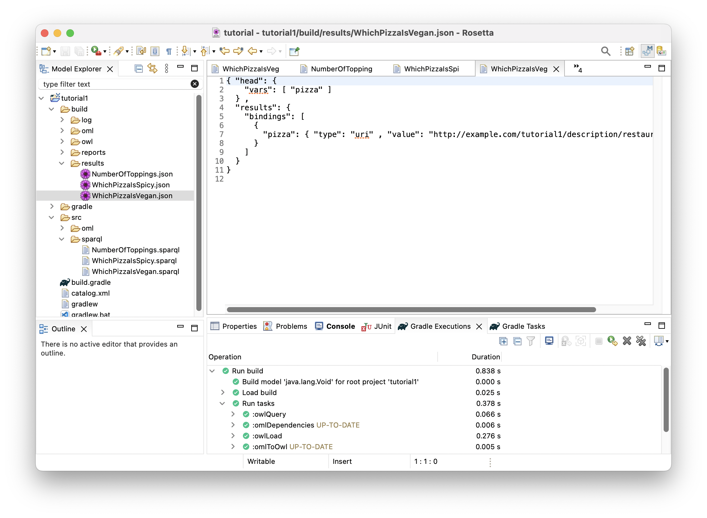

# Tutorial 1: OML Basics # {#tutorial1}

Note: If you have not already done so, please follow the [Getting Ready](#getting-ready) instructions first before proceeding.

## Learning Objectives ## {#tutorial1-learning-objectives}
This tutorial provides a quick overview of the basic workflows of OML. Users will learn how to create an OML project, and within it, create a vocabulary for a simple domain (we use a Pizza domain since everyone is familiar with it), then use such vocabulary to describe knowledge (the pizzas sold by some pizza restaurant). Furthermore, users will learn how to build the project to check its logical consistency (e.g., vegetarian pizzas have no meat ingredients), and how to run queries on the described knowledge to answer business questions (e.g., how mauch ingredients were used?, and how many vegan pizzas were sold?).

Note: the source files created in this tutorial are available for reference in this [repository](https://github.com/opencaesar/oml-tutorials/tree/master/tutorial1), but we encourage the reader to recreate them by following the instructions below.

## Create OML Project ## {#tutorial1-create-oml-project}

1. Right click in the [=Model Explorer view=] and select New -> OML Project.
1. Enter the project name as `tutorial1`. Press Next.
1. Enter the project details as shown below. Press Finish.

    

1. The `tutorial1` project should now be visible in the [=Model Explorer view=].

Note: The project creation process may take a few seconds. Rosetta will show the progress of project creation in the status bar (bottom-right). Wait until this process finishes.

5. Expand the `tutorial1` project node in the [=Model Explorer view=] as shown in the image below.

    

## Create OML Vocabulary ## {#tutorial1-create-oml-vocabulary}

Now, you will create a simple vocabulary for describing pizzas along with their bases and toppings. Different kinds of  pizzas, bases, and toppings are modeled, along with their properties, interrelations, and restrictions.

1. Right click on the `tutorial1` subfolder (highlighted in the picture above) in the [=Model Explorer view=] and select New -> OML Model.

1. Enter the details of the `pizza` vocabulary as shown below. Press Finish.

    

1. The `pizza` vocabulary will be created and its OML editor opens as shown below.

    

1. Copy the following OML code and paste it as the new content of vocabulary `pizza`.

```scala
@dc:description "A vocabulary about pizzas"
vocabulary <http://example.com/tutorial1/vocabulary/pizza#> as pizza {
	
	extends <http://www.w3.org/2001/XMLSchema#> as xsd

	extends <http://purl.org/dc/elements/1.1/> as dc

	extends <http://www.w3.org/2000/01/rdf-schema#> as rdfs

	// Top Level

	@rdfs:comment "The class of things that are uniquely identified by id"
	aspect IdentifiedThing [
		key hasId
	]
	
	@rdfs:comment "The id property of an identified thing"
	scalar property hasId [
		domain IdentifiedThing
		range xsd:string
		functional
	]	

	// Identified Things

	@rdfs:comment "The class of food items"
	concept Food :> IdentifiedThing

	@rdfs:comment "A relation from a food to another used as an ingredient"
	relation entity HasIngredient [
		from Food
		to Food
		forward hasIngredient
		reverse isIngredientOf
		transitive
	]

	@rdfs:comment "An enumeration of spiciness levels"
	enumerated scalar Spiciness [
		"Hot",
		"Medium",
		"Mild"
	]

	@rdfs:comment "The spiciness property of a food item"
	scalar property hasSpiceness [
		domain Food
		range Spiciness
		functional
	]
	
	// Foods
	
	@rdfs:comment "The class of pizzas"
	concept Pizza :> Food [
		restricts some relation hasBase to PizzaBase
	]

	@rdfs:comment "The class of pizza bases"
	concept PizzaBase :> Food

	@rdfs:comment "The class of pizza toppings"
	concept PizzaTopping :> Food

	@rdfs:comment "A relation from a pizza to a base"
	relation entity HasBase :> HasIngredient [
		from Pizza
		to PizzaBase
		forward hasBase
		reverse isBaseOf
		functional
		inverse functional
	]

	@rdfs:comment "A relation from a pizza to a topping"
	relation entity HasTopping :> HasIngredient [
		from Pizza
		to PizzaTopping
		forward hasTopping
		reverse isToppingOf
		inverse functional
	]

	// Pizzas
		
	@rdfs:comment "The class of pizzas with some cheese toppings"
	concept CheesyPizza :> Pizza [
		restricts some relation hasTopping to CheeseTopping
	]
	
	@rdfs:comment "The class of pizzas with some meat toppings"
	concept MeatyPizza :> Pizza [
		restricts some relation hasTopping to MeatTopping
	]
	
	@rdfs:comment "The class of pizzas with all vegetarian toppings"
	concept VegetarianPizza :> Pizza [
		restricts all relation hasTopping to VegetarianTopping
	]

	@rdfs:comment "The class of American pizzas"
	concept American :> CheesyPizza, MeatyPizza [
		restricts some relation hasTopping to MozzarellaTopping
		restricts some relation hasTopping to SausageTopping
		restricts some relation hasTopping to TomatoTopping
	]

	@rdfs:comment "The class of Veneziana pizzas"
	concept Veneziana :> CheesyPizza, MeatyPizza [
		restricts some relation hasTopping to MozzarellaTopping
		restricts some relation hasTopping to TomatoTopping
		restricts some relation hasTopping to SultanaTopping
	]

	@rdfs:comment "The class of Margherita pizzas"
	concept Margherita :> CheesyPizza, VegetarianPizza [
		restricts some relation hasTopping to MozzarellaTopping
		restricts some relation hasTopping to TomatoTopping
	]

	// Pizza Bases

	@rdfs:comment "The class of deep pan bases"
	concept DeepPanBase :> PizzaBase
	
	@rdfs:comment "The class of thin and crispy bases"
	concept ThinAndCrispyBase :> PizzaBase

	// Pizza Toppings
		
	@rdfs:comment "The class of meat toppings"
	concept MeatTopping :> PizzaTopping
	
	@rdfs:comment "The class of vegetarian toppings"
	concept VegetarianTopping :> PizzaTopping

	@rdfs:comment "The class of hot spiciness toppings"
	concept HotTopping :> PizzaTopping [
		restricts scalar property hasSpiceness to "Hot"
	]

	@rdfs:comment "The class of medium spiciness toppings"
	concept MediumTopping :> PizzaTopping [
		restricts scalar property hasSpiceness to "Medium"
	]

	@rdfs:comment "The class of mild spiciness toppings"
	concept MildTopping :> PizzaTopping [
		restricts scalar property hasSpiceness to "Mild"
	]

	// Meat Topping

	@rdfs:comment "The class sausage toppings"
	concept SausageTopping :> MeatTopping, MildTopping
	@rdfs:comment "The class spiced beef toppings"
	concept SpicedBeefTopping :> MeatTopping, HotTopping
	
	// Vegetarion Toppings

	@rdfs:comment "The class sauce toppings"
	concept SauceTopping :> VegetarianTopping
	@rdfs:comment "The class cheese toppings"
	concept CheeseTopping :> VegetarianTopping
	@rdfs:comment "The class fruit toppings"
	concept FruitTopping :> VegetarianTopping
	@rdfs:comment "The class vegetable toppings"
	concept VegetableTopping :> VegetarianTopping

	// Sauce Toppings

	@rdfs:comment "The class of tabasco toppings"
	concept TobascoTopping :> SauceTopping, HotTopping

	// Cheese Toppings

	@rdfs:comment "The class of parmesan toppings"
	concept ParmesanTopping :> CheeseTopping, MildTopping
	@rdfs:comment "The class of mozzarella toppings"
	concept MozzarellaTopping :> CheeseTopping, MildTopping

	// Fruit Toppings

	@rdfs:comment "The class of sultana toppings"
	concept SultanaTopping :> FruitTopping, MediumTopping
	
	// Vegetable Toppings

	@rdfs:comment "The class of pepper toppings"
	concept PepperTopping :> VegetableTopping
	@rdfs:comment "The class of tomatoe toppings"
	concept TomatoTopping :> VegetableTopping, MildTopping

	// Pepper Toppings

	@rdfs:comment "The class of jalapeno pepper toppings"
	concept JalapenoPepperTopping :> PepperTopping, HotTopping
	@rdfs:comment "The class of sweet pepper toppings"
	concept SweetPepperTopping :> PepperTopping, MildTopping
}
```

## Create OML Vocabulary Bundle ## {#tutorial1-create-oml-vocabulary-bundle}

Now, you will create a vocabulary bundle to enable logical closed-world reasoning on pizzas described using the pizza vocabulary. This automatically asserts that classes in the bundled vocabularies that do not have common subtypes are disjoint (have no intersection), which helps detect a wide class of errors that would otherwise not get detected due to the open-world assumption (whatever is not asserted may be true or false).

1. Right click on the `vocabulary` subfolder in the [=Model Explorer view=] and select New -> OML Model.

1. Enter the details of the `pizza-bundle` vocabulary bundle as shown below. Press Finish.

    

1. The `pizza-bundle` vocabulary bundle will be created and its OML editor opens as shown below.

    

1. Copy the following OML code and paste it as the new content of the vocabulary bundle.

```scala
@dc:description "A vocabulary bundle for closed-world reasoning about pizzas"
vocabulary bundle <http://example.com/tutorial1/vocabulary/pizza-bundle#> as pizza-bundle {
	
	includes <http://purl.org/dc/elements/1.1/> as dc

	// The pizza vocabulary bundle "includes" the pizza vocabulary
	includes <http://example.com/tutorial1/vocabulary/pizza#>

}
```

## Create OML Description ## {#tutorial1-create-oml-description}

Now, you will create a description of the pizza instances baked by a particular pizza restaurant. The description will be done using terms from the pizza vocabulary above.

1. Right click on the `description` subfolder in the [=Model Explorer view=] and select New -> OML Model.

1. Enter the details of the `restaurant` description as shown below. Press Finish.

    

1. The `restaurant` description will be created and its OML editor opens as shown below.

    

1. Copy the following OML code and paste it as the new content of the description.

```scala
@dc:description "A description of the sales of a specific pizza restaurant"
description <http://example.com/tutorial1/description/restaurant#> as restaurant {
	
	uses <http://purl.org/dc/elements/1.1/> as dc

	// The restaurant description "uses" the pizza vocabulary terms in assertions 
	uses <http://example.com/tutorial1/vocabulary/pizza#> as pizza

	// Pizza 1

	ci base1 : pizza:DeepPanBase
	ci topping1-1 : pizza:TomatoTopping
	ci topping1-2 : pizza:MozzarellaTopping
	ci topping1-3 : pizza:SausageTopping
	ci pizza1 : pizza:American [
		pizza:hasId "1"
		pizza:hasBase base1
		pizza:hasTopping topping1-1
		pizza:hasTopping topping1-2
		pizza:hasTopping topping1-3
	]
	
	// Pizza 2

	ci base2 : pizza:ThinAndCrispyBase
	ci topping2-1 : pizza:TomatoTopping
	ci topping2-2 : pizza:MozzarellaTopping
	ci topping2-3 : pizza:SausageTopping
	ci pizza2 : pizza:American [
		pizza:hasId "2"
		pizza:hasBase base2
		pizza:hasTopping topping2-1
		pizza:hasTopping topping2-2
		pizza:hasTopping topping2-3
	]
		
	// Pizza 3

	ci base3 : pizza:ThinAndCrispyBase
	ci topping3-1 : pizza:TomatoTopping
	ci topping3-2 : pizza:MozzarellaTopping
	ci pizza3 : pizza:Margherita [
		pizza:hasId "3"
		pizza:hasBase base3
		pizza:hasTopping topping3-1
		pizza:hasTopping topping3-2
	]

	// Pizza 4

	ci base4 : pizza:ThinAndCrispyBase
	ci topping4-1 : pizza:TomatoTopping
	ci topping4-2 : pizza:MozzarellaTopping
	ci topping4-3 : pizza:SultanaTopping
	ci topping4-4 : pizza:SpicedBeefTopping
	ci pizza4 : pizza:Veneziana [
		pizza:hasId "4"
		pizza:hasBase base4
		pizza:hasTopping topping4-1
		pizza:hasTopping topping4-2
		pizza:hasTopping topping4-3
		pizza:hasTopping topping4-4
	]

	// Pizza 5

	ci base5 : pizza:DeepPanBase
	ci topping5-1 : pizza:TobascoTopping
	ci topping5-2 : pizza:ParmesanTopping
	ci topping5-3 : pizza:JalapenoPepperTopping
	ci pizza5 : pizza:VegetarianPizza [
		pizza:hasId "5"
		pizza:hasBase base5
		pizza:hasTopping topping5-1
		pizza:hasTopping topping5-2
		pizza:hasTopping topping5-3
	]

	// Pizza 6

	ci base6 : pizza:DeepPanBase
	ci topping6-1 : pizza:TomatoTopping
	ci topping6-2 : pizza:JalapenoPepperTopping
	ci pizza6 : pizza:VegetarianPizza [
		pizza:hasId "6"
		pizza:hasBase base6
		pizza:hasTopping topping6-1
		pizza:hasTopping topping6-1
	]

}
```
## Edit OML Description Bundle ## {#tutorial1-edit-oml-description-bundle}

Now, you will include the restaurant description in a description bundle that will be analyzed as a dataset with closed-world assumptions. This requires the description bundle to use the pizza vocabulary bundle above in order to reuse its closed world assumptions.  Additionally, it automatically asserts that instances in the bundled descriptions are the only ones available in the world.

1. Double-click on the `description/bundle.oml` file in the [=Model Explorer view=] to open the editor (if not already open).

    

1. Copy the following OML code and paste it as the new content of description bundle.

```scala
@dc:description "A description bundle for closed-world reasoning about a restaurant"
description bundle <http://example.com/tutorial1/description/bundle#> as ^bundle {

	uses <http://purl.org/dc/elements/1.1/> as dc
	
	// The description bundle "uses" the vocabulary bundle world closure axioms
	uses <http://example.com/tutorial1/vocabulary/pizza-bundle#>

	// The description bundle "includes" the restaurant description	
	includes <http://example.com/tutorial1/description/restaurant#>
	
}
```

## Run Build Task ## {#tutorial1-run-build-task}

Now, it is time to run the Gradle `build` task of the project to verify whether the description bundle is logically consistent (and uses vocabulary bundles that have satisfiable classes). The OML code we have so far should pass this test.

1. Click on the [=Gradle Task view=] and wait until the `tutorial1` project shows up there (keep an eye on the loading message in the status bar bottom-right).

    

1. Expand the `tutorial1` node followed by expanding the `oml` node.

1. Double-click on the `build` task and wait for it to finish running in the [=Gradle Executions view=].

   <video width="100%" style="border:1px groove black;" controls>
     <source src="assets/mov/Tutorial1-Run-Build-Task.mov"/>
   </video>

1. Inspect the build status in the [=Gradle Executions view=] and notice that it is all green icons.

    

## Fix Logical Inconsistency ## {#tutorial1-fix-logical-inconsistency}

Now, we will introduce a logical problem in the OML code above and see how the reasoner helps us detect it and explain it.

**Introducing a problem**

1. Click on the `restaurant.oml` editor to bring it in focus.

1. In line 30, change the `hasId` property value of instance `pizza2` to "1" (from "2"), to become similar to the value of `hasId` of instance `pizza1` (in line 16). Save the editor.

    

1. In the [=Gradle Task view=] double-click to rerun task `tutorial1/oml/build` again, and wait for it to finish running in the [=Gradle Executions view=].

1. Inspect the build status in the [=Gradle Executions view=] and notice that it now shows a failure (red icons) on task `owlReason`.

    

1. Right click on the `Execute run for :owlReason` red icon and select `Show Failures` from the context menu. The follow dialog shows up saying that some "Ontology is inconsistent. Check tutorial1/build/reports/reasoning.xml for more details". Click Close button.

    

1. In the [=Model Explorer view=], right click on the `tutorial1` project and choose *Refresh*. Then, navigate to file `orial1/build/reports/reasoning.xml` and double click on it. The file opens in the `Junit` view showing the problem as an inconsistency (on the left), and providing an explanation for it (on the right).

   <video width="100%" style="border:1px groove black;" controls>
     <source src="assets/mov/Tutorial1-Inspect-Inconsistency.mov"/>
   </video>

**Explaining the problem**

This problem demonstrates why it is useful to use a logical reasoner to detect inconsistencies that may otherwise be non-obvious or unexpected. When this occurs, the reasoner provides a brief description and a minimal ontology that demonstrates the problem.

In this case, the brief description is *"an invidual belongs to a type and its complement"*. This means there exists an individual (called an instance in OML) in the model that can be inferred, using the logical semantics of the used vocabulary, to be classified by two classes that are disjoiint (i.e., do not have an intersection, or in other words are a complement of each other, hence cannot be types of the same instance).


Looking at the minimal ontology presented, we can figure out the cause of the problem. It says that relation `hasBase` is *functional*, meaning that it can have maximum one value for a given instance. Looking at the relevant snippet of the pizza vocabulary confirms that.

```scala
@rdfs:comment "A relation from a pizza to a base"
relation entity HasBase :> HasIngredient [
	from Pizza
	to PizzaBase
	forward hasBase
	reverse isBaseOf
	functional
	inverse functional
]
```

Moreover, it says that instance `base1` is a value of property `hasBase` on instance `pizza1`, and instance `base2` is a value of property `hasBase` on instance `pizza2`. Looking at the relevant snippet of the restaurant description confirms that.

```scala
	ci base1 : pizza:DeepPanBase
	ci pizza1 : pizza:American [
		pizza:hasId "1"
		pizza:hasBase base1
	]
	ci base2 : pizza:ThinAndCrispyBase
	ci pizza2 : pizza:American [
		pizza:hasId "1"
		pizza:hasBase base2
	]
```

So far so good, where is the issue then?

The explanation highlights that `pizza1` and `pizza2` have the same value ("1") of property `hasId`, which is defined by the `pizza` vocabulary to be *functional* (can have a maximum one value per instance). It infers from this that `pizza1` and `pizza2` are two names of a single pizza instance.

```scala
scalar property hasId [
	domain IdentifiedThing
	range xsd:string
	functional
]	
```

In light of the above, and having established previously that property `hasBase` is *functional*, it follows logically that `base1` and `base2` must be two names of the same base individual. But, wait, we asserted in the restaurant description that those instances are typed by concepts `DeepPanBase` and `ThinAndCrispyBase`, respectively. This means now that the same base instance is typed by both these types. 

However, the explanation also says that these two types are in fact disjoint. Where did it get this from? It turns out to be a generated assertion in the `pizza-bundle` vocabulary bundle. Such assertion is generated since the two types do not have a common subtype in the `pizza` vocabulary (included in the vocabulary bundle). Such closed-world semantics is a benefit of using a vocabulary bundle.

Now, let us put all those inferences together to understand the reported problem *"an individual belongs to a type and its complement"*. It turns out that the individual here is known by the two names `base1` and `base2` and it is inferred to belong to type `DeepPanBase` and its complement type `ThinAndCrispyBase`, which is a logical inconsistency.

**Fixing the problem**

1. Let's now fix the problem by reverting the change we just did. Click on the `restaurant` editor again and navigate to line 30 and restore the original `hasId` property value of `pizza2` to "2". Save the editor.

1. Click on the [=Gradle Task view=] and double-click to rerun the `tutorial1/oml/build` task again and wait for it to finish running in the [=Gradle Executions view=].

1. Inspect the build status in the [=Gradle Executions view=] and notice that it is back to showing green icons.

## Run Query Task ## {#tutorial1-run-query-task}

Now that the model is consistent, it is time to get some value out of it by using it to answer business questions. To do that, we will run some queries in SPARQL on the model and inspect their results.

1. Navigate in the [=Model Explorer view=] to the `src` folder, and right click on it and choose New -> Folder.

    

1. Enter the name of the folder as `sparql` and press Finish. This creates a new folder `src/sparql` in the [=Model Explorer view=].

    

1. Right click on the `src/sparql` folder in the [=Model Explorer view=] and select New -> File.

    

1. Enter the name of the file as `NumberOfToppings.sparql` and press Finish. This creates a new file under the `sparql` folder in the [=Model Explorer view=].

1. Paste the following SPARQL code as the content of the file editor and save it.

```scala
PREFIX pizza:       <http://example.com/tutorial1/vocabulary/pizza#>
PREFIX rdfs: 		<http://www.w3.org/2000/01/rdf-schema#>

SELECT ?toppingKind (COUNT(?topping) as ?toppingCount)
WHERE {
    ?r pizza:hasTopping ?topping .
    ?topping a ?toppingKind .
    ?toppingKind rdfs:subClassOf pizza:PizzaTopping .
}
GROUP BY ?toppingKind
```

6. Repeat the previous steps to create a second query file called `WhichPizzaIsSpicy.sparql` and this time use the following SPARQL code.

```scala
PREFIX pizza:       <http://example.com/tutorial1/vocabulary/pizza#>
PREFIX rdfs: 		<http://www.w3.org/2000/01/rdf-schema#>

SELECT DISTINCT ?pizza
WHERE {
    ?pizza pizza:hasTopping [pizza:hasSpiceness "Hot"]
    
}
```

7. Repeat the previous steps to create a third query file called `WhichPizzaIsVegan.sparql` and this time use the following SPARQL code.

```scala
PREFIX pizza:       <http://example.com/tutorial1/vocabulary/pizza#>
PREFIX rdfs: 		<http://www.w3.org/2000/01/rdf-schema#>

SELECT DISTINCT ?pizza
WHERE {
    ?pizza a pizza:Pizza .
    FILTER NOT EXISTS {
       ?pizza pizza:hasTopping ?nvt . 
       FILTER NOT EXISTS { 
       	   ?nvt a pizza:VegetableTopping 
       }
    } 
}
```

8. By now, you should see the following in the [=Model Explorer view=].

    

1. Before we can run the queries, we need to have a triple store (database) server running. To do that, click on the [=Gradle Task view=] and navigate to the task `tutorial1/oml/startFuseki`. Double click the task and wait for it to finish running in the [=Gradle Executions view=]. 

Note: A *Fuseki* server should now be running locally on your machine.

10. In the [=Gradle Task view=], navigate to the task `tutorial1/oml/owlQuery` and double click to run it and wait for it to finish running in the [=Gradle Executions view=]. This task first loads the description bundle to the Fuseki server, then runs on it all the queries from the `sparql` folder.

1. In the [=Model Explorer view=], right click on the `tutorial1` project and choose *Refresh*. Then, navigate to folder `build/results` to see the JSON files resulting from running the queries. Each one is named after one query.

   <video width="100%" style="border:1px groove black;" controls>
     <source src="assets/mov/Tutorial1-Show-Query-Results.mov"/>
   </video>

12. Double click on file `NumberOfToppings.json` in the [=Model Explorer view=] to open its editor.

    

>This query returned a table of two columns. The first column named `toppingKind` represents the unique topping kinds (identified by their IRIs) that were used by the restaurant in makking pizzas. The second column named `toppingCount`  represents the total count of each topping kind that were used to make those pizzas.

13. Double click on file `WhichPizzaIsSpicy.json` in the [=Model Explorer view=] to open its editor.

    

>This query returned a table of one column named `pizza` which represents the pizzas (identified by their IRIs) that were considered spicy because the spiciness of one of their toppings was *Hot*.

14. Double click on file `WhichPizzaIsVegan.json` in the [=Model Explorer view=] to open its editor.

    

>This query returned a table of one column named `pizza` which represents the pizzas (identified by their IRIs) that were considered *vegan* because none their toppings were non-vegetable.


15. Now that we are done running queries, we can stop the *Fuseki* server by navigating to task `tutorial1/oml/stopFuseki` in the [=Gradle Task view=]. Double click to run the task and  wait for it to finish running in the [=Gradle Executions view=]. 

Note: This kills the *Fuseki* server process running on your machine.

## Summary ## {#tutorial1-summary}

This tutorial introduced the OML language, its *Rosetta* workbench, and its main modeling and analysis workflows.  It demonstrated how OML can be used to define a semantic business vocabulary (`pizza` in this case) that can be used to describe knowledge (the pizzas made by a `restaurant` in this case), check its consistency and generate inferences with the help of a logical reasoner, and write queries to answer business questions. It also demonstated how the *Rosetta* workbench can be used to author OML ontologies and run and inspect the results of analysis tasks (developed in Gradle), like the *build* task that invokes a logical reasoner, the *startFusei* and *stopFuseki* tasks to start/stop the *Fuseki* triple store, and the *owlQuery* task that runs SPARQL queries on the model.