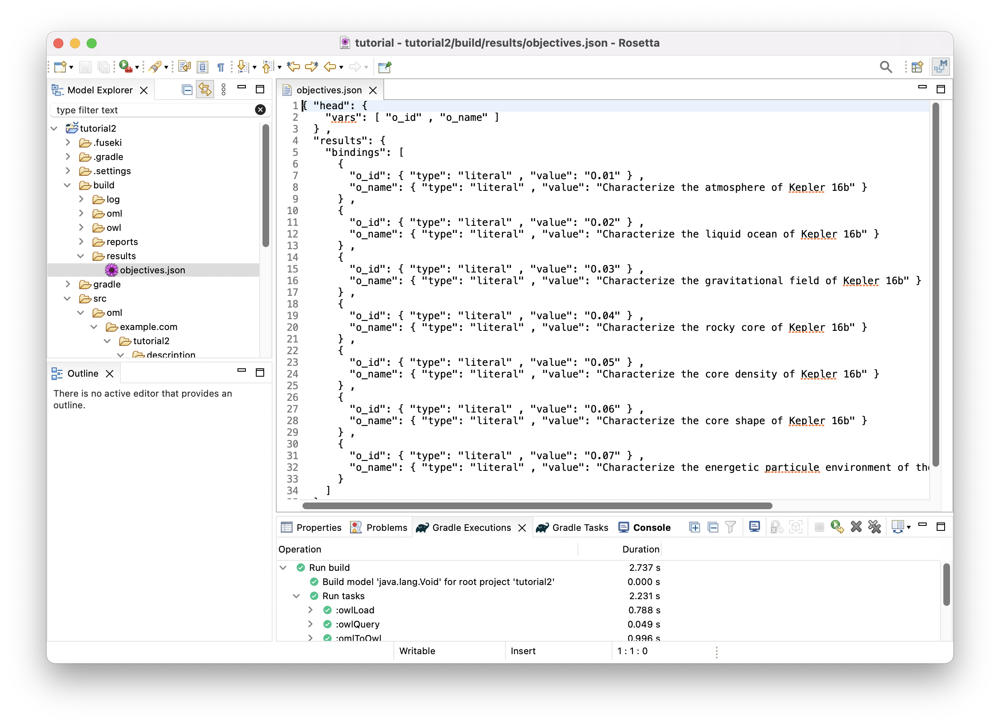

# Tutorial 2: OML Patterns # {#tutorial2}

Note: If you have not already done so, please do [Tutorial 1](#tutorial1) first before doing this one since we assume your familiarity with the basics of OML.

## Learning Objectives ## {#tutorial2-learning-objectives}
This tutorial demonstrates the process of developing a methodology for capturing knowledge in a given business domain with OML. The methodology will be developed as a series of patterns, each of which repersents a small step in the methodology, and is encoded by some new vocabulary. As an example, we will develop a simple systems engineering methodology. The tutorial also demonstrates describing knowledge using instances of those patterns and organizing them into modules that capture related concerns. As an example, we will describe a fanciful space mission called Kepler16b, which is an exoplanet orbiting a binary star system called Kepler16 .. approximately 245 light-years from Earth.

Note: the source files created in this tutorial are available for reference in this [repository](https://github.com/opencaesar/oml-tutorials/tree/master/tutorial2), but we encourage the reader to recreate them by following the instructions below.

## Create OML Project ##  {#tutorial2-oml-project}

We will start by creating an OML project that has a vocablary bundle and a description bundle that uses it.

1. In the [=Model Explorer view], right click and choose New -> OML Project.
1. Name the project `tutorial2`. Click Next.
1. Fill the OML project details as seen below. Click Finish.

    

1. In the [=Model Explorer view=], expand the `tutorial2` project, right-click on the `src/oml/example.com/tutorial2` folder, choose New -> OML Model and fill the OML model details as shown below. Click Finish.

    

1. In the [=Model Explorer view=], double click on the file `src/oml/example.com/tutorial2/description/bundle.oml` to open its editor. Paste the following OML code as the contents of the file.

```scala
description bundle <http://example.com/tutorial2/description/bundle#> as ^bundle {
	
	uses <http://example.com/tutorial2/vocabulary/bundle#>
}
```

Note: since we be running queries for every pattern, let us run the Fuseki server once now, and keep it running till the end, then we will stop it.

6. From the [=Gradle Task view=], run the task `tutorial2/oml/startFuseki` and wait until it finishes execution in the [=Gradle Executions view=]. It should run successfuly with no errors.

Note: you should now be ready to create the patterns below. For each pattern, we give its synopsis, the new vocabulary required to support it, the new descriptions to use it, and finally the queries that we can analyze it.

## P1: Objective aggregates Objective ## {#tutorial2-p1}

**Pattern Synopsis**

A systems engineering endeavor begins with objectives to be achieved. Objectives are not requirements; they are desires. They may be in conflict. They may not be achievable in principle. They may not be feasible. They may be related such that achieving one objective helps to achieve another. We call this relationship *aggregates*, which could be important for planning a campaign of pursuit. Aggregates is a general relationship, broader than objectives, but is homeomeric, meaning that parts and whole are of the same type. We say an Objective is an AggregatedThing, meaning it can aggregate or be aggregated. We further say an Objective aggregates only Objectives and is aggregated in only *Objectives* (this is called a restriction in OML).

**New Vocabulary**

We will create two vocabularies and add them to the vocabulay bundle. The first vocabulary is called `base`, which we will use to define basic patterns, and the second is called `mission`, which we will use to describe patterns related to missions in systems engineering. We will then add to them the details of pattern P1.

1. Create a vocabulary with the IRI `<http://example.com/tutorial2/vocabulary/base#>` and prefix `base`. Copy the following OML code as its contents. Save the editor.

```scala
vocabulary <http://example.com/tutorial2/vocabulary/base#> as base {

	extends <http://www.w3.org/2000/01/rdf-schema#> as rdfs
	extends <http://www.w3.org/2001/XMLSchema#> as xsd
}
```

2. Create a vocabulary with the IRI `<http://example.com/tutorial2/vocabulary/mission#>` and prefix `mission`. Copy the following OML code as its contents. Save the editor.

```scala
vocabulary <http://example.com/tutorial2/vocabulary/mission#> as mission {
	
	extends <http://www.w3.org/2000/01/rdf-schema#> as rdfs
	extends <http://example.com/tutorial2/vocabulary/base#> as base
}
```

3. Open the `vocabulary/bundle` editor, Copy the follow OML code as its contents. Save the editor.

```scala
vocabulary bundle <http://example.com/tutorial2/vocabulary/bundle#> as ^bundle {
	
	includes <http://example.com/tutorial2/vocabulary/mission#>
}
```

4. if you did all the previous steps correctly, the following should be the contents of all files so far.

    

1. In the `base` vocabulary, append the following OML code to its body:

```scala
	@rdfs:label "The class of things having an id and a canonical name"
	aspect IdentifiedThing

	@rdfs:label "The has canonical name property"
	scalar property hasCanonicalName [
		domain IdentifiedThing
		range xsd:string
	]

	@rdfs:label "The has identifier property"
	scalar property hasIdentifier [
		domain IdentifiedThing
		range xsd:string
	]

	@rdfs:label "The has description property"
	scalar property hasDescription [
		domain IdentifiedThing
		range xsd:string
	]

 	@rdfs:label "The class of things that can be aggregated"
	aspect AggregatedThing

	@rdfs:label "The aggregates relation between aggregated things"
	relation entity Aggregates [
		from AggregatedThing
		to AggregatedThing
		forward aggregates
		reverse isAggregatedIn
		asymmetric
		irreflexive
	]
```

6. In the `mission` vocabulary, append the following OML code to its body:

```scala
	@rdfs:comment "An Objective=] represents a specific interest 
	that one or more stakeholders have in the successful execution of a mission."
	concept Objective :> base:IdentifiedThing, base:AggregatedThing [
		restricts all relation base:aggregates to Objective
		restricts all relation base:isAggregatedIn to Objective
	]
```

7. This is a visualization of the vocabularies you created so far.

	<table>
		<tr>
			<td></td>
			<td></td>
		</tr>
		<tr>
			<td>Base Vocabulary</td>
			<td>Mission Vocabulary</td>
		</tr>
	</table>

8. Let us check that our ontologies are good so far, by running the task called `tutorial2/oml/build` from the [=Gradle Task view=], and waiting for it to finish running in the [=Gradle Executions view=]. This should run with no errors.

**New Description**

We will now create a new description model for the objectives of the Kepler16 mission, then add it to the description bundle. Each description is identified with an id and a canonical name and may specify which other objective it aggregates.

9. Create a description with the IRI `<http://example.com/tutorial2/description/objectives#>` and prefix `objectives`. Copy the following OML code as its contents. Save the editor.

```scala
description <http://example.com/tutorial2/description/objectives#> as objectives {

	uses <http://example.com/tutorial2/vocabulary/base#> as base
	uses <http://example.com/tutorial2/vocabulary/mission#> as mission

	ci characterize-atmosphere : mission:Objective [
		base:hasIdentifier "O.01"
		base:hasCanonicalName "Characterize the atmosphere of Kepler 16b"
		base:aggregates characterize-liquid-ocean
	]
	ci characterize-liquid-ocean : mission:Objective [
		base:hasIdentifier "O.02"
		base:hasCanonicalName "Characterize the liquid ocean of Kepler 16b"
	]
	ci characterize-gravitational-field : mission:Objective [
		base:hasIdentifier "O.03"
		base:hasCanonicalName "Characterize the gravitational field of Kepler 16b"
		base:aggregates characterize-liquid-ocean
		base:aggregates characterize-rocky-core
	]
	ci characterize-rocky-core : mission:Objective [
		base:hasIdentifier "O.04"
		base:hasCanonicalName "Characterize the rocky core of Kepler 16b"
		base:aggregates characterize-rocky-core-density
		base:aggregates characterize-rocky-core-shape
	]
	ci characterize-rocky-core-density : mission:Objective [
		base:hasIdentifier "O.05"
		base:hasCanonicalName "Characterize the core density of Kepler 16b"
	]
	ci characterize-rocky-core-shape : mission:Objective [
		base:hasIdentifier "O.06"
		base:hasCanonicalName "Characterize the core shape of Kepler 16b"
	]
	ci characterize-environment : mission:Objective [
		base:hasIdentifier "O.07"
		base:hasCanonicalName "Characterize the energetic particule environment of the Kepler 16b binary star system"
		base:aggregates characterize-liquid-ocean
	]
}
```

10. Open the `description/bundle` editor, Append the follow OML code to the body. Save the editor.

```scala
	includes <http://example.com/tutorial2/description/objectives#>
```

11. This is a visualization of the descriptions you created so far.

	<table>
		<tr>
			<td></td>
		</tr>
		<tr>
			<td>Objectives Desrciption</td>
		</tr>
	</table>

12. Let us check that our ontologies are stil good, by running the task called `tutorial2/oml/build` from the [=Gradle Task view=], and waiting for it to finish running in the [=Gradle Executions view=]. This should run with no errors.

**New Queries**

Now that we have defined the vocabulary of the first pattern, and used it in the mission description, we will create a SPARQL query to extract the pattern instances from the description.

13. Creat the file `src/sparql/objectives.sparql` and copy the following SPARQL code as its content. It looks for objectives in the model and selects their ids and names.

```scala
PREFIX base:        <http://example.com/tutorial2/vocabulary/base#>
PREFIX mission:     <http://example.com/tutorial2/vocabulary/mission#>

SELECT DISTINCT ?o_id ?o_name
WHERE {
	?obj a mission:Objective ;
		base:hasIdentifier ?o_id ;
		base:hasCanonicalName ?o_name .
}
ORDER BY ?o_id
```

14. Let's now run this query by running the task `tutorial2/oml/owlQuery` from the [=Gradle Task view=] and waiting for it to finish execution in the [=Gradle Executions view=]. It should run with no errors.

15. Right click on the project in the [=Model Explorer view=] and select `Refresh`. Navigate to the file `build/results/objectives.json` and double click it to open its editor. You should see the following results in JSON.

	

16. With this JSON results, one could develop a visualization like the following:

Note: the visualization code is not part of this tutorial

<html>
<head>
<style>
#table {
  font-family: Arial, Helvetica, sans-serif;
  border-collapse: collapse;
  border: 1px solid;
  padding: 10px;
  box-shadow: 5px 10px 18px #888888;
}

#table td, #table th {
  border: 1px solid #ddd;
  padding: 8px;
}

#table tr:nth-child(even){background-color: #f2f2f2;}

#table tr:hover {background-color: #ddd;}

#table th {
  padding-top: 12px;
  padding-bottom: 12px;
  text-align: left;
  padding: 8px;
  background-color: #04AA6D;
  color: white;
}
</style>
</head>
<body>
<table id="table"><thead><tr><th>o_id</th><th>o_name</th></tr></thead><tbody><tr><td>O.01</td><td>Characterize the atmosphere of Kepler 16b</td></tr><tr><td>O.02</td><td>Characterize the liquid ocean of Kepler 16b</td></tr><tr><td>O.03</td><td>Characterize the gravitational field of Kepler 16b</td></tr><tr><td>O.04</td><td>Characterize the rocky core of Kepler 16b</td></tr><tr><td>O.05</td><td>Characterize the core density of Kepler 16b</td></tr><tr><td>O.06</td><td>Characterize the core shape of Kepler 16b</td></tr><tr><td>O.07</td><td>Characterize the energetic particule environment of the Kepler 16b binary star system</td></tr></tbody></table>
</body>
</html>

## P2: Mission pursues Objective ## {#tutorial2-p2}

## P3: Mission deploys Component ## {#tutorial2-p3}

## P4: Component contains Component ## {#tutorial2-p4}

## P5: Component presents Interface ## {#tutorial2-p5}

## P6: Junction joins Interface ## {#tutorial2-p6}

## P7: Requirement specifies (Component presents Interface) ## {#tutorial2-p7}

## P8: Requirement refines Requirement ## {#tutorial2-p8}

## P9: Interface transfers (Flow or Item) ## {#tutorial2-p9}

## Summary ## {#tutorial2-summary}
