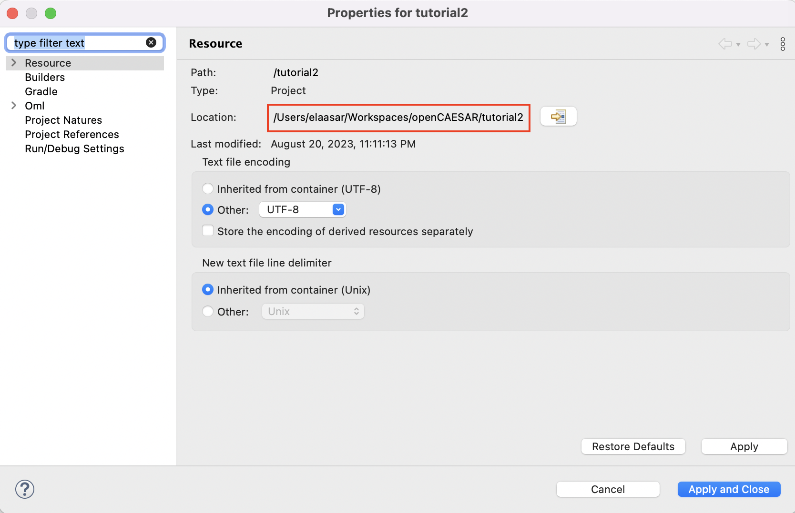
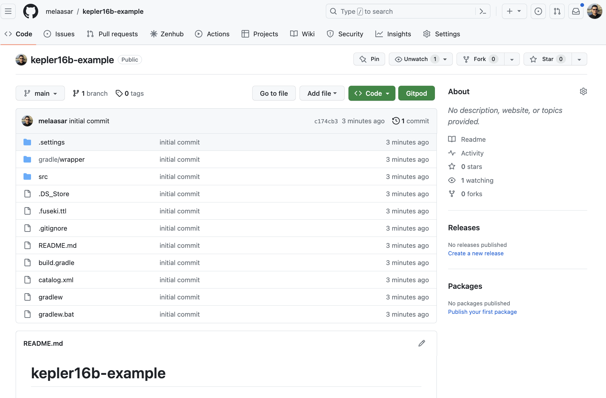
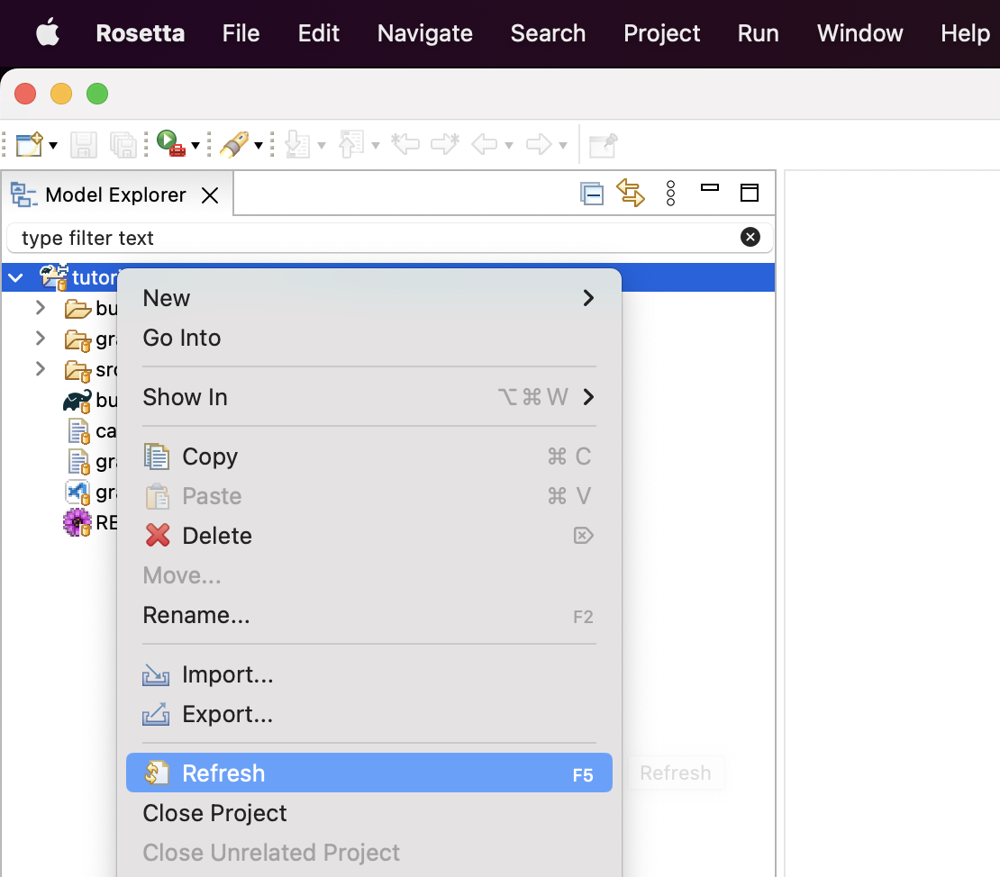

# Tutorial 3: OML CI/CD # {#tutorial3}

Note: This tutorial builds on the project developed in [Tutorial 2](#tutorial2). Please do that first before proceeding.

## Learning Objectives ## {#tutorial3-learning-objectives}
Managing an OML project in a git repository makes a lot of sense. First, OML models are textual files, which allows git to edit them natively. Second, all the OML workbenches already support git. Third, the VS Code extension for OML supports editing OML files in the cloud (and even in the browser in the future). Finally, the products of an OML project, typically documents, can be published online in git directly. Following the best practices of model-based development, such documents should be produced automatically from models through a rigorous and repeatable process. This is possible to achieve thanks to the process of Continuous Integration of Delivery (CI/CD) that is supported by most git repos.

This tutorial teaches how to set up a CI/CD workflow for an OML project managed in a git repo. Users will learn the following:

- How to manage an OML project in a git repository
- How to setup a CI/CD workflow in the git repository to build the project on each commit
- How to generate the default docs for an OML project and update it on each commit
- How to generate custom docs for an OML project and update it on each commit

Note: The source files created in this tutorial are available for reference in this [repository](https://github.com/opencaesar/kepler16b-example), but we encourage the reader to recreate them by following the instructions below.

## Manage Project in Git ## {#tutorial3-manage-project-in-git}
In this step, we will create a Github repo for the project and push it there using the [Git CLI](https://git-scm.com/book/en/v2/Getting-Started-Installing-Git).

1. Open a web browser. navigate to your Github organization and select the `New Repository` button. Set the name of the repo to `kepler16b-example` and the other settings as shown below. Finally, click the `Create Repository` button.

	

2. Back in your OML Rosetta workspace, right-click on the `tutorial2` project, select Proprties action, and note the `Location` path.

	

3. Open the `Terminal` application on your machine, navigate to the project's path, and initialize the repo using the following commands:

```shell
$ cd path/to/tutorial2
$ git init
$ git remote add origin git@github.com:OWNER/kepler16b-example.git
$ git pull
```

Note: Replace OWNER by your new Github repo's owner.

4. Stage, commit, and push the project to the Github remote repo using the following commands:

```shell
$ git add .
$ git commit -m "initial commit"
$ git push --set-upstream origin main -f
```

5. In your web browser, refresh the repo's page. You should now see the repository looking like this:

	

6. In the OML Rosetta workspace, right click on the project and choose Refresh.

	

## Setup CI/CD Workflow ## {#tutorial3-setup-ci-cd-workflow}
In this step, we will use Github Actions to create a CI/CD workflow that builds the project and run queries on any commit.

1. In a web browser, navigate to your repo's web page, and click on the Actions tab.

	

2. In the Actions page, click on the `Configure` button of the `Simple workflow`.

	

3. In the path, rename the file to `ci.yml`.

	

4. Replace the file contents by the following code:

```yaml
name: CI/CD

on:
  push:
    branches: [ "main" ]
  pull_request:
    branches: [ "main" ]

permissions:
  contents: read

jobs:
  build:
    runs-on: ubuntu-latest
    steps:
    - name: Checkout
      uses: actions/checkout@v3
    - name: Set up JDK 17
      uses: actions/setup-java@v3
      with:
        java-version: '17'
        distribution: 'temurin'
    - name: Setup Gradle
      uses: gradle/gradle-build-action@v2
    - name: Build
      run: ./gradlew build
	- name: Query
      run: ./gradlew startFuseki owlQuery stopFuseki
    - name: Upload
      if: ${{ always() }}
      uses: actions/upload-artifact@v3
      with:
        name: build
        path: build/
```

Note: The CI script above has a single job called `build` with 6 steps. The first 3 checkout the repo, setup jdk, and setup gradle. The next 3, build the project (which run the DL reasoner), run the SPARQL queries, and upload the build folder (for inspection in case of error).

5. Commit the CI file and watch the first CI run complete successfully.

	<video width="100%" style="border:1px groove black;" controls>
		<source src="assets/mov/Tutorial3-First-CI-Build.mp4"/>
	</video>

6. Now, We will create a new branch, add a syntax error in the OML model (cross referencing a non-existing element) in it, commit it to the repo, and see how the CI workflow detects it. After that, we will undo the change to fix it.

	<video width="100%" style="border:1px groove black;" controls>
		<source src="assets/mov/Tutorial3-Second-CI-Build.mp4"/>
	</video>

7. Then, we will add a semantic error in the OML model (make an assembly contained by two containers) to see how the CI workflow detects it (by finding the inverse functional `base:contains` relation violated in this case). After that, we will undo the change to fix it.

	<video width="100%" style="border:1px groove black;" controls>
		<source src="assets/mov/Tutorial3-Third-CI-Build.mp4"/>
	</video>

## Generate Default Docs ## {#tutorial3-generate-default-docs}
The openCAESAR project provides a tool called [owl-doc](https://github.com/opencaesar/owl-tools/tree/master/owl-doc) that generates default documentation for an OML datasets. Such tool, like most openCAESAR analysis tools, can be invoked both as a standard-alone CLI, or as a task through the Gradle CLI. In this exercise, we will use the Gradle version and invoke it from the CI workflow.

1. In the project's root folder, navigate to the `build.gradle` file and double click it to open its editor.

1. Find the `buildscript` clause, and its nested `dependencies` clause, and add a dependency on the `owl-doc` tool, like this:

```scala
buildscript {
	repositories {
        ...
	}
	dependencies {
        classpath 'io.opencaesar.owl:owl-doc-gradle:2.+'
        ...
	}
}
```

1. Find a task called  and copy/paste the following task code right before it.

```scala
/*
 * A task to generate documentation for the OWL catalog
 */
task generateDocs(type: io.opencaesar.owl.doc.OwlDocTask, dependsOn: owlReason) {
    // OWL catalog
    inputCatalogPath = file('build/owl/catalog.xml')
    // OWL catalog title
    inputCatalogTitle = "Kepler16b"
    // OWL catalog version
    inputCatalogVersion = project.version
    // OWL Ontology Iris
    inputOntologyIris = [ "$rootIri/classes", "$rootIri/properties",  "$rootIri/individuals" ]
    // Output folder
    outputFolderPath = file('build/doc')
    // Output case sensitivie path
    outputCaseSensitive = org.gradle.internal.os.OperatingSystem.current().isLinux()
}
```

Note: that `generateDocs` task is typed by `OwlDocTask` and declares that it dependends on `owlReason`, which itself depends on `omlToOwl`. We configured it this way because a) it requires the dataset to be in OWL format, and b) we like to include in the entailments in the docs. If we do not need (b), then we can change it to depend on `omlToOwl` directly and change the `inputONtologyIris` param to [ "$rootIri" ].

1. Save the `build.gradle` file.

## Generate Custom Docs ## {#tutorial3-generate-custom-doc}
