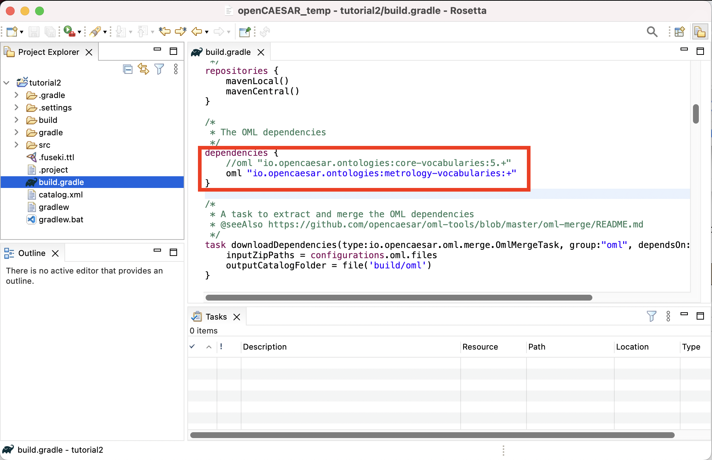

# Tutorial 2: OML Patterns # {#tutorial2}

Note: This tutorial builds on [Tutorial 1](#tutorial1). Please do that first before proceeding.

## Learning Objectives ## {#tutorial2-learning-objectives}
This tutorial demonstrates the process of developing a methodology for capturing knowledge in a given business domain with OML. The methodology will be developed as a series of patterns, each of which represents a small step in the methodology and is encoded by some new vocabulary. As an example, we will develop a simple systems engineering methodology. The tutorial also demonstrates describing knowledge using instances of those patterns and organizing them into modules that capture related concerns. As an example, we will describe a fanciful space mission called Kepler16b, which is an exoplanet orbiting a binary star system called Kepler16—approximately 245 light-years from Earth.

Note: the source files created in this tutorial are available for reference in this [repository](https://github.com/opencaesar/kepler16b-example), but we encourage the reader to recreate them by following the instructions below.

## Create OML Project ##  {#tutorial2-oml-project}

We will start by creating an OML project that has a vocabulary bundle and a description bundle that uses it.

1. In the [=Model Explorer view], right click and choose New -> OML Project.
1. Name the project `tutorial2`. Click Next.
1. Fill the OML project details as seen below. Click Finish.

    

1. In the [=Model Explorer view=], double click on the `build.gradle` file, and modify the declared dependency on `core-vocabulary` to `metrology-vocabulary` instead. Save the editor.

	

Note: specifying `+` as a dynamic version for `metrology-vocabularies` will result in downloding the latest version. However, a safer approach would be to pin the dependency to the current major revision (e.g., `7.+`) to protect the project against future incompatible major revisions of `metrology-vocabularies`. At the time of this writing, the major revision for that library was `7.+` but this could be different when you take the tutorial. Click [here](https://github.com/opencaesar/metrology-vocabularies/releases) to check what the latest version at this time is.

1. In the [=Model Explorer view=], expand the `tutorial2` project, right-click on the `src/oml/example.com/tutorial2` folder, choose New -> OML Model and fill the OML model details as shown below. Click Finish.

    

1. In the [=Model Explorer view=], double click on the file `src/oml/example.com/tutorial2/description/bundle.oml` to open its editor. Paste the following OML code as the contents of the file.

```scala
description bundle <http://example.com/tutorial2/description/bundle#> as ^bundle {
	
	uses <http://example.com/tutorial2/vocabulary/bundle#>
}
```

Note: since we be running SPARQL queries for every pattern, we will run a Fuseki server once now, and keep it running till the end of the tutorial when we will stop it.

6. From the [=Gradle Tasks view=], run the task `tutorial2/oml/startFuseki` and wait until it finishes execution in the [=Gradle Executions view=]. It should run successfully with no errors.

Note: you should now be ready to create the patterns below. For each pattern, we give its synopsis, the new vocabulary required to support it, the new descriptions to use it, and finally the queries that we can analyze it.

## P1: Objective aggregates Objective ## {#tutorial2-p1}

**Pattern Synopsis**

A systems engineering endeavor begins with objectives to be achieved. Objectives are not requirements; they are desires. They may be in conflict. They may not be achievable in principle. They may not be feasible. They may be related such that achieving one objective helps to achieve another. We call this relationship *aggregates*, which could be important for planning a campaign of pursuit. *Aggregates* is a general relationship, broader than *objectives*, but is homomeric, meaning that parts and whole are of the same type. We say an *Objective* is an *AggregatedThing*, meaning it can aggregate or be aggregated. We further say an *Objective* *aggregates* only *Objectives* and is aggregated in only *Objectives* (this is called a restriction in OML).

**New Vocabulary**

We will create two vocabularies and add them to the vocabulary bundle. The first vocabulary is called `base`, which we will use to define basic patterns, and the second is called `mission`, which we will use to describe patterns related to missions in systems engineering. We will then add to them the details of pattern P1.

1. Create a vocabulary with the IRI <`http://example.com/tutorial2/vocabulary/base#`> and prefix `base`. Copy the following OML code as its contents. Save the editor.

```scala
vocabulary <http://example.com/tutorial2/vocabulary/base#> as base {

	extends <http://www.w3.org/2000/01/rdf-schema#> as rdfs
	extends <http://www.w3.org/2001/XMLSchema#> as xsd
}
```

2. Create a vocabulary with the IRI <`http://example.com/tutorial2/vocabulary/mission#`> and prefix `mission`. Copy the following OML code as its contents. Save the editor.

```scala
vocabulary <http://example.com/tutorial2/vocabulary/mission#> as mission {
	
	extends <http://www.w3.org/2000/01/rdf-schema#> as rdfs
	extends <http://example.com/tutorial2/vocabulary/base#> as base
}
```

3. Open the `vocabulary/bundle` editor, Copy the follow OML code as its contents. Save the editor.

```scala
vocabulary bundle <http://example.com/tutorial2/vocabulary/bundle#> as ^bundle {
	
	includes <http://example.com/tutorial2/vocabulary/mission#>
}
```

Note: how we only added the `mission` vocabulary, not the `base` vocabulary, to the bundle. This is because in OML, import statements (like `includes`, `extends`, and `uses`) are transitive. Since `mission` already imports (extends) `base`, the bundle would transitively include `base` as well. But It would not be wrong to explicitly include `base` in the bundle too.

4. if you did all the previous steps correctly, the following should be the contents of all files so far.

    

1. In the `vocabulary/base` ontology, append the following OML code to its body (i.e., insert it before the closing `}` bracket):

<pre highlight="scala" line-highlight="3, 16">
	@rdfs:comment "The class of things having an id and a canonical name"
	aspect IdentifiedThing [
		key hasIdentifier
	]

	@rdfs:comment "The has canonical name property"
	scalar property hasCanonicalName [
		domain IdentifiedThing
		range xsd:string
	]

	@rdfs:comment "The has identifier property"
	scalar property hasIdentifier [
		domain IdentifiedThing
		range xsd:string
		functional
	]

	@rdfs:comment "The has description property"
	scalar property hasDescription [
		domain IdentifiedThing
		range xsd:string
	]

 	@rdfs:comment "The class of things that can be aggregated"
	aspect AggregatedThing

	@rdfs:comment "The aggregates relation between aggregated things"
	relation entity Aggregates [
		from AggregatedThing
		to AggregatedThing
		forward aggregates
		reverse isAggregatedIn
		asymmetric
		irreflexive
	]
</pre>

Note: the syntax used for annotations on ontology members above (e.g., `@rdfs:comment "value"` used to put a comment on a vocabulary member). What comes after the `@` is the IRI of an annotation property (declared in some vocabulary) followed by a (literal or IRI) value.

Note: the `key` axiom in the `IdentifiedThing` aspect. It says that instances of this type must have unique values for their `hasIdentifier` property (which is similar to the concept of primary key in relational schemas). For this to work as expected, properties that are part of a key needs to be defined as `functional`, meaning that may have a maximum of one value. Otherwise, two instances with different values for `hasIdentifier` may still be inferred as aliases to the same instance with twos values for the key property.

6. In the `vocabulary/mission` ontology, append the following OML code to its body:

```scala
	@rdfs:comment "An Objective represents a specific interest 
	that one or more stakeholders have in the successful execution of a mission."
	concept Objective < base:IdentifiedThing, base:AggregatedThing [
		restricts all base:aggregates to Objective
		restricts all base:isAggregatedIn to Objective
	]
```

7. This is a visualization of the vocabularies you created so far.

	<table>
		<tr>
			<td></td>
			<td></td>
		</tr>
		<tr>
			<td>Base Vocabulary</td>
			<td>Mission Vocabulary</td>
		</tr>
	</table>

8. Let us check that our ontologies are good so far, by running the task `tutorial2/oml/build` from the [=Gradle Tasks view=], and waiting for it to finish running in the [=Gradle Executions view=]. This should run with no errors.

**New Description**

We will now create a new description model for the objectives of the Kepler16 mission, then add it to the description bundle. Each description is identified with an id and a canonical name and may specify which other objective it aggregates.

9. Create a description with the IRI <`http://example.com/tutorial2/description/objectives#`> and prefix `objectives`. Copy the following OML code as its contents. Save the editor.

```scala
description <http://example.com/tutorial2/description/objectives#> as objectives {

	uses <http://example.com/tutorial2/vocabulary/base#> as base
	uses <http://example.com/tutorial2/vocabulary/mission#> as mission

	instance characterize-atmosphere : mission:Objective [
		base:hasIdentifier "O.01"
		base:hasCanonicalName "Characterize the atmosphere of Kepler 16b"
		base:aggregates characterize-liquid-ocean
	]
	instance characterize-liquid-ocean : mission:Objective [
		base:hasIdentifier "O.02"
		base:hasCanonicalName "Characterize the liquid ocean of Kepler 16b"
	]
	instance characterize-gravitational-field : mission:Objective [
		base:hasIdentifier "O.03"
		base:hasCanonicalName "Characterize the gravitational field of Kepler 16b"
		base:aggregates characterize-liquid-ocean
		base:aggregates characterize-rocky-core
	]
	instance characterize-rocky-core : mission:Objective [
		base:hasIdentifier "O.04"
		base:hasCanonicalName "Characterize the rocky core of Kepler 16b"
		base:aggregates characterize-rocky-core-density
		base:aggregates characterize-rocky-core-shape
	]
	instance characterize-rocky-core-density : mission:Objective [
		base:hasIdentifier "O.05"
		base:hasCanonicalName "Characterize the core density of Kepler 16b"
	]
	instance characterize-rocky-core-shape : mission:Objective [
		base:hasIdentifier "O.06"
		base:hasCanonicalName "Characterize the core shape of Kepler 16b"
	]
	instance characterize-environment : mission:Objective [
		base:hasIdentifier "O.07"
		base:hasCanonicalName "Characterize the energetic particule environment of the Kepler 16b binary star system"
		base:aggregates characterize-liquid-ocean
	]
}
```

10. This is a visualization of the descriptions you created so far.

	<table>
		<tr>
			<td></td>
		</tr>
		<tr>
			<td>Objectives Desrciption</td>
		</tr>
	</table>

11. Open the `description/bundle` editor, Append the follow OML code to the body. Save the editor.

```scala
	includes <http://example.com/tutorial2/description/objectives#>
```

12. Let us check that our ontologies are still good, by running the task `tutorial2/oml/build` from the [=Gradle Tasks view=], and waiting for it to finish running in the [=Gradle Executions view=]. This should run with no errors.

**New Queries**

Now that we have defined the vocabulary of the first pattern, and used it in the mission description, we will create a SPARQL query to extract the pattern instances from the description.

13. Create the file `src/sparql/objectives.sparql` and copy the following SPARQL code as its content. It looks for objectives in the model and selects their ids and names.

```scala
PREFIX base:        <http://example.com/tutorial2/vocabulary/base#>
PREFIX mission:     <http://example.com/tutorial2/vocabulary/mission#>

SELECT DISTINCT ?o1_id ?o1_name ?o2_id ?o2_name
WHERE {
    ?o1 a mission:Objective ;
		base:hasIdentifier ?o1_id ;
		base:hasCanonicalName ?o1_name ;
		base:aggregates [
			base:hasIdentifier ?o2_id ;
			base:hasCanonicalName ?o2_name
		]
}
ORDER BY ?o1_id ?o2_id
```

14. Let's now run this query by running the task `tutorial2/oml/owlQuery` from the [=Gradle Tasks view=] and waiting for it to finish execution in the [=Gradle Executions view=]. It should run with no errors.

15. Right click on the project in the [=Model Explorer view=] and select `Refresh`. Navigate to the file `build/results/objectives.json` and double click it to open its editor. You should see the following results in JSON.

	

16. With this JSON results, one could develop a visualization like the following:

Note: the visualization code is not part of this tutorial

<html>
<head>
<style>
#table1 {
  font-family: Arial, Helvetica, sans-serif;
  border-collapse: collapse;
  border: 1px solid;
  padding: 10px;
  box-shadow: 5px 10px 18px #888888;
}

#table1 td, #table th {
  border: 1px solid #ddd;
  padding: 8px;
}

#table1 tr:nth-child(even){background-color: #f2f2f2;}

#table1 tr:hover {background-color: #ddd;}

#table1 th {
  padding-top: 12px;
  padding-bottom: 12px;
  text-align: left;
  padding: 8px;
  background-color: #04AA6D;
  color: white;
}
</style>
</head>
<body>
<table id="table1"><thead><tr><th>o1_id</th><th>o1_name</th><th>o2_id</th><th>o2_name</th></tr></thead><tbody><tr><td>O.01</td><td>Characterize the atmosphere of Kepler 16b</td><td>O.02</td><td>Characterize the liquid ocean of Kepler 16b</td></tr><tr><td>O.03</td><td>Characterize the gravitational field of Kepler 16b</td><td>O.02</td><td>Characterize the liquid ocean of Kepler 16b</td></tr><tr><td>O.03</td><td>Characterize the gravitational field of Kepler 16b</td><td>O.04</td><td>Characterize the rocky core of Kepler 16b</td></tr><tr><td>O.04</td><td>Characterize the rocky core of Kepler 16b</td><td>O.05</td><td>Characterize the core density of Kepler 16b</td></tr><tr><td>O.04</td><td>Characterize the rocky core of Kepler 16b</td><td>O.06</td><td>Characterize the core shape of Kepler 16b</td></tr><tr><td>O.07</td><td>Characterize the energetic particule environment of the Kepler 16b binary star system</td><td>O.02</td><td>Characterize the liquid ocean of Kepler 16b</td></tr></tbody></table>
</body>
</html>

## P2: Mission pursues Objective ## {#tutorial2-p2}

**Pattern Synopsis**

We undertake missions to pursue objectives. Again, objectives are not requirements. Part of the job of a mission is to negotiate an achievable set of objectives. Every mission pursues zero or more objectives. The lower bound is zero in the vocabulary because one-or-more is really a life-cycle completeness constraint. The notion of mission makes sense even if we don’t know what its objectives are. Every objective may be pursued by zero or more missions.

**New Vocabulary**

1. In the body of ontology `vocabulary/mission`, append the following OML code, which adds the concept of a `Mission` with relation entity `Purses`, after the existing concept of `Objective`. Save the editor.

```scala
	@rdfs:comment "A Mission pursues Objectives."
	concept Mission < base:IdentifiedThing

	@rdfs:comment "A Mission pursues zero or more Objectives."
	relation entity Pursues [
		from Mission
		to Objective
		forward pursues
		reverse isPursuedBy
		asymmetric
		irreflexive
	]
```

Note: that relation entity `Purses` is a reified relation (i.e., a class of relation instances), where its forward `purses` and its reverse `isPursedBy` are unreified relations (i.e., simple references). In a description model, either a reified or an unreified version of the relation can be used. The former is useful when it is desired to give the link a name and other characterizations.

Note: the semantic (logical) flags specified on the relation entity `Pursues`. The first flag `reverse functional` means that an `Objective` (the target of the relation) can be pursued by a max of one `Mission` (the source of the relation). The second flag `asymmetric` means that if a mission pursues an objective, then it would be illogical to infer that the objective pursues the mission (remember with open world assumptions, anything can be inferred unless you state otherwise). The third flag `irreflexive` means that an instance cannot be related to itself by this relation.

2. The following is a visualization of the `mission` vocabulary so far:

    

3. Let us check that our ontologies are good so far, by running the task `tutorial2/oml/build` from the [=Gradle Tasks view=], and waiting for it to finish running in the [=Gradle Executions view=]. This should run with no errors.

**New Description**

Let us now use the pattern in describing a couple of missions in kepler6b.

4. Create a description with the IRI <`http://example.com/tutorial2/description/missions#`> and prefix `missions`. Copy the following OML code as its contents. Save the editor.

```scala
description <http://example.com/tutorial2/description/missions#> as missions {

	uses <http://example.com/tutorial2/vocabulary/base#> as base
	uses <http://example.com/tutorial2/vocabulary/mission#> as mission
	extends <http://example.com/tutorial2/description/objectives#> as objectives

	instance orbiter : mission:Mission [
		base:hasIdentifier "M.01"
		base:hasCanonicalName "Orbiter Mission"
		mission:pursues objectives:characterize-atmosphere
		mission:pursues objectives:characterize-environment
		mission:pursues objectives:characterize-gravitational-field
	]
	instance lander : mission:Mission [
		base:hasIdentifier "M.02"
		base:hasCanonicalName "Lander Mission"
		mission:pursues objectives:characterize-atmosphere
		mission:pursues objectives:characterize-environment
	]
}
```

5. The following is a visualization of the `missions` description we just created.

    

6. Append the following OML code to the body of `description/bundle` to include the new `missions` ontology. Save the editor.

```scala
	includes <http://example.com/tutorial2/description/missions#>
```

7. Let us check that our ontologies are good so far, by running the task `tutorial2/oml/build` from the [=Gradle Tasks view=], and waiting for it to finish running in the [=Gradle Executions view=]. This should run with no errors.

*New Queries*

Now we will create a SPARQL query to extract the pattern instances from the description.

8. Creat the file `src/sparql/missions.sparql` and copy the following SPARQL code as its content. It looks for missions that purses objectives.

```scala
PREFIX base:        <http://example.com/tutorial2/vocabulary/base#>
PREFIX mission:     <http://example.com/tutorial2/vocabulary/mission#>

SELECT DISTINCT ?m_id ?m_name ?o_id ?o_name
WHERE {
	?m a mission:Mission ;
		base:hasIdentifier ?m_id ;
		base:hasCanonicalName ?m_name ;
		mission:pursues [
        a mission:Objective ;
        base:hasIdentifier ?o_id ;
    	  base:hasCanonicalName ?o_name
    ]
}
ORDER BY ?m_id ?o_id
```

9. Let's now run this query by running the task `tutorial2/oml/owlQuery` from the [=Gradle Tasks view=] and waiting for it to finish execution in the [=Gradle Executions view=]. It should run with no errors.

10. Right click on the project in the [=Model Explorer view=] and select `Refresh`. Navigate to the file `build/results/missions.json` and double click it to open its editor. You should see the following results in JSON.

	

11. With this JSON results, one could develop visualizations like the following:

Note: the visualization code is not part of this tutorial

<div class="jp-Cell jp-CodeCell jp-Notebook-cell jp-mod-noInput">
<div class="jp-Cell-outputWrapper">
<div class="jp-Collapser jp-OutputCollapser jp-Cell-outputCollapser">
</div>
<div class="jp-OutputArea jp-Cell-outputArea">
<div class="jp-OutputArea-child jp-OutputArea-executeResult">
<div class="jp-RenderedHTMLCommon jp-RenderedHTML jp-OutputArea-output jp-OutputArea-executeResult" data-mime-type="text/html" tabindex="0">
<style>
.node circle {
fill: #fff;
stroke: steelblue;
stroke-width: 3px;
}
.node text {
font: 12px sans-serif;
}
.link {
fill: none;
stroke: #ccc;
stroke-width: 1px;
}
</style>
<div id="figure3"></div>
<script type="module">
import * as d3 from "https://cdn.jsdelivr.net/npm/d3@7/+esm";
function drawTree(data, containerID, root_name, unique=true, _width=960, _height=500, depthMultiplier=180) {

	function getOrCreateNode(id, name, dict){
		var node = dict[id];
		if (!node){
			node = {}
			node.id  = id;
			node.name = name;
			dict[id] = node;
		}
		return node;
	}
	
	function addNode(parentid, id, name, dict){
		var parent = dict[parentid];
		var node = dict[id];
		if (!node){
			node = getOrCreateNode(id,name,dict);
			node.parent = parent.id;
			if (!parent.children){
				parent.children = [];
			}
			parent.children.push(node);
		}
		return node;
	}
	
	function transform(data){
		var idToNode = [];
		var root = getOrCreateNode("-1",root_name,idToNode);
		root.parent = "null";
		var columns = [ "m_id" , "m_name" , "o_id" , "o_name" ];
		data.forEach(row => {
			var parent_id = "-1";
			for (let i = 0; i < columns.length/2; i++) {
				if (row[columns[2*i]]) {
					var childId = (!unique ? parent_id+"." : "") +row[columns[2*i]];
					addNode(parent_id, childId, row[columns[2*i]]+" "+row[columns[2*i+1]], idToNode);
					parent_id = childId;
				}
			}
		});	
		return root;
	}
	
	function getVal(d){
		return d.value + (d.children ? d.data.value : 0);
	}

	
	var treeData = transform(data);

	// ************** Generate the tree diagram	 *****************
	var margin = {top: 20, right: 120, bottom: 20, left: 120},
		width = _width - margin.right - margin.left,
		height = _height - margin.top - margin.bottom;
		
	var i = 0,
		root;
		
		
	var root = d3.hierarchy(treeData)
			.sum(d => d.value)
			.sort((a, b) => b.value - a.value)
			
	var tree = d3.tree();
	tree.size([height, width]); 
	var diagonal = d3.linkHorizontal().x(d => d.y).y(d => d.x)
	
	var svg = d3.select(containerID).append("svg")
		.attr("width", width + margin.right + margin.left)
		.attr("height", height + margin.top + margin.bottom)
	  .append("g")
		.attr("transform", "translate(" + margin.left + "," + margin.top + ")");


  	const gLink = svg.append("g")
      .attr("fill", "none")
      .attr("stroke", "#555")
      .attr("stroke-opacity", 0.4)
      .attr("stroke-width", 1.5);

	root.x0 = height / 2;
	root.y0 = 0;

	function update(source) {
	    const duration = d3.event && d3.event.altKey ? 2500 : 250;
	    const nodes = root.descendants().reverse();
	    const links = root.links();
	
	    // Compute the new tree layout.
	    tree(root);
	
	    let left = root;
	    let right = root;
	    root.eachBefore(node => {
	      if (node.x < left.x) left = node;
	      if (node.x > right.x) right = node;
	    });

		// Normalize for fixed-depth.
	    nodes.forEach(function(d) { d.y = d.depth * depthMultiplier; });

	
	    const height = right.x - left.x + margin.top + margin.bottom;
	
	    const transition = svg.transition()
	        .duration(duration);
	
	 	// Update the nodes…
	  	var node = svg.selectAll("g.node")
		  .data(nodes, function(d) { return d.id || (d.id = ++i); });

	
	    // Enter any new nodes at the parent's previous position.
	    const nodeEnter = node.enter().append("g")
	        .attr("transform", function(d) { return "translate(" + source.y0 + "," + source.x0 + ")"; })
		  	.attr("class", "node")
	        .on("click", click);
	
	    nodeEnter.append("circle")
 		  .attr("r", 1e-6)
		  .style("fill", function(d) { return d._children ? "lightsteelblue" : "#fff"; });

	
	    nodeEnter.append("text")
	        .attr("dy", "0.35em")
	        .attr("x", function(d) { return d.children || d._children ? -13 : 13; })
	        .attr("text-anchor", function(d) { return d.children || d._children ? "end" : "start"; })
	        .text(function(d){
				return d.data.name;
			});
	
	    // Transition nodes to their new position.
	    const nodeUpdate = node.merge(nodeEnter).transition(transition)
		  	.attr("transform", function(d) { return "translate(" + d.y + "," + d.x + ")"; });

		nodeUpdate.select("circle")
		  .attr("r", 10)
		  .style("fill", function(d) { return d._children ? "lightsteelblue" : "#fff"; });

		nodeUpdate.select("text")
		  .style("fill-opacity", 1);
	    
		// Transition exiting nodes to the parent's new position.
	    const nodeExit = node.exit().transition(transition)
		  .attr("transform", function(d) { return "translate(" + source.y + "," + source.x + ")"; })
		  .remove();

		nodeExit.select("circle")
		  .attr("r", 1e-6);
	
	  	nodeExit.select("text")
		  .style("fill-opacity", 1e-6);
	
	    // Update the links…
	    const link = gLink.selectAll("path")
	      .data(links, d => d.target.id);
	
	    // Enter any new links at the parent's previous position.
	    const linkEnter = link.enter().append("path")
			.attr("class", "link")
	        .attr("d", d => {
	          const o = {x: source.x0, y: source.y0};
	          return diagonal({source: o, target: o});
	        });
	
	    // Transition links to their new position.
	    link.merge(linkEnter).transition(transition)
	        .attr("d", diagonal);
	
	    // Transition exiting nodes to the parent's new position.
	    link.exit().transition(transition).remove()
	        .attr("d", d => {
	          const o = {x: source.x, y: source.y};
	          return diagonal({source: o, target: o});
	        });
	
	    // Stash the old positions for transition.
	    root.eachBefore(d => {
	      d.x0 = d.x;
	      d.y0 = d.y;
	    });
	 }

  	update(root);

	// Toggle children on click.
	function click(event, d) {
	  if (d.children) {
		d._children = d.children;
		d.children = null;
	  } else {
		d.children = d._children;
		d._children = null;
	  }
	  update(d);
	}
}
var data = [{"m_id":"M.01","m_name":"Orbiter Mission","o_id":"O.01","o_name":"Characterize the atmosphere of Kepler 16b"},{"m_id":"M.01","m_name":"Orbiter Mission","o_id":"O.03","o_name":"Characterize the gravitational field of Kepler 16b"},{"m_id":"M.01","m_name":"Orbiter Mission","o_id":"O.07","o_name":"Characterize the energetic particule environment of the Kepler 16b binary star system"},{"m_id":"M.02","m_name":"Lander Mission","o_id":"O.01","o_name":"Characterize the atmosphere of Kepler 16b"},{"m_id":"M.02","m_name":"Lander Mission","o_id":"O.07","o_name":"Characterize the energetic particule environment of the Kepler 16b binary star system"}]
drawTree(data, '#figure3', "Missions", false, 960, 300, 150)
</script>
</div>
</div>
</div>
</div>
</div>

## P3: Mission deploys Component ## {#tutorial2-p3}

**Pattern Synopsis**

We say a mission deploys components, which are typically the major systems  of the mission. In our case, these are Launch System, Spacecraft, etc.  *Deploys* is a whole-part relationship, but allows more than one mission to deploy the same component, as in for example, a shared mission operates a system for coordinated ops.

**New Vocabularies**

1. Append the following OML code, which adds the concept of a `Component` with the relation `Deploys` to the body of the `mission` vocabulary. Save the editor.

```scala
	@rdfs:comment "A Component is something that can be deployed in a mission."
	concept Component < base:IdentifiedThing

	@rdfs:comment "A Mission deploys zero or more Components."
	relation entity Deploys [
		from Mission
		to Component
		forward deploys
		reverse isDeployedBy
		asymmetric
		irreflexive
	]
```

2. The following is a visualization of the `mission` vocabulary so far:

    

3. Let us check that our ontologies are good so far, by running the task `tutorial2/oml/build` from the [=Gradle Tasks view=], and waiting for it to finish running in the [=Gradle Executions view=]. This should run with no errors.

**New Descriptions**

We will now add more details to the `missions` description using the pattern above. Specifically, we will add components and specify that the mission deploys some of them (the roots of component containment as shown in pattern P4 later).

4. Create a description with the IRI <`http://example.com/tutorial2/description/components#`> and prefix `components`. Copy the following OML code as its contents. Save the editor.

```scala
description <http://example.com/tutorial2/description/components#> as components {

	uses <http://example.com/tutorial2/vocabulary/base#> as base
	uses <http://example.com/tutorial2/vocabulary/mission#> as mission

	instance orbiter-launch-system : mission:Component [
		base:hasIdentifier "C.01"
		base:hasCanonicalName "Orbiter Launch System"
	]
	instance orbiter-spacecraft : mission:Component [
		base:hasIdentifier "C.02"
		base:hasCanonicalName "Orbiter Spacecraft"
	]
	instance orbiter-power-subsystem : mission:Component [
		base:hasIdentifier "C.02.01"
		base:hasCanonicalName "Orbiter Power Subsystem"
	]
	instance orbiter-harness : mission:Component [
		base:hasIdentifier "C.02.02"
		base:hasCanonicalName "Orbiter Harness"
	]
	instance orbiter-thermal-subsystem : mission:Component [
		base:hasIdentifier "C.02.03"
		base:hasCanonicalName "Orbiter Thermal Subsystem"
	]
	instance orbiter-command-and-data-handling-subsystem : mission:Component [
		base:hasIdentifier "C.02.04"
		base:hasCanonicalName "Orbiter CDH Subsystem"
	]
	instance orbiter-telecom-subsystem : mission:Component [
		base:hasIdentifier "C.02.05"
		base:hasCanonicalName "Orbiter Telecom Subsystem"
	]
	instance orbiter-guidance-navigation-control-subsystem : mission:Component [
		base:hasIdentifier "C.02.06"
		base:hasCanonicalName "Orbiter GNC Subsystem"
	]
	instance orbiter-mechanical-subsystem : mission:Component [
		base:hasIdentifier "C.02.07"
		base:hasCanonicalName "Orbiter Mechanical Subsystem"
	]
	instance orbiter-spacraft-flight-software : mission:Component [
		base:hasIdentifier "C.02.08"
		base:hasCanonicalName "Orbiter Flight Software"
	]
	instance orbiter-propulsion-subsystem : mission:Component [
		base:hasIdentifier "C.02.09"
		base:hasCanonicalName "Orbiter Propulsion Subsystem"
	]
	instance orbiter-ground-data-system : mission:Component [
		base:hasIdentifier "C.03"
		base:hasCanonicalName "Orbiter Ground Data System"
	]
	instance mission-operations-system : mission:Component [
		base:hasIdentifier "C.04"
		base:hasCanonicalName "Mission Operations System"
	]
	instance lander-launch-system : mission:Component [
		base:hasIdentifier "C.05"
		base:hasCanonicalName "Lander Launch System"
	]
	instance lander-spacecraft : mission:Component [
		base:hasIdentifier "C.06"
		base:hasCanonicalName "Lander Spacecraft"
	]
	instance lander-ground-data-system : mission:Component [
		base:hasIdentifier "C.07"
		base:hasCanonicalName "Lander Ground Data System"
	]
}
```

5. In `description/missions`, append the following OML code to the body of the description.

```scala
	ref instance orbiter [
		mission:deploys components:orbiter-launch-system
		mission:deploys components:orbiter-spacecraft
		mission:deploys components:orbiter-ground-data-system
		mission:deploys components:mission-operations-system
	]
	ref instance lander [
		mission:deploys components:lander-launch-system
		mission:deploys components:lander-spacecraft
		mission:deploys components:lander-ground-data-system
		mission:deploys components:mission-operations-system
	]
```

Note: The usage of the OML keyword `ref` before the `instance` keyword in the OML code above. It is used to reference an instance defined elsewhere (in this case in the same description). Alternatively, we could have added the `mission:deploys` statements directly to the instance definitions above. However, the chosen style allows us to decouple the pattern instances for the sake of this tutorial.

Note: The OML code above will show error markers because the `components` ontology is not imported yet. The next step has the fix.

6. In `description/missions`, add the following OML statement right after the existing `extends` statement (at the top). Save the editor.

```scala
	extends <http://example.com/tutorial2/description/components#> as components
```

Note: This should clear the errors from the previous step.

7. The following is a visualization of the `components` and `missions` descriptions so far:

    

	Components

    

	Missions

8. Append the following OML code to the body of `description/bundle` to include the new `components` ontology. Save the editor.

```scala
	includes <http://example.com/tutorial2/description/components#>
```

9. Let us check that our ontologies are good so far, by running the task `tutorial2/oml/build` from the [=Gradle Tasks view=], and waiting for it to finish running in the [=Gradle Executions view=]. This should run with no errors.

**New Queries**

Note: No new queries for this pattern. We will incorporate it with another pattern below.

## P4: Component contains Component ## {#tutorial2-p4}

**Pattern Synopsis**

*Contains* is another whole-part relationship, but unlike *Deploys*, a part can be contained in at most one whole. Like *Aggregates*, *Contains* is homomeric, meaning parts and whole are of the same type. We say a *Component* is a *ContainedThing*, meaning it can contain or be contained. We further say a *Component* contains only *Components* and is contained in only a *Component*.

**New Vocabularies**

1. Since `Contains` is a fundamental relation, like `Aggregates`, let us add it to the `vocabulary/base` ontology. Append the following OML code to the `vocabulary/base` ontology. Save the editor.

```scala
	@rdfs:comment "A ContainedElement is a thing that can participate in homomeric containment relationships."
	aspect ContainedElement

	@rdfs:comment "Contains is a many-to-many relation used to represent homomeric relations that form directed rooted trees."
	relation entity Contains [
		from ContainedElement
		to ContainedElement
		forward contains
		reverse isContainedIn
		inverse functional
		asymmetric
		irreflexive
	]
```

Note: You have seen so far that some entities are modeled as `concept` while others are modeled as `aspect` in OML vocabularies. While the former is used to define a concrete entity, the latter is used to define an abstract one meant for specialization.

2. In the `vocabulary/mission` ontology, append the following OML code to the body. Save the editor.

```scala
	@rdfs:comment "A Component can be organized hierarchically by containing other Components. "
	ref concept Component < base:ContainedElement [
		restricts all base:contains to Component
		restricts all base:isContainedIn to Component
	]
```

Note: that we used the `ref` keyword here to add more statements to the concept `Component` defined earlier. Again, we could have added these statements to the original definition but chose this style to separate concerns.

3. The following is a visualization of the (modified) `base` and `mission` vocabularies so far:

	<table>
		<col style="width:40%">
		<col style="width:60%">
		<tr>
			<td></td>
			<td></td>
		</tr>
		<tr>
			<td>Base Vocabulary</td>
			<td>Mission Vocabulary</td>
		</tr>
	</table>

4. Let us check that our ontologies are good so far, by running the task `tutorial2/oml/build` from the [=Gradle Tasks view=], and waiting for it to finish running in the [=Gradle Executions view=]. This should run with no errors.

**New Descriptions**

Now, we will use the pattern to describe the physical composition (containment) of the components in kepler16b.

5. Append the following OML code to the `description/components` ontology. Save the editor.

```scala
	ref instance orbiter-spacecraft [
		base:contains orbiter-power-subsystem
		base:contains orbiter-harness
		base:contains orbiter-thermal-subsystem
		base:contains orbiter-command-and-data-handling-subsystem
		base:contains orbiter-telecom-subsystem
		base:contains orbiter-guidance-navigation-control-subsystem
		base:contains orbiter-mechanical-subsystem
		base:contains orbiter-spacraft-flight-software
		base:contains orbiter-propulsion-subsystem
	]
```

6. The following is a visualization of the `components` description so far:

    
	
7. Let us check that our ontologies are good so far, by running the task `tutorial2/oml/build` from the [=Gradle Tasks view=], and waiting for it to finish running in the [=Gradle Executions view=]. This should run with no errors.

**New Queries**

Note: No new queries for this pattern. We will incorporate it with another pattern below.

## P5: Mass characterizes Component ## {#tutorial2-p5}

**Pattern Synopsis**

This pattern adds a mass quantity to a mechanical component and a magnitude for that quantity for leaf components. The metrology vocabulary used is based on the [VIM4 Draft 11 January 2021](https://www.bipm.org/documents/20126/54295284/VIM4_CD_210111c.pdf/a57419b7-790f-2cca-f7c9-25d54d049bf6). The quantity library used is based on the [ISO/IEC 80000](https://www.iso.org/standard/30669.html).

**New Vocabularies**

1. Create a vocabulary with the IRI <`http://example.com/tutorial2/vocabulary/mechanical#`> and prefix `mechanical`. Copy the following OML code as its contents. Save the editor.

```scala
vocabulary <http://example.com/tutorial2/vocabulary/mechanical#> as mechanical {

	extends <http://www.w3.org/2000/01/rdf-schema#> as rdfs
	extends <http://example.com/tutorial2/vocabulary/mission#> as mission
	extends <http://bipm.org/jcgm/vim4#> as vim4
	uses <http://iso.org/iso-80000-4.1#> as iso-80000-4.1

	@rdfs:comment "The class of mechanical components as physical objects"
	concept MechanicalComponent < mission:Component, vim4:Object

	@rdfs:comment "The class of magnitudes in kilograms for mass quantities on mechanical components"
	concept MassMagnitude < vim4:InherentUnitaryQuantityValue [
		restricts all vim4:characterizes to MechanicalComponent
		restricts vim4:instantiates to iso-80000-4.1:mass
		restricts vim4:unit to iso-80000-4.1:kilogram
	]
}
```

Note: how concept `MechanicalComponent` specializes both `mission:Component` and `vim4:Object` (multiple-inheritance).

Note: how concept `MassMagnitude` specializes `vim4:InherentUnitaryQuantityValue` and restricts some of its properties like saying that it characterizes `MechanicalComponent`, instantiates the `iso-80000-4.1:mass` quantity, and has a unit of `iso-80000-4.1:kilogram`. This makes all instances of `MassMagnitude` have those restrictions.

2. The following is a visualization of the `mechanical` vocabulary:

	

7. Append the following OML code to the body of `vocabulary/bundle` to include the new `mechanical` ontology. Save the editor.

```scala
	includes <http://example.com/tutorial2/vocabulary/mechanical#>
```

4. Let us check that our ontologies are good so far, by running the task `tutorial2/oml/build` from the [=Gradle Tasks view=], and waiting for it to finish running in the [=Gradle Executions view=]. This should run with no errors.

**New Descriptions**

Now we can use this pattern to define the mechanical components and add their mass characterizations.

5. Create a description with the IRI <`http://example.com/tutorial2/description/masses#`> and prefix `masses`. Copy the following OML code as its contents. Save the editor.

```scala
description <http://example.com/tutorial2/description/masses#> as masses {

	uses <http://www.w3.org/2001/XMLSchema#> as xsd
	uses <http://bipm.org/jcgm/vim4#> as vim4
	uses <http://example.com/tutorial2/vocabulary/mechanical#> as mechanical
	extends <http://example.com/tutorial2/description/components#> as components

	ref instance components:orbiter-launch-system : mechanical:MechanicalComponent
	instance orbiter-launch-system.mass.magnitude : mechanical:MassMagnitude [
		vim4:hasDoubleNumber "2000"^^xsd:double
		vim4:characterizes components:orbiter-launch-system
	]

	ref instance components:lander-launch-system : mechanical:MechanicalComponent
	instance lander-launch-system.mass.magnitude : mechanical:MassMagnitude [
		vim4:hasDoubleNumber "3500"^^xsd:double
		vim4:characterizes components:lander-launch-system
	]

	ref instance components:lander-spacecraft : mechanical:MechanicalComponent
	instance lander-spacecraft.mass.magnitude : mechanical:MassMagnitude [
		vim4:hasDoubleNumber "1200"^^xsd:double
		vim4:characterizes components:lander-spacecraft
	]

	ref instance components:orbiter-power-subsystem : mechanical:MechanicalComponent
	instance orbiter-power-subsystem.mass.magnitude : mechanical:MassMagnitude [
		vim4:hasDoubleNumber "297"^^xsd:double
		vim4:characterizes components:orbiter-power-subsystem
	]

	ref instance components:orbiter-harness : mechanical:MechanicalComponent
	instance orbiter-harness.mass.magnitude : mechanical:MassMagnitude [
		vim4:hasDoubleNumber "138"^^xsd:double
		vim4:characterizes components:orbiter-harness
	]

	ref instance components:orbiter-thermal-subsystem : mechanical:MechanicalComponent
	instance orbiter-thermal-subsystem.mass.magnitude : mechanical:MassMagnitude [
		vim4:hasDoubleNumber "307"^^xsd:double
		vim4:characterizes components:orbiter-thermal-subsystem
	]

	ref instance components:orbiter-command-and-data-handling-subsystem : mechanical:MechanicalComponent
	instance orbiter-command-and-data-handling-subsystem.mass.magnitude : mechanical:MassMagnitude [
		vim4:hasDoubleNumber "147"^^xsd:double
		vim4:characterizes components:orbiter-command-and-data-handling-subsystem
	]

	ref instance components:orbiter-telecom-subsystem : mechanical:MechanicalComponent
	instance orbiter-telecom-subsystem.mass.magnitude : mechanical:MassMagnitude [
		vim4:hasDoubleNumber "316"^^xsd:double
		vim4:characterizes components:orbiter-telecom-subsystem
	]

	ref instance components:orbiter-guidance-navigation-control-subsystem : mechanical:MechanicalComponent
	instance orbiter-guidance-navigation-control-subsystem.mass.magnitude : mechanical:MassMagnitude [
		vim4:hasDoubleNumber "156"^^xsd:double
		vim4:characterizes components:orbiter-guidance-navigation-control-subsystem
	]

	ref instance components:orbiter-mechanical-subsystem : mechanical:MechanicalComponent
	instance orbiter-mechanical-subsystem.mass.magnitude : mechanical:MassMagnitude [
		vim4:hasDoubleNumber "325"^^xsd:double
		vim4:characterizes components:orbiter-mechanical-subsystem
	]

	ref instance components:orbiter-spacraft-flight-software : mechanical:MechanicalComponent
	instance orbiter-spacraft-flight-software.mass.magnitude : mechanical:MassMagnitude [
		vim4:hasDoubleNumber "165"^^xsd:double
		vim4:characterizes components:orbiter-spacraft-flight-software
	]

	ref instance components:orbiter-propulsion-subsystem : mechanical:MechanicalComponent
	instance orbiter-propulsion-subsystem.mass.magnitude : mechanical:MassMagnitude [
		vim4:hasDoubleNumber "6"^^xsd:double
		vim4:characterizes components:orbiter-propulsion-subsystem
	]
}
```

Note: how in OML code above, instances already typed by `mission:Components` in P3 are referenced (with `ref`) in this description and declared with another type `mechanical:MechanicalComponent`. This ability to add multiple types (whether related to each other by specialization or not) to an instance is a powerful feature of OML called multi-classification. Being able to add those other types from a different description is yet another nice feature, since it allows separation of concerns. (Alternatively, we could have changed the original type of those instances from `mission:Component` to `mechanical:MechanicalComponent`).

Note: how the magnitude of each component is specified with a double literal. The literal type here specifies the precision of the value. Recall how the `unit` of the value has been restricted to `iso-80000-4.1:kilogram` in type `mechanical:MassMagnitude`. This means all those magnitudes values above have this unit. If the restriction was omitted, each instance could have specified its own unit. But, restricting units makes it easier to unify them in the same system, and manage this in one place, without losing precision (by ignoring to specify a unit) or inviting inconsistencies (by specifying them with every value).

6. The following is a visualization of the `masses` description:

    

8. Append the following OML code to the body of `description/bundle` to include the new `masses` ontology. Save the editor.

```scala
	includes <http://example.com/tutorial2/description/masses#>
```

8. Let us check that our ontologies are good so far, by running the task `tutorial2/oml/build` from the [=Gradle Tasks view=], and waiting for it to finish running in the [=Gradle Executions view=]. This should run with no errors.

**New Queries**

Let us now create a query that extracts component, their compositions (if any), and their mass characterizations (if any).

9. Create the file `src/sparql/components.sparql` and copy the following SPARQL code as its content.

```scala
PREFIX base:        <http://example.com/tutorial2/vocabulary/base#>
PREFIX mission:     <http://example.com/tutorial2/vocabulary/mission#>
PREFIX vim4:		<http://bipm.org/jcgm/vim4#>

SELECT DISTINCT ?c1_id ?c1_name ?c1_mass ?c2_id ?c2_name
WHERE {
	?c1 a mission:Component ;
		base:hasIdentifier ?c1_id ;
		base:hasCanonicalName ?c1_name .
	OPTIONAL {
		?c1 base:isContainedIn ?c2 .
		?c2 base:hasIdentifier ?c2_id ;
			base:hasCanonicalName ?c2_name .
	}
	OPTIONAL {
		?c1_mass_mag vim4:characterizes ?c1 ;
			vim4:hasDoubleNumber ?c1_mass .
	}
}
ORDER BY ?c1_id ?c2_id
```

10. Let's now run this query by running the task `tutorial2/oml/owlQuery` from the [=Gradle Tasks view=] and waiting for it to finish execution in the [=Gradle Executions view=]. It should run with no errors.

11. Right click on the project in the [=Model Explorer view=] and select `Refresh`. Navigate to the file `build/results/components.json` and double click it to open its editor. You should see the following results in JSON.

	

12. With this JSON results, one could develop visualizations like the following:

Note: the visualization code is not part of this tutorial

<html>
<head>
<style>
.node {
		cursor: pointer;
	}

.node circle {
  fill: #fff;
  stroke: steelblue;
  stroke-width: 3px;
}

.node text {
  font: 12px sans-serif;
}

.link {
  fill: none;
  stroke: #ccc;
  stroke-width: 2px;
}

#table3 {
  font-family: Arial, Helvetica, sans-serif;
  border-collapse: collapse;
  border: 1px solid;
  padding: 10px;
  box-shadow: 5px 10px 18px #888888;
}

#table3 td, #table th {
  border: 1px solid #ddd;
  padding: 8px;
}

#table3 tr:nth-child(even){background-color: #f2f2f2;}

#table3 tr:hover {background-color: #ddd;}

#table3 th {
  padding-top: 12px;
  padding-bottom: 12px;
  text-align: left;
  padding: 8px;
  background-color: #04AA6D;
  color: white;
}
</style>
</head>
<body>
<table id="table3"><thead><tr><th>c1_name</th><th>c1_id</th><th>c1_mass</th><th>c2_name</th><th>c2_id</th></tr></thead><tbody><tr><td>Orbiter Launch System</td><td>C.01</td><td>2000.0</td><td></td><td></td></tr><tr><td>Orbiter Spacecraft</td><td>C.02</td><td></td><td></td><td></td></tr><tr><td>Orbiter Power Subsystem</td><td>C.02.01</td><td>297.0</td><td>Orbiter Spacecraft</td><td>C.02</td></tr><tr><td>Orbiter Harness</td><td>C.02.02</td><td>138.0</td><td>Orbiter Spacecraft</td><td>C.02</td></tr><tr><td>Orbiter Thermal Subsystem</td><td>C.02.03</td><td>307.0</td><td>Orbiter Spacecraft</td><td>C.02</td></tr><tr><td>Orbiter CDH subsystem</td><td>C.02.04</td><td>147.0</td><td>Orbiter Spacecraft</td><td>C.02</td></tr><tr><td>Orbiter Telecom Subsystem</td><td>C.02.05</td><td>316.0</td><td>Orbiter Spacecraft</td><td>C.02</td></tr><tr><td>Orbiter GNC subsystem</td><td>C.02.06</td><td>156.0</td><td>Orbiter Spacecraft</td><td>C.02</td></tr><tr><td>Orbiter Mechanical Subsystem</td><td>C.02.07</td><td>325.0</td><td>Orbiter Spacecraft</td><td>C.02</td></tr><tr><td>Orbiter Spacraft Flight Software</td><td>C.02.08</td><td>165.0</td><td>Orbiter Spacecraft</td><td>C.02</td></tr><tr><td>Orbiter Propulsion Subsystem</td><td>C.02.09</td><td>6.0</td><td>Orbiter Spacecraft</td><td>C.02</td></tr><tr><td>Orbiter Ground Data System</td><td>C.03</td><td></td><td></td><td></td></tr><tr><td>Mission Operations System</td><td>C.04</td><td></td><td></td><td></td></tr><tr><td>Lander Launch System</td><td>C.05</td><td>3500.0</td><td></td><td></td></tr><tr><td>Lander Spacecraft</td><td>C.06</td><td>1200.0</td><td></td><td></td></tr><tr><td>Lander Ground Data System</td><td>C.07</td><td></td><td></td><td></td></tr></tbody></table>
<p></p>
<svg width="960" height="500"><g transform="translate(120,20)"><g fill="none" stroke="#555" stroke-opacity="0.4" stroke-width="1.5"><path class="link" d="M0,281.11111111111114C90,281.11111111111114,90,127.77777777777779,180,127.77777777777779"></path><path class="link" d="M0,281.11111111111114C90,281.11111111111114,90,178.8888888888889,180,178.8888888888889"></path><path class="link" d="M0,281.11111111111114C90,281.11111111111114,90,230,180,230"></path><path class="link" d="M0,281.11111111111114C90,281.11111111111114,90,281.11111111111114,180,281.11111111111114"></path><path class="link" d="M0,281.11111111111114C90,281.11111111111114,90,332.22222222222223,180,332.22222222222223"></path><path class="link" d="M0,281.11111111111114C90,281.11111111111114,90,383.33333333333337,180,383.33333333333337"></path><path class="link" d="M0,281.11111111111114C90,281.11111111111114,90,434.44444444444446,180,434.44444444444446"></path><path class="link" d="M180,230C270,230,270,25.555555555555557,360,25.555555555555557"></path><path class="link" d="M180,230C270,230,270,76.66666666666667,360,76.66666666666667"></path><path class="link" d="M180,230C270,230,270,127.77777777777779,360,127.77777777777779"></path><path class="link" d="M180,230C270,230,270,178.8888888888889,360,178.8888888888889"></path><path class="link" d="M180,230C270,230,270,230,360,230"></path><path class="link" d="M180,230C270,230,270,281.11111111111114,360,281.11111111111114"></path><path class="link" d="M180,230C270,230,270,332.22222222222223,360,332.22222222222223"></path><path class="link" d="M180,230C270,230,270,383.33333333333337,360,383.33333333333337"></path><path class="link" d="M180,230C270,230,270,434.44444444444446,360,434.44444444444446"></path></g><g transform="translate(360, 434.4444580078125)" class="node"><circle r="10" style="fill: rgb(255, 255, 255);"></circle><text dy="0.35em" x="13" text-anchor="start">Orbiter Propulsion Subsystem(6)</text></g><g transform="translate(360, 383.3333435058594)" class="node"><circle r="10" style="fill: rgb(255, 255, 255);"></circle><text dy="0.35em" x="13" text-anchor="start">Orbiter Harness(138)</text></g><g transform="translate(360, 332.22222900390625)" class="node"><circle r="10" style="fill: rgb(255, 255, 255);"></circle><text dy="0.35em" x="13" text-anchor="start">Orbiter CDH Subsystem(147)</text></g><g transform="translate(360, 281.1111145019531)" class="node"><circle r="10" style="fill: rgb(255, 255, 255);"></circle><text dy="0.35em" x="13" text-anchor="start">Orbiter GNC Subsystem(156)</text></g><g transform="translate(360, 230)" class="node"><circle r="10" style="fill: rgb(255, 255, 255);"></circle><text dy="0.35em" x="13" text-anchor="start">Orbiter Spacraft Flight Software(165)</text></g><g transform="translate(360, 178.88888549804688)" class="node"><circle r="10" style="fill: rgb(255, 255, 255);"></circle><text dy="0.35em" x="13" text-anchor="start">Orbiter Power Subsystem(297)</text></g><g transform="translate(360, 127.77777862548828)" class="node"><circle r="10" style="fill: rgb(255, 255, 255);"></circle><text dy="0.35em" x="13" text-anchor="start">Orbiter Thermal Subsystem(307)</text></g><g transform="translate(360, 76.66666412353516)" class="node"><circle r="10" style="fill: rgb(255, 255, 255);"></circle><text dy="0.35em" x="13" text-anchor="start">Orbiter Telecom Subsystem(316)</text></g><g transform="translate(360, 25.55555534362793)" class="node"><circle r="10" style="fill: rgb(255, 255, 255);"></circle><text dy="0.35em" x="13" text-anchor="start">orbiter-mechanical-subsystem(325)</text></g><g transform="translate(180, 434.4444580078125)" class="node"><circle r="10" style="fill: rgb(255, 255, 255);"></circle><text dy="0.35em" x="13" text-anchor="start">Lander Ground Data System(0)</text></g><g transform="translate(180, 383.3333435058594)" class="node"><circle r="10" style="fill: rgb(255, 255, 255);"></circle><text dy="0.35em" x="13" text-anchor="start">Mission Operations System(0)</text></g><g transform="translate(180, 332.22222900390625)" class="node"><circle r="10" style="fill: rgb(255, 255, 255);"></circle><text dy="0.35em" x="13" text-anchor="start">Orbiter Ground Data System(0)</text></g><g transform="translate(180, 281.1111145019531)" class="node"><circle r="10" style="fill: rgb(255, 255, 255);"></circle><text dy="0.35em" x="13" text-anchor="start">Lander Spacecraft(1200)</text></g><g transform="translate(180, 230)" class="node"><circle r="10" style="fill: rgb(255, 255, 255);"></circle><text dy="0.35em" x="-13" text-anchor="end">Orbiter Spacecraft(1857)</text></g><g transform="translate(180, 178.88888549804688)" class="node"><circle r="10" style="fill: rgb(255, 255, 255);"></circle><text dy="0.35em" x="13" text-anchor="start">Orbiter Launch System(2000)</text></g><g transform="translate(180, 127.77777862548828)" class="node"><circle r="10" style="fill: rgb(255, 255, 255);"></circle><text dy="0.35em" x="13" text-anchor="start">Lander Launch System(3500)</text></g><g transform="translate(0, 281.1111145019531)" class="node"><circle r="10" style="fill: rgb(255, 255, 255);"></circle><text dy="0.35em" x="-13" text-anchor="end">Root</text></g></g></svg>
</body>
</html>

Note: that in the second visualization above, each node in the tree rolls up the mass from the levels below (if any). Such computation would be part of an analysis that runs on the query results before producing the visualization.

## P6: Component presents Interface ## {#tutorial2-p6}

**Pattern Synopsis**

*Components* contain other components. These subcomponents interact in ways that lead to emergent behavior. The interactions are sometimes the result of purposeful interconnection. Components may be designed with specific features to allow or enact interconnection. These features we call *Interfaces*. We say Components present Interfaces. Note that an interface is on one side or the other; it’s not the connection itself.

**New Vocabularies**

1. In the `vocabulary/mission` ontology, append the following OML code to the body. Save the editor.

```scala
	@rdfs:comment "An Interface represents a set of features that describe some Component's interaction with another Component."
	concept Interface < base:IdentifiedThing

	@rdfs:comment "A Component presents zero or more Interfaces."
	relation entity Presents [
		from Component
		to Interface
		forward presents
		reverse isPresentedBy
		inverse functional
		asymmetric
		irreflexive
	]
```

2. The following is a visualization of the `mission` vocabulary so far:

	

3. Let us check that our ontologies are good so far, by running the task `tutorial2/oml/build` from the [=Gradle Tasks view=], and waiting for it to finish running in the [=Gradle Executions view=]. This should run with no errors.

**New Description**

With this pattern, we can model the interfaces of some of the components in kepler16b.

4. Create a description with the IRI <`http://example.com/tutorial2/description/interfaces#`> and prefix `interfaces`. Copy the following OML code as its contents. Save the editor.

```scala
description <http://example.com/tutorial2/description/interfaces#> as interfaces {

	uses <http://example.com/tutorial2/vocabulary/base#> as base
	uses <http://example.com/tutorial2/vocabulary/mission#> as mission
	extends <http://example.com/tutorial2/description/components#> as components

	instance orbiter-ground-data-system.telemetryIn : mission:Interface [
		base:hasIdentifier "I.04"
		base:hasCanonicalName "Telemetry In"
	]
	relation instance orbiter-ground-data-system.presents.telemetryIn : mission:Presents [
		from components:orbiter-ground-data-system
		to orbiter-ground-data-system.telemetryIn
	]
	instance orbiter-ground-data-system.commandOut : mission:Interface [
		base:hasIdentifier "I.03"
		base:hasCanonicalName "Command Out"
	]
	relation instance orbiter-ground-data-system.presents.commandOut : mission:Presents [
		from components:orbiter-ground-data-system
		to orbiter-ground-data-system.commandOut
	]

	instance orbiter-spacecraft.commandIn : mission:Interface [
		base:hasIdentifier "I.01"
		base:hasCanonicalName "Command In"
	]
	relation instance orbiter-spacecraft.presents.commandIn : mission:Presents [
		from components:orbiter-spacecraft
		to orbiter-spacecraft.commandIn
	]
	instance orbiter-spacecraft.telemetryOut : mission:Interface [
		base:hasIdentifier "I.02"
		base:hasCanonicalName "Telemetry Out"
	]
	relation instance orbiter-spacecraft.presents.telemetryOut : mission:Presents [
		from components:orbiter-spacecraft
		to orbiter-spacecraft.telemetryOut
	]
}
```

Note: in the OML code above a new element defined with the keywords `relation instance`. This is a named instance that represents a reified link between two instances. A relation instance is typed by one or more relation entity (comparable to a concept instance being typed by one or more concepts). For example, the first relation instance above  named `orbiter-ground-data-system.presents.telemetryIn` is typed by the `mission:Presents` relation entity and is `from` concept instance `components:orbiter-ground-data-system` (a component) to concept instance `orbiter-ground-data-system.telemetryIn` (an interface). 

Note: Creating a relation instance is an alternative to creating an unreified (simple) link as we have doing so far. It is done when the link needs to be referenced by other statements (as we will see in P7), or when it needs to be characterized by values to its properties (defined in the domain of relation entity types).

5. The following is a visualization of the `interfaces` description:

    

6. Append the following OML code to the body of `description/bundle` to include the new `interfaces` ontology. Save the editor.

```scala
	includes <http://example.com/tutorial2/description/interfaces#>
```

7. Let us check that our ontologies are good so far, by running the task `tutorial2/oml/build` from the [=Gradle Tasks view=], and waiting for it to finish running in the [=Gradle Executions view=]. This should run with no errors.

**New Queries**

Note: No new queries for this pattern. We will incorporate it with another pattern below.

## P7: Requirement specifies Presents ## {#tutorial2-p7}

**Pattern Synopsis**

*Requirements* specify conditions that must be true of the system. One thing a requirement may specify is that some component presents an interface of a certain type or with certain properties. We say this with the reification pattern: (*Requirement specifies (Component presents Interface)*), in which (*Component presents Interface*) is reified with a member of class *Presents* (as seen above in P6).

**New Vocabulary**

1. In the `vocabulary/mission` ontology, append the following OML code to the body. Save the editor.

```scala
	@rdfs:comment "SpecifiedThing is something that isSpecifiedBy a Requirement"
	aspect SpecifiedThing

	@rdfs:comment "Presents is a relation that can be specified by a requirement."
	ref relation entity Presents < SpecifiedThing

	@rdfs:comment "A Requirement specifies that something must be true about something."
	concept Requirement < base:IdentifiedThing

	@rdfs:comment "A Requirement specifies zero or more SpecifiedThings."
	relation entity Specifies [
		from Requirement
		to SpecifiedThing
		forward specifies
		reverse isSpecifiedBy
		functional
		asymmetric
		irreflexive
	]
```

Note: how we added aspect `SpecifiedThing` as another supertype to relation entity `Presents`, which was previous defined. This says that its relation instances can be ranges of `Specifies` links.

2. The following is a visualization of the `mission` vocabulary so far:

	

3. Let us check that our ontologies are good so far, by running the task `tutorial2/oml/build` from the [=Gradle Tasks view=], and waiting for it to finish running in the [=Gradle Executions view=]. This should run with no errors.

**New Description**

With this pattern in the vocabulary, and with (Component `Presents` Interface) relation instances specified in P6 before, we can now create requirements that specify those instances.

4. Create a description with the IRI <`http://example.com/tutorial2/description/requirements#`> and prefix `requirements`. Copy the following OML code as its contents. Save the editor.

```scala
description <http://example.com/tutorial2/description/requirements#> as requirements {

	uses <http://example.com/tutorial2/vocabulary/base#> as base
	uses <http://example.com/tutorial2/vocabulary/mission#> as mission
	extends <http://example.com/tutorial2/description/interfaces#> as interfaces

	instance orbiter-ground-data-system-command-to-spacecraft : mission:Requirement [
		base:hasIdentifier "R.04"
		mission:specifies interfaces:orbiter-ground-data-system.presents.commandOut
	]

	instance orbiter-spacecraft-command-from-ground-data-system : mission:Requirement [
		base:hasIdentifier "R.05"
		mission:specifies interfaces:orbiter-spacecraft.presents.commandIn
	]

	instance orbiter-ground-data-system-telemetry-from-spacecraft : mission:Requirement [
		base:hasIdentifier "R.06"
		mission:specifies interfaces:orbiter-ground-data-system.presents.telemetryIn
	]

	instance orbiter-spacecraft-telemetry-to-ground-data-system : mission:Requirement [
		base:hasIdentifier "R.07"
		mission:specifies interfaces:orbiter-spacecraft.presents.telemetryOut
	]
}
```

5. The following is a visualization of the `requirements` description:

    

6. Append the following OML code to the body of `description/bundle` to include the new `requirements` ontology. Save the editor.

```scala
	includes <http://example.com/tutorial2/description/requirements#>
```

7. Let us check that our ontologies are good so far, by running the task `tutorial2/oml/build` from the [=Gradle Tasks view=], and waiting for it to finish running in the [=Gradle Executions view=]. This should run with no errors.

**New Queries**

Let us now develop a query that extracts the requirements on components presenting interfaces.

9. Create the file `src/sparql/requirements.sparql` and copy the following SPARQL code as its content.

```scala
PREFIX base:        <http://example.com/tutorial2/vocabulary/base#>
PREFIX mission:     <http://example.com/tutorial2/vocabulary/mission#>
PREFIX oml:     	<http://opencaesar.io/oml#>
PREFIX rdfs:     	<http://www.w3.org/2000/01/rdf-schema#>

SELECT DISTINCT ?r_id ?c_name ?i_name
WHERE {
	?r a mission:Requirement ;
		base:hasIdentifier ?r_id ;
		mission:specifies [
			a mission:Presents ;
			oml:hasSource [
				base:hasCanonicalName ?c_name
			] ;
			oml:hasTarget [
				base:hasCanonicalName ?i_name
			]
		]
}
ORDER BY ?r_id ?c_name ?i_name
```

10. Let's now run this query by running the task `tutorial2/oml/owlQuery` from the [=Gradle Tasks view=] and waiting for it to finish execution in the [=Gradle Executions view=]. It should run with no errors.

11. Right click on the project in the [=Model Explorer view=] and select `Refresh`. Navigate to the file `build/results/requirements.json` and double click it to open its editor. You should see the following results in JSON.

	

12. With this JSON results, one could develop a requirement doc generator that would generate the following:

Note: the doc generator code is not part of the tutorial.

```
Requirement 'R.04' specifies that component 'Orbiter Ground Data System' shall present interface 'Command Out'.
Requirement 'R.05' specifies that component 'Orbiter Spacecraft' shall present interface 'Command In'.
Requirement 'R.06' specifies that component 'Orbiter Ground Data System' shall present interface 'Telemetry In'.
Requirement 'R.07' specifies that component 'Orbiter Spacecraft' shall present interface 'Telemetry Out'.
```

## P8: Interface joins Interface ## {#tutorial2-p8}

**Pattern Synopsis**

*Junctions* represent actual connections between *Interfaces* presented by *Components*. When a component has an interface that joins an interface of another component, we infer that there is a Connection between these components.

**New Vocabulary**

1. In the `vocabulary/mission` ontology, append the following OML code to the body. Save the editor.

```scala
	@rdfs:comment "A Junction joins two or more Interfaces."
	relation entity Junction [
		from Interface
		to Interface
		forward joins
		symmetric
		irreflexive
	] < base:IdentifiedThing

	@rdfs:comment "A Component connects to zero or more components."
	relation entity Connection [
		from Component
		to Component
		forward connectsTo
		symmetric
	]

	@rdfs:comment "When interfaces presented by components are joined, we infer that the components are connected."
	rule Junction-infers-Connection [
		presents(c1, i1) & joins(i1, i2) & isPresentedBy(i2, c2) -> connectsTo(c1, c2)
	]
```

Note: how the rule `Junction-infers-Connection` says that when a component presents an interface that joins another interface, which is presented by another component, then the former component is said to connect to the latter component. Since both relation entities `Junction` and `Connection` are flagged as symmetric, a single assertion that a junction joins one interface to another is sufficient to make a DL reasoner infer that both their components connect to one another.

2. The following is a visualization of the `mission` vocabulary so far:

	

3. Let us check that our ontologies are good so far, by running the task `tutorial2/oml/build` from the [=Gradle Tasks view=], and waiting for it to finish running in the [=Gradle Executions view=]. This should run with no errors.

**New Description**

With this pattern in the vocabulary, we can specify `Junction` relation instances between some interfaces.

4. Create a description with the IRI <`http://example.com/tutorial2/description/junctions#`> and prefix `junctions`. Copy the following OML code as its contents. Save the editor.

```scala
description <http://example.com/tutorial2/description/junctions#> as junctions {

	uses <http://example.com/tutorial2/vocabulary/base#> as base
	uses <http://example.com/tutorial2/vocabulary/mission#> as mission
	extends <http://example.com/tutorial2/description/interfaces#> as interfaces

	relation instance orbiter-ground-data-system.orbiter-spacecraft.command.uplink : mission:Junction [
		from interfaces:orbiter-ground-data-system.commandOut
		to interfaces:orbiter-spacecraft.commandIn
		base:hasIdentifier "J.01"
		base:hasCanonicalName "Orbiter Command Uplink"
	]

	relation instance orbiter-ground-data-system.orbiter-spacecraft.telemetry.downlink : mission:Junction [
		from interfaces:orbiter-spacecraft.telemetryOut
		to interfaces:orbiter-ground-data-system.telemetryIn
		base:hasIdentifier "J.02"
		base:hasCanonicalName "Orbiter Telemetry Downlink"
	]
}
```

5. The following is a visualization of the `junctions` description:

    

6. Append the following OML code to the body of `description/bundle` to include the new `junctions` ontology. Save the editor.

```scala
	includes <http://example.com/tutorial2/description/junctions#>
```

7. Let us check that our ontologies are good so far, by running the task `tutorial2/oml/build` from the [=Gradle Tasks view=], and waiting for it to finish running in the [=Gradle Executions view=]. This should run with no errors.

**New Queries**

Let us now develop a query that extracts the requirements on components presenting interfaces.

8. Creat the file `src/sparql/connections.sparql` and copy the following SPARQL code as its content.

```scala
PREFIX base:        <http://example.com/tutorial2/vocabulary/base#>
PREFIX mission:     <http://example.com/tutorial2/vocabulary/mission#>

SELECT DISTINCT ?c1_name ?c2_name
WHERE {
	?c1 a mission:Component ;
		base:hasCanonicalName ?c1_name ;
		mission:connectsTo [
			base:hasCanonicalName ?c2_name
		]
}
ORDER BY ?c1_name ?c2_name
```

10. Let's now run this query by running the task `tutorial2/oml/owlQuery` from the [=Gradle Tasks view=] and waiting for it to finish execution in the [=Gradle Executions view=]. It should run with no errors.

11. Right click on the project in the [=Model Explorer view=] and select `Refresh`. Navigate to the file `build/results/connections.json` and double click it to open its editor. You should see the following results in JSON.

	

Note: how the entailments generated by the DL reasoner allowed us to write concise queries that would otherwise have had to encode all the logical semantics.

## Summary ## {#tutorial2-summary}

This tutorial introduced the pattern-based approach of modeling with OML. It demonstrated how vocabulary can be designed in terms of patterns with well-defined syntax and semantics that allow useful analysis to be carried out on a model in support of a particular methodology of systems modeling. It also demonstrated how descriptions can be organized into loosely coupled fragments that declare minimum dependencies on each other. This can help scalability when specifying large models (by loading the minimum information only). It can also improve reusability of models (by reusing the minimum information only). Finally, the tutorial also covered some more syntax and semantics of OML that makes modeling and reasoning flexible and powerful. We saw the use of aspects as mix-in types to add capabilities to concepts and relation entities, relation entities and how they can be used to create both reified and unreified links, scalar properties and how they are typed by datatypes, restrictions and how they can be used to tighten the range or values of properties, and rules and semantic flags of relation entities and how they can influence logical entailments and reasoning.
