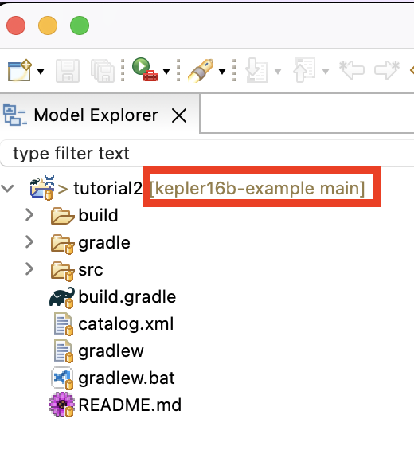

# Tutorial 3: OML CI # {#tutorial3}

Note: This tutorial builds on the project developed in [Tutorial 2](#tutorial2). Please do that first before proceeding.

## Learning Objectives ## {#tutorial3-learning-objectives}

Managing an OML project in a git repository makes a lot of sense since OML models are textual artifacts. One of the biggest advantages of managing source files in a git repo is that it is easy to setup a continuous integration (CI) pipeline that builds the source on every commit. This mechanism to centralize and automate the build process is especially important to help foster collaboration on a project without sacrificing its quality as it detects problems early. 

By the end of this tutorial, readers will be able to:

1. Setup a Git repository for OML projects:
2. Setup CI pipelines for OML repositories
3. Use CI pipeline to detect OML syntactic errors 
4. Use CI pipeline to detect OML semantic errors

Note: The source files created in this tutorial are available for reference in this [repository](https://github.com/opencaesar/kepler16b-example), but we encourage the reader to recreate them by following the instructions below.

## Setup Git Repository ## {#tutorial3-setup-git-repository}

In this step, we will create a new Github repo and push the OML project from [Tutorial 2](#tutorial2) to it using the [Git CLI](https://git-scm.com/book/en/v2/Getting-Started-Installing-Git).

1. Open a web browser. navigate to your favorite Github organization and select the `New Repository` button. Set the name of the repo to `kepler16b-example` and the other settings as shown below. Finally, click the `Create Repository` button.

	

2. In your OML Rosetta workspace, right-click on the `tutorial2` project, select Proprties action, and note the `Location` path.

	

3. Open the `Terminal` application on your machine, navigate to the project's path, and initialize the repo using the following commands:

```shell
$ cd path/to/tutorial2
$ git init
$ git remote add origin git@github.com:OWNER/kepler16b-example.git
$ git pull
```
Replace OWNER by your new Github repo's owner.

4. Stage, commit, and push the project to the Github remote repository using the following commands:

```shell
$ git add .
$ git commit -m "initial commit"
$ git push --set-upstream origin main -f
```

5. In your web browser, refresh the repo's page. You should now see the repository looking like this:

	

6. In the OML Rosetta workspace, right click on the project and choose Refresh.

	

  > Your project should now show as being managed in the github repo.

	

## Setup CI Pipeline ## {#tutorial3-setup-ci-pipeline}

In this step, we will create a CI pipeline for the repository using Github Actions. The pipeline (called a workflow in Github Actions) will build the project on every commit.

1. In a web browser, navigate to your repo's web page, and click on the Actions tab.

	

2. In the Actions page, click on the `Configure` button of the `Simple workflow`.

	

3. In the path, rename the file to `ci.yml`.

	

4. Replace the file contents by the following code:

```yaml
name: CI/CD

on:
  push:
    branches: [ "main" ]
  pull_request:
    branches: [ "main" ]

permissions:
  contents: read

jobs:
  build:
    runs-on: ubuntu-latest
    steps:
    - name: Checkout
      uses: actions/checkout@v3
    - name: Setup JDK
      uses: actions/setup-java@v3
      with:
        java-version: '17'
        distribution: 'temurin'
    - name: Setup Gradle
      uses: gradle/gradle-build-action@v2
    - name: Build
      run: ./gradlew build
    - name: Upload
      if: ${{ always() }}
      uses: actions/upload-artifact@v3
      with:
        name: build
        path: build/
```

The CI workflow above has a single job called `build` with 5 named: Check, Setup JDK, Setup Gradle, Build (runs the DL reasoner) and Upload (uploads the `build` folder as an artifact for later inspection in case of error).

5. Push the `cy.yml` file to the repo and watch the first workflow run complete successfully.

	<video width="100%" style="border:1px groove black;" controls>
		<source src="assets/tutorial3/First-CI-Build.mp4">
	</video>

3. Back in OML Rosetta,  Right click on the project and select Team -> Pull. A pull results dialog will open. Press the button to close it.

Note: this last step is needed to refresh the local clone of the repo with the changes we committed on the remote on Github.

## Detect Syntactic Error ## {#tutorial3-push-syntactic-error}

In OML Rosetta, create a new branch, add a syntactic error (an invalid cross-reference) to the OML files, and push it. Watch how the CI workflow detects the error. Then, undo the change and push to watch how the workflow succeeds again.

	<video width="100%" style="border:1px groove black;" controls>
		<source src="assets/tutorial3/Second-CI-Build.mp4">
	</video>

## Detect Semantic Error ## {#tutorial3-push-semantic-error}

In OML Rosetta, in the same branch (created in the previous step), add a semantic error (an assembly contained by two assemblies which is a violation of the `base:contains` relation being inverse functional) to the OML files to see how the CI workflow detects the error. Then, undo the change and push to watch how the workflow succeeds again.

	<video width="100%" style="border:1px groove black;" controls>
		<source src="assets/tutorial3/Third-CI-Build.mp4">
	</video>

## Summary ## {#tutorial3-summary}

In the realm of OML projects, efficient collaboration and project integrity are paramount. This tutorial serves as a comprehensive guide, detailing the strategic management of OML projects within Git repositories, fortified by Continuous Integration (CI) pipelines. Through a step-by-step approach, the tutorial expertly navigates learners through the intricacies of project management on GitHub repositories, followed by the establishment of robust CI pipelines using GitHub Actions. A focal point of the tutorial lies in the demonstration of how these pipelines can adeptly identify both syntactic and semantic errors in commits pushed to the repository. By embracing these methodologies, professionals can elevate project collaboration, fortify quality control, and ensure the consistent enhancement of OML projects within a collaborative environment.