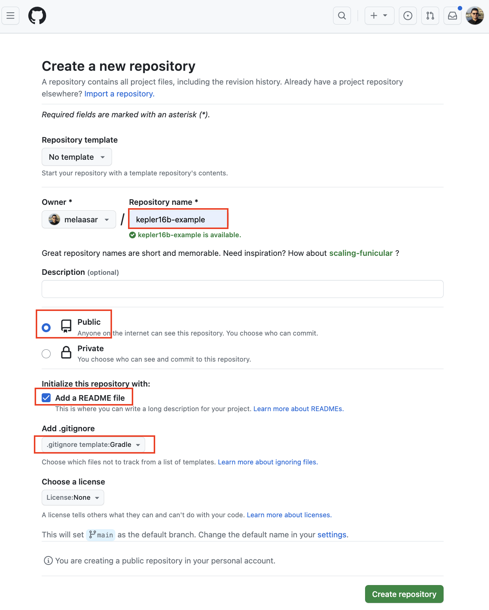
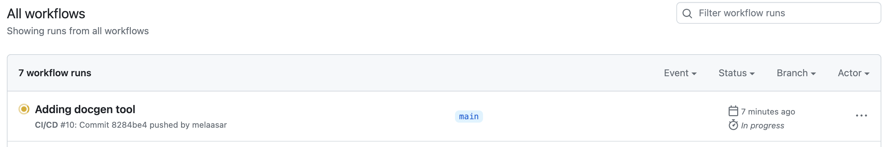

# Tutorial 4: OML CI/CD # {#tutorial4}

Note: This tutorial builds on the project developed in [Tutorial 3](#tutorial3). Please do that first before proceeding.

## Learning Objectives ## {#tutorial4-learning-objectives}
Managing an OML project in a git repository makes a lot of sense. First, OML models are textual files, which allows git to edit them natively. Second, all the OML workbenches already support git. Third, the VS Code extension for OML supports editing OML files in the cloud (and even in the browser in the future). Finally, the products of an OML project, typically documents, can be published online in git directly. Following the best practices of model-based development, such documents should be produced automatically from models through a rigorous and repeatable process. This is possible to achieve thanks to the process of Continuous Integration of Delivery (CI/CD) that is supported by most git repos.

This tutorial teaches the following skills:

- How to manage an OML project in a git repository
- How to setup a CI/CD process in the git repository to build the project on each commit
- How to publish OML Doc for an OML project and update it on each commit
- How to publish a Jupyter Notebook for an OML project and update it on each commit

Note: The source files created in this tutorial are available for reference in this [repository](https://github.com/opencaesar/kepler16b-example), but we encourage the reader to recreate them by following the instructions below.

## Manage Project in Git ## {#tutorial4-manage-project-in-git}
In this step, we will create a Github repo for the project and push it there using the [Git CLI](https://git-scm.com/book/en/v2/Getting-Started-Installing-Git).

1. Open a web browser. navigate to your Github organization and select the `New Repository` button. Set the name of the repo to `kepler16b-example` and the other settings as shown below. Finally, click the `Create Repository` button.

	

2. Back in your OML Rosetta workspace, right-click on the `tutorial2` project, select Proprties action, and note the `Location` path.

	

3. Open the `Terminal` application on your machine, navigate to the project's path, and initialize the repo using the following commands:

```shell
$ cd path/to/tutorial2
$ git init
$ git remote add origin git@github.com:OWNER/kepler16b-example.git
$ git pull
```

Note: Replace OWNER by your new Github repo's owner.

4. Stage, commit, and push the project to the Github remote repo using the following commands:

```shell
$ git add .
$ git commit -m "initial commit"
$ git push --set-upstream origin main -f
```

5. In your web browser, refresh the repo's page. You should now see the repository looking like this:

	

6. In the OML Rosetta workspace, right click on the project and choose Refresh.

	

## Setup CI/CD Process ## {#tutorial4-setup-ci-cd-process}
In this step, we will use Github Actions to create a CI/CD workflow that builds the project and run queries on any commit.

1. In a web browser, navigate to your repo's web page, and click on the Actions tab.

	

2. In the Actions page, click on the `Configure` button of the `Simple workflow`.

	

3. In the path, rename the file to `ci.yml`.

	

4. Replace the file contents by the following code:

```yaml
name: CI/CD

on:
  push:
    branches: [ "main" ]
  pull_request:
    branches: [ "main" ]

permissions:
  contents: read

jobs:
  build:
    runs-on: ubuntu-latest
    steps:
    - name: Checkout
      uses: actions/checkout@v3
    - name: Set up JDK 17
      uses: actions/setup-java@v3
      with:
        java-version: '17'
        distribution: 'temurin'
    - name: Setup Gradle
      uses: gradle/gradle-build-action@v2
    - name: Build
      run: ./gradlew build
	- name: Query
      run: ./gradlew startFuseki owlQuery stopFuseki
    - name: Upload
      if: ${{ always() }}
      uses: actions/upload-artifact@v3
      with:
        name: build
        path: build/
```

Note: The CI script above has a single job called `build` with 6 steps. The first 3 checkout the repo, setup jdk, and setup gradle. The next 3, build the project (which run the DL reasoner), run the SPARQL queries, and upload the build folder (for inspection in case of error).

5. Commit the CI file and watch the first CI run complete successfully.

	<video width="100%" style="border:1px groove black;" controls>
		<source src="assets/tutorial4/First-CI-Build.mp4"/>
	</video>

6. Now, We will create a new branch, add a syntax error in the OML model (cross referencing a non-existing element) in it, commit it to the repo, and see how the CI workflow detects it. After that, we will undo the change to fix it.

	<video width="100%" style="border:1px groove black;" controls>
		<source src="assets/tutorial4/Second-CI-Build.mp4"/>
	</video>

7. Then, we will add a semantic error in the OML model (make an assembly contained by two containers) to see how the CI workflow detects it (by finding the inverse functional `base:contains` relation violated in this case). After that, we will undo the change to fix it.

	<video width="100%" style="border:1px groove black;" controls>
		<source src="assets/tutorial4/Third-CI-Build.mp4"/>
	</video>

## Publish OML Doc ## {#tutorial4-publish-oml-doc}
Now that we established a basic CI workflow, we can now add the CD part by publishing default documentation from the OML project on each commit. The openCAESAR project provides a tool called [owl-doc-gradle](https://github.com/opencaesar/owl-tools/tree/master/owl-doc) that generates default documentation for a given OML datasets (we obtain such dataset by converting the OML dataset to OWL). We will use this tool to generate the default documentation.

1. In your web browser, navigate to the repo's URL, click on the Settings tab, then on the Pages tab (on the right).

2. Under Build and Deployment, source, select the `Github Actions` from the drop down menu.

Note: This instructs Github to use the `ci.yml` that we previously created to publish a web site for the repo.

3. In OML Rosetta workspace, modeling perspective, right click on the project and select Team -> Switch To -> main.

4. Right click on the project again and select Team -> Pull. A pull results dialog will open. Press the button to close it.

5. Navigate to the `build.gradle` file and double click it to open its editor.

6. Find the `dependencies` clause within the `buildscript` clause, and add a new dependency on the `owl-doc-gradle` tool on the top:

```scala
buildscript {
	repositories {
        ...
	}
	dependencies {
        classpath 'io.opencaesar.owl:owl-doc-gradle:2.+'
        ...
	}
}
```

7. Find a task called `owlReason`, copy/paste the following task right after it, and save the `build.gradle` file.

```scala
/*
 * A task to generate documentation for the OWL catalog
 * @seeAlso https://github.com/opencaesar/owl-tools/blob/master/owl-doc/README.md
 */
task generateDocs(type: io.opencaesar.owl.doc.OwlDocTask, dependsOn: owlReason) {
    // OWL catalog
    inputCatalogPath = file('build/owl/catalog.xml')
    // OWL catalog title
    inputCatalogTitle = 'Kepler16b'
    // OWL Ontology Iris
    inputOntologyIris = [ "$rootIri/classes", "$rootIri/properties",  "$rootIri/individuals" ]
    // Output folder
    outputFolderPath = file('build/doc')
    // Output case sensitivie path
    outputCaseSensitive = org.gradle.internal.os.OperatingSystem.current().isLinux()
}
```

Note: that `generateDocs` task is typed by `OwlDocTask` and declares that it dependends on `owlReason`, which itself depends on `omlToOwl`. We configured it this way because a) it requires the dataset to be in OWL format, and b) we like to include the entailments in the docs. If we do not need (b), then we can change it to depend on `omlToOwl` directly and change the `inputONtologyIris` param to [ "$rootIri" ].

8. In the Model Explorere view's toolbar, click on the View menu (vertical dots), and select Filters and Customization action.

	

9. In the dialog, uncheck the `*.resources` box. Click OK.

10. Navigate to the `.github/workflows/ci.yml` file and double click it to open its editor.

11. At the end of the `build` job, append the following 2 steps:

```yaml
    - name: Generate Documents
      run: ./gradlew generateDocs
    - name: Publish
      uses: actions/upload-pages-artifact@v1
      with:
        path: build/doc/
```

Note: The first step invokes the generateDocs task, and the second step uloads its output (`build/doc` folder`) as a Github Pages artifact.

12. Add the following new `deploy` job after the `build` job (separate them by an empty line). Save the editor.

```yaml
  deploy:
    needs: build
    permissions:
      pages: write
      id-token: write
    environment:
      name: github-pages
      url: ${{ steps.deployment.outputs.page_url }}
    runs-on: ubuntu-latest
    steps:
      - name: Deploy
        id: deployment
        uses: actions/deploy-pages@v1
```

Note: The `deploy` job publishes the Github Pages artifact to be the repo's web server's content.

13. Switch to the `Git` perspective, focus on the Git Staging view, stage the ci.yml file, write a commit message (e.g., adding docgen), and press the `Commit and Push` button.

14. In your web browser, navigate to the repo's URL, and click on the Actions tab. You should see the CI workflow running.

	

15. Once it finishes successfully (green tick), click on the run liml, and under the `deploy` step, click on the URL. You should see a page that looks like this:

	

Note: Try to browse the generated documentation to be familiar with it. As an exercise, make a change to one of the OML description files (e.g., change one of the element's descriptions) and push it. Observe how this triggers the CI workflow to rerun to update the documentation.

## Publish Jupyter Notebook ## {#tutorial4-generate-jupyter-nb}

TBD

## Summary ## {#tutorial4-summary}

TBD