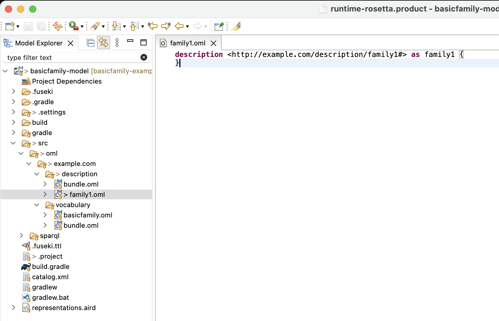

# Tutorial 5: OML Sirius # {#tutorial5}

Note: This tutorial builds on the skills learned in [Tutorial 1](#tutorial1). Please do that first before proceeding.

## Learning Objectives ## {#tutorial5-learning-objectives}

Welcome to this enlightening tutorial where we will explore the versatile capabilities of the [Sirius](https://eclipse.dev/sirius/) framework and how it simplifies the process of authoring OML models within the [Rosetta](https://github.com/opencaesar/oml-rosetta) workbench. Throughout this tutorial, we will embark on a journey to create an OML project, where we harness the power of built-in Sirius-based editors and viewers to not only author but also visually depict OML models. But that's not all—our expedition continues as we venture into the creation of a Sirius viewpoint project, where we will craft user-friendly, domain-specific editors tailored for the seamless authoring of description models. This approach is a game-changer, significantly reducing the learning curve for OML users who may find working with a graphical user interface more intuitive than a traditional textual editor. Finally, we will get another glimpse of the powerful analysis capabilities of OML.

Upon completing this tutorial, you will gain the following essential skills:

- Proficiency in utilizing the built-in OML diagram editors as a compelling alternative to the conventional OML text editor for authoring and visualizing OML models.
- The ability to craft tailor-made editors and viewers that cater to specific domains, ensuring an exceptionally user-friendly experience when authoring OML description models.
- Empowerment to conduct analyses seamlessly within the authoring views and as part of comprehensive analysis scripts.

Prepare to embark on a transformative journey, as this tutorial equips you with the tools and knowledge to harness the full potential of OML with the assistance of the [Sirius](https://eclipse.dev/sirius/) framework. By the end, you'll be well-equipped to navigate the world of OML modeling and analysis with confidence and finesse. Let's get started!

Note: The source files created in this tutorial are available for reference in this [repository](https://github.com/opencaesar/basicfamily-example), but we encourage the reader to recreate them by following the instructions below.

## Create OML Model Project ## {#tutorial5-create-oml-model-project}

In this step, we will create a new OML project called `basicfamily-model` in the Rosetta workbench. This process should already be familiar from [Tutorial 1](#tutorial1-create-oml-project). 

1. Right click in the [=Model Explorer view=] and select New -> OML Project.
2. Enter the project name as `basicfamily-model`. Press Next.
3. Enter the project details as shown below. Press Finish.

	

4. The `basicfamily-model` project should now be visible in the [=Model Explorer view=].

5. Expand the `basicfamily-model` project node in the [=Model Explorer view=] as shown in the image below.

	

## Create OML Vocabulary ## {#tutorial5-create-oml-vocabulary}

In the step, we will create a vocabulary called `basicfamily`, which is the OML equivalent of an [Ecore metamodel](https://wiki.eclipse.org/Sirius/Tutorials/DomainModelTutorial) that is published as an example with the Sirius framework. Unlike in previous tutorials, we will use the built-in Sirius-based OML vocabulary diagram editor.

1. Right click on the `src/oml/example.com` subfolder in the [=Model Explorer view=] and select New -> OML Model.

2. Enter the details of the `basicfamily` vocabulary as shown below. Press Finish.

	

3. The `basicfamily` vocabulary will be created and its OML editor opens.

	

> Before we can use any Sirius-based viewpoints, we need to convert the project to what Sirius calls a `Modeling Project`.

4. Right-click on the `basicfamily-model` project in the [=Model Explorer view=] and select "Configure -> Convert to Modeling Project".

	

> Before we can use the built-in Vocabulary viewpoint, which provides the vocabulary diagram editor, we need to enable the viewpoint on the project.

5. Right-click on the on the `basicfamily-model` project in the [=Model Explorer view=] and select "Viewpoints Selection".

	

6. Check the "Vocabularies" box and click OK. This activates the ability to create vocabulary diagrams in the project.

	

> Now, we are ready to create a vocabulary diagram for `basicfamily` vocabulary to use it as an alternative editor to the OML text editor.

7. Navigate to the `basicfamily.oml` file in the [=Model Explorer view=] and expand it to show the root vocabulary element. Right-click on the element and select "New Representation -> Basicfamily Editor".

	

8. The New Vocabulary Editor dialog opens up to allow you to customize the diagram name. In this case, we will keep the default name and click OK.

	

9. In order to observe how the graphical syntax is synchronized with the textual syntax, drag the diagram editor using its title bar and dock it to the right of the text editor.

   <video width="100%" style="border:1px groove black;" controls>
     <source src="assets/tutorial5/Dock-Vocabulary-Diagram.mov"/>
   </video>

10. We will now use the Vocabulary diagram editor to author the vocabulary. Follow the steps in the video below and save the editor regularly to see the corresponding textual syntax.

   <video width="100%" style="border:1px groove black;" controls>
     <source src="assets/tutorial5/Create-Basicfamily-Vocabulary.mov"/>
   </video>

11. If you have done the visual authoring all correct, you should end up with the following OML text in `basicfamily.oml`.

Note: that the order of the statements below may be slightly different for you if you created the diagram elements in different order from the video.

```scala
vocabulary <http://example.com/vocabulary/basicfamily#> as basicfamily {

	extends <http://www.w3.org/2001/XMLSchema#> as xsd

	aspect Named

	scalar property name [
		domain Named
		range xsd:string
		functional
	]

	concept Family < Named

	concept Person < Named [
		restricts parents to max 2
	]

	relation members [
		from Family
		to Person
	]

	concept Man < Person

	concept Woman < Person

	relation parents [
		from Person
		to Person
		reverse children
	]

	relation mother [
		from Person
		to Woman
		functional
	]

	relation father [
		from Person
		to Man
		functional
	]
}
```

> Notice that the vocabulary diagram editor does not yet have feature parity with the textual editor in terms of its ability to author the full OML syntax. However, we intend to make incremental progress towards this goal with every release (if you want us to prioritize this, let us know). On the other hand, the editor's visualization capabilities are more complete. Since the textual and diagram editors are always in sync, a modeler could easily switch back and forth between them to edit the vocabulary.

12. In the OML textual editor for `basicfamily.oml`, add specialization from relations `mother` and `father` to relation `parents`.

```scala
	relation mother [
		from Person
		to Woman
		functional
	] < parents

	relation father [
		from Person
		to Man
		functional
	] < parents
```

> Finally, we want to create an OML vocabulary bundle that includes the `basicfamily` vocabulary.

13. The `basicfamily` vocabulary diagram now looks like this (notice the `{subsets parents}` on relation `mother` and `father`).

	

14. Right-click on the `src/oml/example.com/vocabulary` folder in [=Model Explorer view=] and select New -> OML Model. Fill in the diagram like in the picture. Click Finish.

	

15. In the open editor for `bundle.oml`, add an include statement for `basicfamily` like this:

```scala
vocabulary bundle <http://example.com/vocabulary/bundle#> as ^bundle {
	
	includes <http://example.com/vocabulary/basicfamily#>
}
```

Note: Recall that a vocabulary bundle automatically asserts disjointness between included concepts with no common subtypes.

## Create OML Description ## {#tutorial5-create-oml-description}

In this step, we will create an OML description model using the OML textual editor, then visualize it with the built-on OML description diagram.

> Compared with the built-in vocabulary diagram which has authoring capabilities, th built-in OML description diagram only has visualization abilities (so far).

1. Right click on the `src/oml/example.com/description` subfolder in the [=Model Explorer view=] and select New -> OML Model.

2. Enter the details of the `family1` description as shown below. Press Finish.

	

3. The `family1` description will be created and its OML editor opens.

	

> We will now use the text editor to create an OML description model defining `family1`, its men and women members, and their interrelationships.

4. Copy the following OML text and paste it as the new content of the open editor.

```scala
description <http://example.com/description/family1#> as family1 {

	uses <http://example.com/vocabulary/basicfamily#> as basicfamily

	instance family1 : basicfamily:Family [
		basicfamily:members Paul
		basicfamily:members Isa
		basicfamily:members Elias
		basicfamily:members Lea
		basicfamily:members Dave
		basicfamily:members Alain
		basicfamily:members Bryan
		basicfamily:members Fiona
		basicfamily:members Katell
		basicfamily:members Clara
		basicfamily:members Albert
		basicfamily:members Jane
		basicfamily:members Peter
	]

	instance Paul : basicfamily:Man

	instance Isa : basicfamily:Woman

	instance Elias : basicfamily:Man [
		basicfamily:father Paul
		basicfamily:mother Isa
	]

	instance Lea : basicfamily:Woman [
		basicfamily:father Paul
		basicfamily:mother Isa
	]

	instance Dave : basicfamily:Man [
		basicfamily:father Elias
	]

	instance Alain : basicfamily:Man [
		basicfamily:father Dave
		basicfamily:mother Katell
	]

	instance Bryan : basicfamily:Man [
		basicfamily:father Elias
	]

	instance Fiona : basicfamily:Woman [
		basicfamily:father Elias
	]

	instance Katell : basicfamily:Woman

	instance Clara : basicfamily:Woman [
		basicfamily:father Elias
	]

	instance Albert : basicfamily:Man

	instance Jane : basicfamily:Woman [
		basicfamily:mother Fiona
	]

	instance Peter : basicfamily:Man [
		basicfamily:mother Clara
	]
}
```

> We will now visualize the `family1.oml` model using the built-in Sirius-based description diagram.

5. Right-click on the `basicfamily-model` project in the [=Model Explorer view=] and select "Viewpoints Selection". In the dialog, check the "Descriptions" box and click OK.

	

> Now, we are ready to create a description diagram for `family1.oml`.

6. Navigate to `family1.oml` in the [=Model Explorer view=] and expand it to reveal the root description. Right-click on the description and select "New Representation -> Family1 Viewer". In the opened dialog, leave the default name and click OK.

	

> The `Family1 Viewer` diagram opens with visualization of the model content. You will notice that the diagram is a bit busy since the `family1` instance, which is related to all family members using the `members` relation is visualized. Deleting this node from the diagram and rearranging the remaining nodes improves the layout.

7. Follow the few steps in the video below to improve the layout of the diagram.

   <video width="100%" style="border:1px groove black;" controls>
     <source src="assets/tutorial5/Create-Family1-Diagram1.mov"/>
   </video>

8. The final diagram should look like this now.

	

> Notice that although the diagram looks reasonable is still hard to read. Also, while you can make notational/stylistic changes to the diagram, you cannot use it to edit the description model. In the next section, we will develop a custom diagram to improve both aspects.

> Finally, we want to add the `family1` description to the description bundle and make the latter use the `basicfamily` vocabulary.

9. Navigate in [=Model Explorer view=] to the `src/oml/example.com/description/bundle.oml` file and double click it to open its OML textual editor.

10. In the open editor for `bundle.oml`, replace the contents with the following. Save the editor.

```scala
description bundle <http://example.com/description/bundle#> as ^bundle {
	
	uses <http://example.com/vocabulary/basicfamily#>
	
	includes <http://example.com/description/family1#>
}
```
Note: Recall that a description bundle represents a closed dataset that we want to reason on.

## Create Sirius Viewpoint Project ## {#tutorial5-create-sirius-viewpoint-project}

In this step, we will use Sirius to develop a custom diagram for the `basicfamily` vocabulary that a) improves the notation/style, and b) allows for editing the description model. In order to do this in Sirius, we need to define what Sirius calls a Viewpoint Specification Project.

1. In the [=Model Explorer view=], right click on an empty area and choose New -> Project -> Sirius -> Viewpoint Specification Project.

2. Give the project the name `basicfamily-viewpoint` and click Next.

3. In the Viewpoint Specification Model page, rename the model to simply `basicfamily.odesign` then click Finish.

> The project shows up in the [=Model Explorer view=] and its editor opens up.

4. Drag and dock it to the right of the working area. Your screen should now look like this.

	

5. In the odesign editor, expand the tree to reveal a viewpoint node called `MyViewpoint`. Select it and then in the Property Sheet view, rename it to `persons`. Also set the "Model File Extension" field to `oml`.

	

6. Under the `persons` node, you see another node for a Java service. Select it and edit it its text to `defaultpackage.Services`. 

> This step is only needed since we chose the name of the project to be `basicfamily-viewpoint`, which contains an invalid Java character `-`. Eclipse could not use that name for the root package and instead named it `defaultpackage`.

	

7. Double click the `defaultpackage.Services` node in the tree. It should open a Java editor for the Services class. This is how you know you have configured this correctly. Close the Java editor.

> We will add a few more Java services from the [openCAESAR public API](https://www.opencaesar.io/oml/javadoc/index.html).

8. Navigate in the [=Model Explorer view=] to the file `basicfamily-viewpoint/META-INF/MANIFEST.MF` and double click on it. In the open editor, switch to the `Dependencies` tab. Click the Add button. In the Plug-in Selection dialog, search for `oml` and select the `io.opencaesar.oml` item and click Add.

9. Click the Add button again in the `Dependencies` tab and in the dialog search for `rosetta` and select the `io.opencaesar.rosetta.sirius.viewpoint` item and click Add. Save the `MANIFEST.MF` editor and close it.

Note: The versions of the new dependencies you added will correspond to the version of Rosetta you installed (i.e., they do not have to match the picture).

	

10. Back in the odesign editor, right click on the `defaultpackage.Services` node and select Copy. Then, right click on the `persons` node, and select Paste. Repeat the paste a total of 4 times. Now, click on each of the pasted services and edit them in the Property Sheet view to the following class names. Save the editor after.

- io.opencaesar.oml.util.OmlRead
- io.opencaesar.oml.util.OmlSearch
- io.opencaesar.oml.util.OmlDelete
- io.opencaesar.rosetta.sirius.viewpoint.OmlServices

	

> We need to copy some icons to the `basicfamily-viewpoint` project, so we use them in the definition of the viewpoint.

11. Download [icons.zip](assets/tutorial5/icons.zip) and unzip it. Move the `icons` folder to the root of the `basicfamily-viewpoint` project. 

	

> Finally, we need to activate the new `persons` viewpoint on the `basicfamily-model` project.

12. Right click on the `basicfamily-model` project in the [=Model Explorer view=] and select Viewpoint Selection. Check the `persons` box in the dialog and click OK.

	

> Now, all the editors we will define in the `persons` viewpoint can be used in the `basicfamily-model` project.

## Create Diagram Editor ## {#tutorial5-create-diagram-editor}

In this step, we will define a custom diagram editor for OML description models that use the `basicfamily` OML vocabulary.

1. In the `basicfamily.odesign` editor, right click on the `persons` viewpoint and select New Representation -> Diagram Description.

	

2. Select the newly created diagram node in the editor then click on the Property Sheet view to edit its properties. Switch first on the *Metamodels* tab, click on `Add from registry` button (on the right), type `oml` in the edit box, and select the `http://opencaesar.io/oml` item and click OK.

	

> Now, we will specify that this diagram can be created for a `oml.ConceptInstance` that is typed by the `basicfamily:Family` concept from the vocabulary.

3. In the Property Sheet view, switch to the *General* tab and make the following modifications:

    <pre no-line-numbers style="background: rgba(0, 0, 0, .03)">
    <b>General</b>:
    - <b>Id</b>: Persons diagram
    - <b>Domain Class</b>: oml.ConceptInstance
    - <b>Precondition Expression</b>: aql:self.findIsKindOf('basicfamily:Family')
    </pre>

	

> We will now create two kinds of nodes within the diagram, one for a Man and one for a Woman (the two kind of Person from the vocabulary).

4. In the `basicfamily.odesign` editor, expand the `Persons diagram` node to reveal the `Default` node. Right click on that node and select New Diagram Element -> Node. In the Property Sheet, enter the following information for the node:

    <pre no-line-numbers style="background: rgba(0, 0, 0, .03)">
    <b>General</b>:
    - <b>Id</b>: ManNode
    - <b>Domain Class</b>: oml.ConceptInstance
    - <b>Semantic Candidates Expression</b>: aql:self.findTargetInstances('basicfamily:members')
    <b>Advanced</b>:
    - <b>Precondition Expression</b>: aql:self.findIsKindOf('basicfamily:Man')
    </pre>

5. In the `basicfamily.odesign` editor, right click on the `ManNode` node and select New Style -> Workspace Image. In the Property Sheet, change the following:

    <pre no-line-numbers style="background: rgba(0, 0, 0, .03)">
    <b>General</b>:
    - <b>Image Path</b>: /basicfamily-viewpoint/icons/man.svg
    <b>Label</b>:
    - <b>Show Icon</b>: false
    - <b>Label Position</b>: border
    <b>Corner</b>:
    - <b>Arc Height</b>: 1
    - <b>Arc Width</b>: 1
    <b>Advanced</b>:
    - <b>Size Computation Expression</b>: 4
    </pre>

6. In the `basicfamily.odesign` editor, right click on the `ManNode` node and select Copy. Select the `Default` node, right click and select Paste. In the Property Sheet, change the following information only:

    <pre no-line-numbers style="background: rgba(0, 0, 0, .03)">
    <b>General</b>:
    - <b>Id</b>: WomanNode
    <b>Advanced</b>
    - <b>Precondition Expression</b>: aql:self.findIsKindOf('basicfamily:Woman')
    </pre>

> We will now create two kinds of edges within the diagram, one for the `basicfamily:father` relation and one for a `basicfamily:mother` relation (from the vocabulary).

7. In the `basicfamily.odesign` editor, right click on the `Default` node and select New Diagram Element -> Relation Based Edge. In the Property Sheet, change the following:

    <pre no-line-numbers style="background: rgba(0, 0, 0, .03)">
    <b>General</b>:
    - <b>Id</b>: FatherEdge
    - <b>Source Mapping</b>: ManNode, WomanNode
    - <b>Target Mapping</b>: ManNode
    - <b>Target Finder Expression</b>: aql:self.findTargetInstances('basicfamily:father')
    </pre>

8. In the `basicfamily.odesign` editor, expand the `fatherEdge` node and select the nested Edge Style node. In the Property Sheet, change the following:

    <pre no-line-numbers style="background: rgba(0, 0, 0, .03)">
    <b>Color</b>:
    - <b>Stroke Color</b>: blue
    </pre>

9. In the `basicfamily.odesign` editor, right click on the `fatherEdge` node and select Copy. Select the `Default` node, right click and select Paste. In the Property Sheet, change the following information only:

    <pre no-line-numbers style="background: rgba(0, 0, 0, .03)">
    <b>General</b>:
    - <b>Id</b>: MotherEdge
    - <b>Target Mapping</b>: WomanNode
    - <b>Target Finder Expression</b>: aql:self.findTargetInstances('basicfamily:mother')
    </pre>

10. In the `basicfamily.odesign` editor, expand the `motherEdge` node and select the nested Edge Style node. In the Property Sheet, change the following:

    <pre no-line-numbers style="background: rgba(0, 0, 0, .03)">
    <b>Color</b>:
    - <b>Stroke Color</b>: purple
    </pre>

> Save the `basicfamily.odesign` editor. Now, we will create an instance of this diagram editor in the description model.

11. In the [=Model Explorer view=], navigate to the file `basicfamily-model/src/oml/example.com/description/family1.oml`. Expand the file's node to reveal the root `description` node. Right click the nested `family1` node and select New Representation -> new Persons diagram. Rename the diagram to `Persons diagram`. Click OK.

	

12. The new diagram editor opens. Drag it and dock it to the right editor stack. It should look like this:

	

> When compared to the built-in description diagram, the new custom diagram is much more concise and readable. So far, this is a viewer only, now we will turn it into an editor. We will start by adding tools to create Man and Woman nodes.

13. In the `basicfamily.odesign` editor, right click on the `Default` node and select New Tool -> Section. In the property sheet, change the following:

    <pre no-line-numbers style="background: rgba(0, 0, 0, .03)">
    <b>General</b>:
    - <b>Id</b>: Tools
    </pre>

14. Right click on the `Tools` node and select New Element Creation -> Node Creation. In the property sheet, change the following:

    <pre no-line-numbers style="background: rgba(0, 0, 0, .03)">
    <b>General</b>:
    - <b>Id</b>: createMan
    - <b>Label</b>: Man
    - <b>Node Mapping</b>: ManNode
    <b>Advanced</b>:
    - <b>Icon Path</b>: /basicfamily-viewpoint/icons/man.gif
    </pre>

15. Expand the `Node Creation Man` node and right click on the nested `container` node and select New Variable -> Expression Variable. In the property sheet, change the following:

    <pre no-line-numbers style="background: rgba(0, 0, 0, .03)">
    <b>General</b>:
    - <b>Name</b>: context
    - <b>Label</b>: aql:container.getDescription()
    </pre>

16. Copy the `context` variable and paste it under the same `container` variable. In the property sheet, change the following:

    <pre no-line-numbers style="background: rgba(0, 0, 0, .03)">
    <b>General</b>:
    - <b>Name</b>: containerInstance
    - <b>Label</b>: aql:container.oclAsType(oml::ConceptInstance)
    </pre>

17. Right click on the nested `Begin` node, select New Operation -> Change Context. In the property sheet, change the following:

    <pre no-line-numbers style="background: rgba(0, 0, 0, .03)">
    <b>General</b>:
    - <b>Browse Expression</b>: aql:context.createConceptInstance('basicfamily:Man', containerInstance, 'basicfamily:members')
    </pre>

18. Right click on the new `Change Context...` node, select New Operation -> Set. In the property sheet, change the following:

    <pre no-line-numbers style="background: rgba(0, 0, 0, .03)">
    <b>General</b>:
    - <b>Feature Name</b>: name
    - <b>Value Expression</b>: aql:context.getNewMemberName('man')
    </pre>

19. Copy the `Node Creation Man` node and paste it in the `Section Tools` node. In the property sheet, change the following:

    <pre no-line-numbers style="background: rgba(0, 0, 0, .03)">
    <b>General</b>:
    - <b>Id</b>: createWoman
    - <b>Label</b>: Woman
    - <b>Node Mapping</b>: WomanNode
    <b>Advanced</b>:
    - <b>Icon Path</b>: /basicfamily-viewpoint/icons/woman.gif
    </pre>

20. Expand the `Node Creation Woman` node and select the nested `Change Context...` node. In the property sheet, change the following:

    <pre no-line-numbers style="background: rgba(0, 0, 0, .03)">
    <b>General</b>:
    - <b>Browse Expression</b>: aql:context.createConceptInstance('basicfamily:Woman', containerInstance, 'basicfamily:members')
    </pre>

21. Select the nested `Set` node. In the property sheet, change the following:

    <pre no-line-numbers style="background: rgba(0, 0, 0, .03)">
    <b>General</b></b>:
    - <b>Value Expression</b>: aql:context.getNewMemberName('woman')
    </pre>

> Now, we will add tools to create Father and Mother edges.

22. Right click on the `Tools` node and select New Element Creation -> Edge Creation. In the property sheet, change the following:

    <pre no-line-numbers style="background: rgba(0, 0, 0, .03)">
    <b>General</b></b>:
    - <b>Id</b>: createFather
    - <b>Label</b>: Father
    - <b>Edge Mapping</b>: FatherEdge
    <b>Advanced</b>:
    - <b>Icon Path</b>: /basicfamily-viewpoint/icons/father.png
    </pre>

23. Expand the `Edge Creation Father` node and right click on the nested `source` node and select New Variable -> Expression Variable. In the property sheet, change the following:

    <pre no-line-numbers style="background: rgba(0, 0, 0, .03)">
    <b>General</b></b>:
    - <b>Name</b>: context
    - <b>Label</b>: aql:source.getDescription()
    </pre>

24. Copy the `context` variable and paste it under the `source` variable. In the property sheet, change the following:

    <pre no-line-numbers style="background: rgba(0, 0, 0, .03)">
    <b>General</b></b>:
    - <b>Name</b>: sourceInstance
    - <b>Label</b>: aql:source.oclAsType(oml::ConceptInstance)
    </pre>


25. Copy the `sourceInstance` variable and paste it under the `target` variable. In the property sheet, change the following:

    <pre no-line-numbers style="background: rgba(0, 0, 0, .03)">
    <b>General</b></b>:
    - <b>Name</b>: targetInstance
    - <b>Label</b>: aql:target.oclAsType(oml::ConceptInstance)
    </pre>

26. Right click on the `Begin` node of the tool and select New Operation -> Change Context. In the property sheet, change the following:

    <pre no-line-numbers style="background: rgba(0, 0, 0, .03)">
    <b>General</b></b>:
    - <b>Browse Expression</b>: aql:context.addPropertyValue(sourceInstance, 'basicfamily:father', targetInstance)
    </pre>

27. Copy the `Edge Creation Fatehr` node and paste it under the `Tools` node. In the property sheet, change the following:

    <pre no-line-numbers style="background: rgba(0, 0, 0, .03)">
    <b>General</b></b>:
    - <b>Id</b>: createMother
    - <b>Label</b>: Mother
    - <b>Edge Mapping</b>: MotherEdge
    <b>Advanced</b>:
    - <b>Icon Path</b>: /basicfamily-viewpoint/icons/mother.png
    </pre>

28. Navigate to the nested `Begin` -> `Change Context...` node. In the property sheet, change the following:

    <pre no-line-numbers style="background: rgba(0, 0, 0, .03)">
    <b>General</b></b>:
    - <b>Browse Expression</b>: aql:context.addPropertyValue(sourceInstance, 'basicfamily:mother', targetInstance)
    </pre>

> Now that we created four create tools, we will create a couple of delete (from model) tools. 

> The first is `Recursive` delete, which when run on an instance, it deletes the instance and recursively its links (e.g., deleting a Man instance deletes its incoming and outgoing father and mother links).

29. Right click on the `Section Tools` node and select New Element Edition -> Delete Element. In the property sheet, change the following:

    <pre no-line-numbers style="background: rgba(0, 0, 0, .03)">
    <b>General</b></b>:
    - <b>Id</b>: Recursive
    - <b>Mappings</b>: ManNode, WomanNode, FatherEdge, MotherEdge
    </pre>

30. Expand the `Delete Element Recursive` node, right click on the `Begin` node and select New Operation -> Change Context. In the property sheet, change the following:

    <pre no-line-numbers style="background: rgba(0, 0, 0, .03)">
    <b>General</b></b>:
    - <b>Browse Expression</b>: aql:self.recursiveDelete()
    </pre>

> The second is `Cascade` delete, which when run on an instance, it deletes the instance, its links, and its related instances based on cascade delete rules. For example, when deleting a `Man` or `Woman` instance, we can configure it to cascade the delete to their children recursively.

31. Right click on the `Section Tools` node and select New Menu -> Operation Action. In the property sheet, change the following:

    <pre no-line-numbers style="background: rgba(0, 0, 0, .03)">
    <b>General</b></b>:
    - <b>Id</b>: Cascade Delete
    - <b>Precondition</b>: ManNode, WomanNode, FatherEdge, MotherEdge
    </pre>

32. Expand the `Operation Action Cascade Delete` node, right click on the `Begin` node and select New Operation -> Change Context. In the property sheet, change the following:

    <pre no-line-numbers style="background: rgba(0, 0, 0, .03)">
    <b>General</b></b>:
    - <b>Browse Expression</b>: aql:self.cascadeDelete()
    </pre>

> The `recursiveDelete` function used in the expression is not provided by the openCAEASR API. Instead, we need to implement it as a service in the viewpoint project itself.

33. In the `basicfamily.odesign` editor, double click on the `defaultpackage.Services` node. This opens a Java editor for the Services class. Replace the content by the following. Save the editor after.

```java
package defaultpackage;

import java.util.ArrayList;
import java.util.HashSet;

import io.opencaesar.oml.NamedInstance;
import io.opencaesar.oml.Relation;
import io.opencaesar.oml.util.OmlDelete;
import io.opencaesar.oml.util.OmlDelete.CascadeDirection;
import io.opencaesar.oml.util.OmlDelete.CascadeRule;
import io.opencaesar.oml.util.OmlRead;
import io.opencaesar.rosetta.sirius.viewpoint.OmlServices;

public class Services {
    
    public void cascadeDelete(NamedInstance instance) {
    	var cascadeRules = new ArrayList<CascadeRule>();
    	
    	Relation parents = (Relation) OmlRead.getMemberByAbbreviatedIri(instance.getOntology(), "basicfamily:parents");
    	cascadeRules.add(new CascadeRule(CascadeDirection.TARGET_TO_SOURCE, null, parents, null, "delete children"));
    	
    	var result = OmlDelete.cascadeDelete(instance, cascadeRules);
    	OmlDelete.recursiveDelete(result);
    }
}
```

> Now that we created the tools, we can use them on the `family1` diagram.

34. In the `family1` diagram, click the palette arrow on the right-hand-side to reveal the node/edge creation tools. Then use the tools to create a `man` and a `woman` that are father and mother of another `man`.

   <video width="100%" style="border:1px groove black;" controls>
     <source src="assets/tutorial5/Use-Diagram-Tools.mov"/>
   </video>

35. Save the diagram and inspect the `family1.oml` file with the OML text editor. It should have the following at the end:

```scala
	instance man : basicfamily:Man

	instance woman : basicfamily:Woman

	instance man1 : basicfamily:Man [
		basicfamily:father man
		basicfamily:mother woman
	]
```

36. Select the family1 diagram editor again, and from the main menu run Undo a few times until the new changes are all undone. Save the editor. Look at the `family1.oml` text editor and observe how the new statements got deleted.

   <video width="100%" style="border:1px groove black;" controls>
     <source src="assets/tutorial5/Undo-Basicfamily-Diagram.mov"/>
   </video>

> Now, we will try the delete tools.

37. In the `family1` diagram, select `Paul` and from the diagram's toolbar select the Delete from Model button. This invokes the Recursive delete tool. After this, undo the delete.

   <video width="100%" style="border:1px groove black;" controls>
     <source src="assets/tutorial5/Recursive-Delete-Paul.mov"/>
   </video>

38. Select `Paul` again and this time right click on it and select Cascade Delete action in the menu. This invokes the Cascade delete tool where it deletes Paul and his offspring. Aftr this, undo the delete. Save the editor.

   <video width="100%" style="border:1px groove black;" controls>
     <source src="assets/tutorial5/Cascade-Delete-Paul.mov"/>
   </video>

## Create Table Editor ## {#tutorial5-create-table-editor}

In this step, we will define a custom table editor for OML description models that use the `basicfamily` OML vocabulary.

1. In the `basicfamily.odesign` editor, right click on the `persons` viewpoint and select New Representation -> Edition Table Description. In the Property Sheet, change the following information:

    <pre no-line-numbers style="background: rgba(0, 0, 0, .03)">
    <b>General</b></b>:
    - <b>Id</b>: Persons table
    - <b>Domain Class</b>: oml.ConceptInstance
    <b>Metamodels</b>:
    - Click `Add from registry` and select `http://opencaesar.io/oml`.
    <b>Advanced</b>:
    - <b>Precondition Expression</b>: aql:self.findIsKindOf('basicfamily:Family')
    </pre>

> Similar to the custom diagram, this enables the custom table to be createable on concept instances of type `basicfamily:Family`. Next, we creat a Line (Row) in the table.

2. Right click on the `Persons table` node and select New Table Element -> Line. In the Property Sheet, change the following:

    <pre no-line-numbers style="background: rgba(0, 0, 0, .03)">
    <b>General</b></b>:
    - <b>Id</b>: PersonLine
    - <b>Domain Class</b>: oml.ConceptInstance
    - <b>Semantic Candidates Expression</b>: aql:self.findTargetInstances('basicfamily:members')
    <b>Label</b>:
    - <b>Header Label Expression</b>: feature:name
    </pre>

3. Right click on the `PersonLine` node and select New Style -> Foreground. In the property sheet, change the following:

    <pre no-line-numbers style="background: rgba(0, 0, 0, .03)">
    <b>Label</b>:
    - <b>Label Size</b>: 11
    </pre>

4. Right click on the `Persons table` node and select New Table Element -> Feature Column. In the property sheet, change the following:

    <pre no-line-numbers style="background: rgba(0, 0, 0, .03)">
    <b>General</b></b>:
    - <b>Id</b>: FatherColumn
    - <b>Feature Name</b>: name
    <b>Label</b>:
    - <b>Header Label Expression</b>: Father
    <b>Advanced</b>:
    - <b>Feature Parent Expression</b>: aql:self.findTargetInstance('basicfamily:father')
    </pre>

5. Right click on the `Persons table` node and select New Table Element -> Feature Column. In the property sheet, change the following:

    <pre no-line-numbers style="background: rgba(0, 0, 0, .03)">
    <b>General</b></b>:
    - <b>Id</b>: MotherColumn
    - <b>Feature Name</b>: name
    <b>Label</b>:
    - <b>Header Label Expression</b>: Mother
    <b>Advanced</b>:
    - <b>Feature Parent Expression</b>: aql:self.findTargetInstance('basicfamily:mother')
    </pre>

6. Right click on the `Persons table` node and select New Table Element -> Feature Column. In the property sheet, change the following:

    <pre no-line-numbers style="background: rgba(0, 0, 0, .03)">
    <b>General</b></b>:
    - <b>Id</b>: ChildrenColumn
    - <b>Feature Name</b>: *
    <b>Label</b>:
    - <b>Header Label Expression</b>: Children
    - <b>Label Expression</b>: aql:self.findTargetInstances('basicfamily:children')->size()
    </pre>

7. Right click on the `Persons table` node and select New Table Element -> Feature Column. In the property sheet, change the following:

    <pre no-line-numbers style="background: rgba(0, 0, 0, .03)">
    <b>General</b></b>:
    - <b>Id</b>: SiblingsColumn
    - <b>Feature Name</b>: *
    <b>Label</b>:
    - <b>Header Label Expression</b>: Siblings
    - <b>Label Expression</b>: aql:self.calculateSiblingsCount()
    </pre>

> This last label expression is not a standard API from openCAESAR, but rather a custom Java function in `basicfamily-viewpoint` project.

8. In `basicfamily.odesign` editor, double click on `defaultpackage.Services` node. This opens a Java editor for `Services` class. Add the following function to the class:

```java
    public int calculateSiblingsCount(NamedInstance self) {
    	var siblings = new HashSet<>();

    	var parents = OmlServices.findTargetInstances(self, "basicfamily:parents");
    	for (var parent : parents) {
    		siblings.addAll(OmlServices.findTargetInstances(parent, "basicfamily:children"));
    	}
    	
    	siblings.remove(self);
    	
    	return siblings.size();
    }
```

> Now, we are not ready to create an instance of the table for the `family1` instance.

9. In the [=Model Explorer view=], navigate to the file `basicfamily-model/src/oml/example.com/description/family1.oml`. Expand the file's node to reveal the root `description` node. Right click the nested `family1` node and select New Representation -> new Persons table. Rename the diagram to `Persons table`. Click OK.

10. The new table editor opens. Drag it and dock it to the right editor stack while docking the diagram to the left stack. Compare the info presented in both the table and the diagram to verify they are in sync.

	

> So far, this table is a viewer only, now we will turn it into an editor. We will start by adding tools to create Man and Woman nodes.

11. In the `basicfamily.odesign` editor, right click on the `Persons table` node and select New Tool -> Create Line Tool. In the property sheet, change the following:

    <pre no-line-numbers style="background: rgba(0, 0, 0, .03)">
    <b>General</b></b>:
    - <b>Id</b>: createManLine
    - <b>Label</b>: New Man
    - <b>Mapping</b>: PersonLine
    </pre>

> Expand the `New Man` node to reveal the variable nodes. 

12. Right click on the `root` variable and select New Variable -> Expression Variable. In the property sheet, change the following:

    <pre no-line-numbers style="background: rgba(0, 0, 0, .03)">
    <b>General</b></b>:
    - <b>Name</b>: context
    - <b>Computation Expression</b>: aql:root.getDescription()
    </pre>

13. Right click on the `root` variable and select New Variable -> Expression Variable. In the property sheet, change the following:

    <pre no-line-numbers style="background: rgba(0, 0, 0, .03)">
    <b>General</b></b>:
    - <b>Name</b>: containerInstance
    - <b>Computation Expression</b>: aql:root.oclAsType(oml::ConceptInstance)
    </pre>

14. Right click on the `New Man` node and select New Operation -> Change Context. In the property sheet, change the following:

    <pre no-line-numbers style="background: rgba(0, 0, 0, .03)">
    <b>General</b></b>:
    - <b>Browse Expression</b>: aql:context.createConceptInstance('basicfamily:Man', containerInstance, 'basicfamily:members')
    </pre>

15. Right click on the last `Change Context` node and select New Operation -> Set. In the property sheet, change the following:

    <pre no-line-numbers style="background: rgba(0, 0, 0, .03)">
    <b>General</b></b>:
    - <b>Feature Name</b>: name
    - <b>Value Expression</b>: aql:context.getNewMemberName('man')
    </pre>

16. Copy the `New Man` node and paste it under the `Persons table` node. In the property sheet, change the following:

    <pre no-line-numbers style="background: rgba(0, 0, 0, .03)">
    <b>General</b></b>:
    - <b>Id</b>: createWomanLine
    - <b>Label</b>: New Woman
    - <b>Mapping</b>: PersonLine
    </pre>

17. Expand the `New Woman` node and navigate to the nested `Change Context` node. In the property sheet, change the following:

    <pre no-line-numbers style="background: rgba(0, 0, 0, .03)">
    <b>General</b></b>:
    - <b>Value Expression</b>: aql:context.createConceptInstance('basicfamily:Woman', containerInstance, 'basicfamily:members')
    </pre>

18. Navigate to the nested `Set` node. In the property sheet, change the following:

    <pre no-line-numbers style="background: rgba(0, 0, 0, .03)">
    <b>General</b></b>:
    - <b>Value Expression</b>: aql:context.getNewMemberName('woman')
    </pre>

> We will now add a Delete tool

19. Right click on the `PersonsLine` node and select New Tool -> Delete Line Tool. In the property sheet, change the following:

    <pre no-line-numbers style="background: rgba(0, 0, 0, .03)">
    <b>General</b></b>:
    - <b>Id</b>: Delete
    </pre>

20. Right click on the `Delete` node and select New Operation -> Change Context. In the property sheet, change the following:

    <pre no-line-numbers style="background: rgba(0, 0, 0, .03)">
    <b>General</b></b>:
    - <b>Browse Expression</b>: aql:self.recursiveDelete()
    </pre>

> Now, let us use these tools to add and delete persons from the table and observe the diagram in the same time.

21. In the `Persons table`, right click on any row and select from the popup menu New Man. Notice that a new row gets added to the end of the table and on the diagram in the same time. Repeat the step creating a New Woman this time. Finally select both new rows, right click and choose Delete Line.

   <video width="100%" style="border:1px groove black;" controls>
     <source src="assets/tutorial5/Edit-Basicfamily-Table1.mov"/>
   </video>

22. Similarly, in the `Persons diagram`, use the pallette tools to create a man and a woman. Observe how the table stays in sync and shows new rows. Then, use the delete tool on the diagram to delete them and observe them being deleted from the table. Save the editor after.

   <video width="100%" style="border:1px groove black;" controls>
     <source src="assets/tutorial5/Edit-Basicfamily-Table2.mov"/>
   </video>

## Create SPARQL Queries ## {#tutorial5-create-sparql-queries}

In this step, we will add a couple of SPARQL queries to the `basicfamily-model` project to explore how OML has powerful query and reasoning capabilities. One of the queries is meant to replicate the `sibling` relation in the table above. The other queries for a `cousin` relation in a couple of ways.

1. In the [=Model Explorer view=], navigate to `basicfamily-model/src` folder, right click and choose New -> Folder, and name it `sparql`.

2. Right click on the `sparql` folder and choose New -> File, and name it `siblings.sparql`. Click Finish. A text editor opens up.

3. In the `siblings.sparql` editor, copy/paste the following SPARQL code. Save the editor.

```sparql
PREFIX basicfamily:        <http://example.com/vocabulary/basicfamily#>

SELECT DISTINCT ?person (COUNT(?sibling) as ?siblings)
WHERE {
	?person a basicfamily:Person .
	OPTIONAL {
		?person basicfamily:parents ?parent .
		?parent basicfamily:children ?sibling .
		FILTER (?person != ?sibling)
	}
}
GROUP BY ?person ?parent
ORDER BY ?person
```

4. Click in the [=Gradle Tasks view=] and double click on the task `basicfamily-model/oml/owlQuery`. Execution runs in the [=Gradle Executions view=].

5. Inspect the results by navigating in the [=Model Explorer view=] to the `basicfamily-model/build` folder. Right click on it and select Refresh. Navigate to the `basicfamily-model/build/results/silblings.json` file. Double-click to open it. You should see the following result:

```json
{ "head": {
    "vars": [ "person" , "siblings" ]
  } ,
  "results": {
    "bindings": [
      { 
        "person": { "type": "uri" , "value": "http://example.com/description/family1#Alain" } ,
        "siblings": { "type": "literal" , "datatype": "http://www.w3.org/2001/XMLSchema#integer" , "value": "0" }
      } ,
      { 
        "person": { "type": "uri" , "value": "http://example.com/description/family1#Albert" } ,
        "siblings": { "type": "literal" , "datatype": "http://www.w3.org/2001/XMLSchema#integer" , "value": "0" }
      } ,
      { 
        "person": { "type": "uri" , "value": "http://example.com/description/family1#Bryan" } ,
        "siblings": { "type": "literal" , "datatype": "http://www.w3.org/2001/XMLSchema#integer" , "value": "3" }
      } ,
      { 
        "person": { "type": "uri" , "value": "http://example.com/description/family1#Clara" } ,
        "siblings": { "type": "literal" , "datatype": "http://www.w3.org/2001/XMLSchema#integer" , "value": "3" }
      } ,
      { 
        "person": { "type": "uri" , "value": "http://example.com/description/family1#Dave" } ,
        "siblings": { "type": "literal" , "datatype": "http://www.w3.org/2001/XMLSchema#integer" , "value": "3" }
      } ,
      { 
        "person": { "type": "uri" , "value": "http://example.com/description/family1#Elias" } ,
        "siblings": { "type": "literal" , "datatype": "http://www.w3.org/2001/XMLSchema#integer" , "value": "1" }
      } ,
      { 
        "person": { "type": "uri" , "value": "http://example.com/description/family1#Fiona" } ,
        "siblings": { "type": "literal" , "datatype": "http://www.w3.org/2001/XMLSchema#integer" , "value": "3" }
      } ,
      { 
        "person": { "type": "uri" , "value": "http://example.com/description/family1#Isa" } ,
        "siblings": { "type": "literal" , "datatype": "http://www.w3.org/2001/XMLSchema#integer" , "value": "0" }
      } ,
      { 
        "person": { "type": "uri" , "value": "http://example.com/description/family1#Jane" } ,
        "siblings": { "type": "literal" , "datatype": "http://www.w3.org/2001/XMLSchema#integer" , "value": "0" }
      } ,
      { 
        "person": { "type": "uri" , "value": "http://example.com/description/family1#Katell" } ,
        "siblings": { "type": "literal" , "datatype": "http://www.w3.org/2001/XMLSchema#integer" , "value": "0" }
      } ,
      { 
        "person": { "type": "uri" , "value": "http://example.com/description/family1#Lea" } ,
        "siblings": { "type": "literal" , "datatype": "http://www.w3.org/2001/XMLSchema#integer" , "value": "1" }
      } ,
      { 
        "person": { "type": "uri" , "value": "http://example.com/description/family1#Paul" } ,
        "siblings": { "type": "literal" , "datatype": "http://www.w3.org/2001/XMLSchema#integer" , "value": "0" }
      } ,
      { 
        "person": { "type": "uri" , "value": "http://example.com/description/family1#Peter" } ,
        "siblings": { "type": "literal" , "datatype": "http://www.w3.org/2001/XMLSchema#integer" , "value": "0" }
      }
    ]
  }
}
```

> Compare this result to the one we got previously in the  `Persons table`. It should be the same.

6. In the [=Model Explorer view=], right click on the `sparql` folder and choose New -> File, and name it `cousins.sparql`. Click Finish. A text editor opens up.

7. In the `cousins.sparql` editor, copy/paste the following SPARQL code. Save the editor.

```sparql
PREFIX basicfamily:        <http://example.com/vocabulary/basicfamily#>

SELECT DISTINCT ?person (COUNT(?cousin) as ?cousins)
WHERE {
	?person a basicfamily:Person .
	OPTIONAL {
		?person basicfamily:parents ?parent .
		?parent basicfamily:parents ?grandparent .
		?grandparent basicfamily:children ?uncleOrAunt .
		?uncleOrAunt basicfamily:children ?cousin .
		FILTER(?uncleOrAunt != ?parent)
	}
}
GROUP BY ?person
ORDER BY ?person
```

8. Click in the [=Gradle Tasks view=] and double click on the task `basicfamily-model/oml/owlQuery`. Execution runs in the [=Gradle Executions view=].

9. Inspect the results by navigating in the [=Model Explorer view=] to the `basicfamily-model/build` folder. Right click on it and select Refresh. Navigate to the `basicfamily-model/build/results/cousins.json` file. Double-click to open it. You should see the following result:

```json
{ "head": {
    "vars": [ "person" , "cousins" ]
  } ,
  "results": {
    "bindings": [
      { 
        "person": { "type": "uri" , "value": "http://example.com/description/family1#Alain" } ,
        "cousins": { "type": "literal" , "datatype": "http://www.w3.org/2001/XMLSchema#integer" , "value": "2" }
      } ,
      { 
        "person": { "type": "uri" , "value": "http://example.com/description/family1#Albert" } ,
        "cousins": { "type": "literal" , "datatype": "http://www.w3.org/2001/XMLSchema#integer" , "value": "0" }
      } ,
      { 
        "person": { "type": "uri" , "value": "http://example.com/description/family1#Bryan" } ,
        "cousins": { "type": "literal" , "datatype": "http://www.w3.org/2001/XMLSchema#integer" , "value": "0" }
      } ,
      { 
        "person": { "type": "uri" , "value": "http://example.com/description/family1#Clara" } ,
        "cousins": { "type": "literal" , "datatype": "http://www.w3.org/2001/XMLSchema#integer" , "value": "0" }
      } ,
      { 
        "person": { "type": "uri" , "value": "http://example.com/description/family1#Dave" } ,
        "cousins": { "type": "literal" , "datatype": "http://www.w3.org/2001/XMLSchema#integer" , "value": "0" }
      } ,
      { 
        "person": { "type": "uri" , "value": "http://example.com/description/family1#Elias" } ,
        "cousins": { "type": "literal" , "datatype": "http://www.w3.org/2001/XMLSchema#integer" , "value": "0" }
      } ,
      { 
        "person": { "type": "uri" , "value": "http://example.com/description/family1#Fiona" } ,
        "cousins": { "type": "literal" , "datatype": "http://www.w3.org/2001/XMLSchema#integer" , "value": "0" }
      } ,
      { 
        "person": { "type": "uri" , "value": "http://example.com/description/family1#Isa" } ,
        "cousins": { "type": "literal" , "datatype": "http://www.w3.org/2001/XMLSchema#integer" , "value": "0" }
      } ,
      { 
        "person": { "type": "uri" , "value": "http://example.com/description/family1#Jane" } ,
        "cousins": { "type": "literal" , "datatype": "http://www.w3.org/2001/XMLSchema#integer" , "value": "2" }
      } ,
      { 
        "person": { "type": "uri" , "value": "http://example.com/description/family1#Katell" } ,
        "cousins": { "type": "literal" , "datatype": "http://www.w3.org/2001/XMLSchema#integer" , "value": "0" }
      } ,
      { 
        "person": { "type": "uri" , "value": "http://example.com/description/family1#Lea" } ,
        "cousins": { "type": "literal" , "datatype": "http://www.w3.org/2001/XMLSchema#integer" , "value": "0" }
      } ,
      { 
        "person": { "type": "uri" , "value": "http://example.com/description/family1#Paul" } ,
        "cousins": { "type": "literal" , "datatype": "http://www.w3.org/2001/XMLSchema#integer" , "value": "0" }
      } ,
      { 
        "person": { "type": "uri" , "value": "http://example.com/description/family1#Peter" } ,
        "cousins": { "type": "literal" , "datatype": "http://www.w3.org/2001/XMLSchema#integer" , "value": "2" }
      }
    ]
  }
}
```

10. Verify this result against the info in the `Persons diagram`.

	

> Notice that the `cousin` relation is not asserted in the model but is derived by query. This suggests that every query that needs to match cousins would need to incorporate the same derivation logic, which could potentially make them both complex to write and costly to run. Besides, if this relation matters for logical reasoning (e.g., if you want to consider cousins marrying to be inconsistent), then you may want to add it to the vocabulary explicitly but still derive it by a rule.

11. In the [=Model Explorer view=], navigate to `basicfamily-model/src/oml/example.com/vocabulary/basicfamily.oml` and double click to open it.

12. Add the following OML fragment to the end of the `basicfamily` vocabulary (before the closing braces):

```scala
	relation cousin [
		from Person
		to Person
	]
	
	rule infer_couson [
		parents(x, y) & 
		parents(y, z) & 
		children(z, c) & 
		differentFrom(c, y) &
		children(c, m) ->
		cousin(x, m)
	]
```

> This basically adds the relation `cousin` to the vocabulary and provides a rule (equivalent to the query we saw previously) to infer it when the DL reasoner generate entailments. This makes the `cousin` axioms available directly as part of the dataset, which makes querying for them easier (as we will see) and usable by the reasoner when checking consistency. Of course, this comes at the expense of inflating the size of the dataset, which may or may not be a concern.

13. In the [=Model Explorer view=], navigate to `basicfamily-model/src/sparql/cousins.sparql` file and double click to open it. Replace the contents by:

```sparql
PREFIX basicfamily:        <http://example.com/vocabulary/basicfamily#>

SELECT DISTINCT ?person (COUNT(?cousin) as ?cousins)
WHERE {
	?person a basicfamily:Person .
	OPTIONAL {
		?person basicfamily:cousin ?cousin
	}
}
GROUP BY ?person
ORDER BY ?person
```

> Notice, how the pattern for matching `cousin` is now direct (one hop).

14. Click in the [=Gradle Tasks view=] and double click on the task `basicfamily-model/oml/owlQuery`. Execution runs in the [=Gradle Executions view=].

15. Inspect the results in the `basicfamily-model/build/results/cousins.json` file. You should see the following result:

```json
{ "head": {
    "vars": [ "person" , "cousins" ]
  } ,
  "results": {
    "bindings": [
      { 
        "person": { "type": "uri" , "value": "http://example.com/description/family1#Alain" } ,
        "cousins": { "type": "literal" , "datatype": "http://www.w3.org/2001/XMLSchema#integer" , "value": "0" }
      } ,
      { 
        "person": { "type": "uri" , "value": "http://example.com/description/family1#Albert" } ,
        "cousins": { "type": "literal" , "datatype": "http://www.w3.org/2001/XMLSchema#integer" , "value": "0" }
      } ,
      { 
        "person": { "type": "uri" , "value": "http://example.com/description/family1#Bryan" } ,
        "cousins": { "type": "literal" , "datatype": "http://www.w3.org/2001/XMLSchema#integer" , "value": "0" }
      } ,
      { 
        "person": { "type": "uri" , "value": "http://example.com/description/family1#Clara" } ,
        "cousins": { "type": "literal" , "datatype": "http://www.w3.org/2001/XMLSchema#integer" , "value": "0" }
      } ,
      { 
        "person": { "type": "uri" , "value": "http://example.com/description/family1#Dave" } ,
        "cousins": { "type": "literal" , "datatype": "http://www.w3.org/2001/XMLSchema#integer" , "value": "0" }
      } ,
      { 
        "person": { "type": "uri" , "value": "http://example.com/description/family1#Elias" } ,
        "cousins": { "type": "literal" , "datatype": "http://www.w3.org/2001/XMLSchema#integer" , "value": "0" }
      } ,
      { 
        "person": { "type": "uri" , "value": "http://example.com/description/family1#Fiona" } ,
        "cousins": { "type": "literal" , "datatype": "http://www.w3.org/2001/XMLSchema#integer" , "value": "0" }
      } ,
      { 
        "person": { "type": "uri" , "value": "http://example.com/description/family1#Isa" } ,
        "cousins": { "type": "literal" , "datatype": "http://www.w3.org/2001/XMLSchema#integer" , "value": "0" }
      } ,
      { 
        "person": { "type": "uri" , "value": "http://example.com/description/family1#Jane" } ,
        "cousins": { "type": "literal" , "datatype": "http://www.w3.org/2001/XMLSchema#integer" , "value": "0" }
      } ,
      { 
        "person": { "type": "uri" , "value": "http://example.com/description/family1#Katell" } ,
        "cousins": { "type": "literal" , "datatype": "http://www.w3.org/2001/XMLSchema#integer" , "value": "0" }
      } ,
      { 
        "person": { "type": "uri" , "value": "http://example.com/description/family1#Lea" } ,
        "cousins": { "type": "literal" , "datatype": "http://www.w3.org/2001/XMLSchema#integer" , "value": "0" }
      } ,
      { 
        "person": { "type": "uri" , "value": "http://example.com/description/family1#Paul" } ,
        "cousins": { "type": "literal" , "datatype": "http://www.w3.org/2001/XMLSchema#integer" , "value": "0" }
      } ,
      { 
        "person": { "type": "uri" , "value": "http://example.com/description/family1#Peter" } ,
        "cousins": { "type": "literal" , "datatype": "http://www.w3.org/2001/XMLSchema#integer" , "value": "0" }
      }
    ]
  }
}
```

> Opps, this result is unexpected. Why were no cousins found? If you look more closely at the `infer_cousin` rule (above) again, you will see that it uses the standard `differentFrom` predicate to ensure that a parent is not matched again as an uncle or an aunt (children of a grandparent). So where is the problem? The problem can be explained by the fact that the vocabulary, as defined, lacks a way to make a person different from another person. Having different names is not by itself sufficient, since a DL reasoner may infer that they are just aliases to the same individual. So how do we fix this? We need to either add a `key` axiom to the `Person` aspect to say that one (or more) of its properties should be considered as a unique key. Alternatively, we can configure the DL reason to use the `Unique Name Assumption` by turning on the `uniqueNames` option on the `owlReason` task in the `build.gradle` script. Since we demonstrated the use of keys in [Tutorial 1](#tutorial1) already, we will use the second method here.

16. In the [=Model Explorer view=], navigate to `basicfamily-model/build.gradle` file and double click to open it. Find the `owlReason` task and set the `uniqueNames` flag to `true` as follows:

```scala
task owlReason(type:io.opencaesar.owl.reason.OwlReasonTask, group:"oml", dependsOn: omlToOwl) {
   ...
    // use unique name assumption
    uniqueNames = true
}
```

17. Rerun the task `basicfamily-model/oml/owlQuery` and inspect the results in the `basicfamily-model/build/results/cousins.json` file. You should see the following correct result now:

```json
{ "head": {
    "vars": [ "person" , "cousins" ]
  } ,
  "results": {
    "bindings": [
      { 
        "person": { "type": "uri" , "value": "http://example.com/description/family1#Alain" } ,
        "cousins": { "type": "literal" , "datatype": "http://www.w3.org/2001/XMLSchema#integer" , "value": "2" }
      } ,
      { 
        "person": { "type": "uri" , "value": "http://example.com/description/family1#Albert" } ,
        "cousins": { "type": "literal" , "datatype": "http://www.w3.org/2001/XMLSchema#integer" , "value": "0" }
      } ,
      { 
        "person": { "type": "uri" , "value": "http://example.com/description/family1#Bryan" } ,
        "cousins": { "type": "literal" , "datatype": "http://www.w3.org/2001/XMLSchema#integer" , "value": "0" }
      } ,
      { 
        "person": { "type": "uri" , "value": "http://example.com/description/family1#Clara" } ,
        "cousins": { "type": "literal" , "datatype": "http://www.w3.org/2001/XMLSchema#integer" , "value": "0" }
      } ,
      { 
        "person": { "type": "uri" , "value": "http://example.com/description/family1#Dave" } ,
        "cousins": { "type": "literal" , "datatype": "http://www.w3.org/2001/XMLSchema#integer" , "value": "0" }
      } ,
      { 
        "person": { "type": "uri" , "value": "http://example.com/description/family1#Elias" } ,
        "cousins": { "type": "literal" , "datatype": "http://www.w3.org/2001/XMLSchema#integer" , "value": "0" }
      } ,
      { 
        "person": { "type": "uri" , "value": "http://example.com/description/family1#Fiona" } ,
        "cousins": { "type": "literal" , "datatype": "http://www.w3.org/2001/XMLSchema#integer" , "value": "0" }
      } ,
      { 
        "person": { "type": "uri" , "value": "http://example.com/description/family1#Isa" } ,
        "cousins": { "type": "literal" , "datatype": "http://www.w3.org/2001/XMLSchema#integer" , "value": "0" }
      } ,
      { 
        "person": { "type": "uri" , "value": "http://example.com/description/family1#Jane" } ,
        "cousins": { "type": "literal" , "datatype": "http://www.w3.org/2001/XMLSchema#integer" , "value": "2" }
      } ,
      { 
        "person": { "type": "uri" , "value": "http://example.com/description/family1#Katell" } ,
        "cousins": { "type": "literal" , "datatype": "http://www.w3.org/2001/XMLSchema#integer" , "value": "0" }
      } ,
      { 
        "person": { "type": "uri" , "value": "http://example.com/description/family1#Lea" } ,
        "cousins": { "type": "literal" , "datatype": "http://www.w3.org/2001/XMLSchema#integer" , "value": "0" }
      } ,
      { 
        "person": { "type": "uri" , "value": "http://example.com/description/family1#Paul" } ,
        "cousins": { "type": "literal" , "datatype": "http://www.w3.org/2001/XMLSchema#integer" , "value": "0" }
      } ,
      { 
        "person": { "type": "uri" , "value": "http://example.com/description/family1#Peter" } ,
        "cousins": { "type": "literal" , "datatype": "http://www.w3.org/2001/XMLSchema#integer" , "value": "2" }
      }
    ]
  }
}
```

## Summary ## {#tutorial5-summary}

In this comprehensive tutorial, we've delved into some captivating facets of OML. Firstly, while OML's textual syntax offers a highly convenient means of working with the language, it's important to note that it's not the sole method available to OML modelers. OML Rosetta takes the experience a step further by furnishing ready-made graphical views (diagrams) for both authoring and viewing OML models. What's truly remarkable is that these graphical and textual views remain in perfect harmony, allowing modelers to seamlessly switch between them without missing a beat.

Furthermore, OML Rosetta empowers users with the ability to craft custom views, leveraging the robust [Sirius](https://eclipse.dev/sirius/) framework. These custom views can encompass diagrams, tables, and more, all designed to enhance the user experience and make it more accessible. Imagine the potential here – not only can this feature be used to create specialized, methodology-specific views that guide users through systematically describing their systems, step by step (akin to the approach we outlined in [Tutorial 2](#tutorial2)), but these views also stay impeccably synchronized since they stem from the same semantic models.

Lastly, we revisited the remarkable analytical capabilities that OML brings to the table. While certain analyses can be effortlessly integrated into the authoring views – as exemplified by our demonstration of computing sibling counts within the table view using the OML Java API – OML's true power lies in its capacity to infer axioms using OML rules and subsequently query these axioms with SPARQL queries. This not only grants methodologists unparalleled control over vocabulary expressiveness, dataset size, and analysis performance but also opens the door to more intricate and potent analyses. With OML, the potential for robust, insightful modeling and analysis knows no bounds.