# Tutorial 6: OML Federation # {#tutorial6}

Note: This tutorial builds on the skills learned in [Tutorial 2](#tutorial2). Please do that first before proceeding.

## Learning Objectives ## {#tutorial6-learning-objectives}

This tutorial illustrates the utilization of OML in a federated approach for modeling and analyzing systems. In this context, `federation` entails the distribution of a model across distinct projects, which may reside in different repositories, encompass various concerns, and be overseen by different authorities. Within this federated framework, these projects establish dependencies on one another to import their artifacts, typically in the form of archives or models and analyses. This strategic approach not only facilitates the clear demarcation of concerns by defining well-defined boundaries but also enhances collaborative efforts. It enables concurrent work processes and allows for synchronized planning, fostering efficient teamwork.

Furthermore, we will employ a compelling real-world scenario to highlight the concept of federation support. Our illustrative scenario revolves around a home security system. Initially, an acquiring organization designs the system at an abstract level using a specific methodology. Subsequently, distinct components of this architectural design are entrusted to various suppliers for implementation with tangible, concrete components. Finally, the acquiring organization orchestrates the integration of these concrete components, utilizing the established architecture, and conducts a comprehensive analysis of this integrated system.

Upon completing this tutorial, you will gain the following essential skills:

- Applying federation to distribute OML models across different projects (possibly in separate repositories) managed by different entities. 
- Establishing dependencies between projects to import other projects' artifacts, fostering modularity and collaboration. 
- Publishing artifacts from projects with semantic versions that communicate to downstream dependencies about the impact of change on those versions.

> Although the tutorial provides insights into leveraging federation for efficient modeling, collaboration, and system analysis in a representative project, it is not the intention of this tutorial to suggest a particular federation strategy. This is a matter of methodology, which is an orthogonal concern.

Note: The source files created in this tutorial are available for reference in this [repository](https://github.com/opencaesar/homesecurity-example), but we encourage the reader to recreate them by following the instructions below.

## Introduction to Federation ## {#tutorial6-introduction-to-federation}

OML federation can be implemented in one of the following (incrementally-federated) styles:

1. OML sub projects of a common parent, depend on each other directly, managed in a single repo.
2. OML sub projects of a common parent, depend on each other through Maven, managed in a single repo.
3. OML projects are all root, depend on each other through Maven, managed in a single repo.
4. OML projects are all root, depend on each other through Maven, managed in different repos.

We will primarily follow style 1 in our demonstration of the home security example. We will then note the differences needed for other styles at the end.

The following specific OML projects will be created for the example:

1. **Parent**: used to nest the sub projects and facilitate their direct inter-dependencies.
2. **Methodology**: used to define the vocabulary for the systems modeling methodology.
3. **Home Security**: used to define an abstract security system architecture (depends on 2).
4. **Smart Sensors**: used to realize the sensor components by the Smart supplier (depends on 3).
5. **Safe Alarms**: used to realize the alarm system by the Safe supplier (depends on 3).
6. **Supreme Monitors**: used to realize the monitoring system by the Supreme supplier (depends on 3).
7. **Secure Systems**: used to integrate realized components by the Secure acquirer (depends on 4, 5, 6).

The above dependencies reflect our federation strategy. First, we define the system modeling methodology we will use. After that, we use the methodology to define an architecture for a home security system at an abstract level identifying the main components and their characteristics, interrelations, and constraints. Then, we give each component to a supplier to realize it in a way that conforms to the abstract architecture. Finally, a system integrator/acquirer (e.g., an OEM, a solution provider) integrates the realized components into a realization architecture and analyzes its conformance to the abstract architecture.

## Create Federated Projects ## {#tutorial6-create-federated-projects}

In this step, we will create all the projects of the example and configure their inter-dependencies as specified above.

> We will use the `Project Explorer` view as it supports project nesting better than the [=Model Explorer view=]. If not already visible, from the menu, select Window -> Show View -> Other ..., search for 'Project Explorer', select it and click Open.

	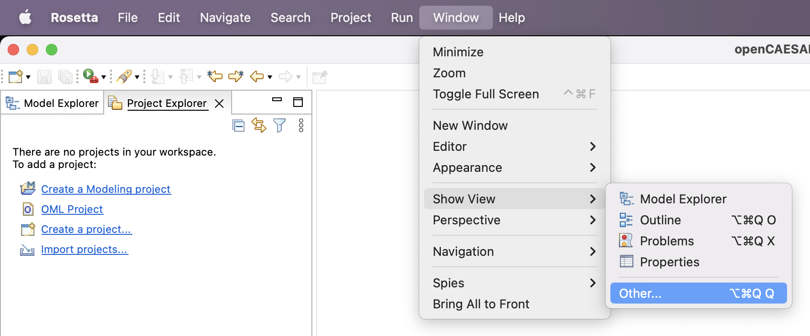

**Parent Project**

1. In Project Explorer view, right click to choose New -> Other ... -> Gradle -> Gradle Project.

> Recall that an OML project is itself a Gradle project, hence can be nested in a parent Gradle project.

2. Click Next a couple of times to get to the New Gradle Project page. Specify the project name as `homesecurity-models`. Click Finish.
3. Expand the project in the Project Explorer view, right click on the nested `libs` folder and choose Delete. Check the box "Delete project contents on disk" and click OK.
4. Navigate to the `settings.gradle` file in Project Explorer, double click to open it.  Remove the include('lib') line. Instead, insert the following lines. Save and close the editor.
    ```
    include 'Methodology'
    include 'HomeSecurity'
    include 'SmartSensors'
    include 'SafeAlarms'
    include 'SupremeMonitors'
    include 'SecureSystems'
    ```
	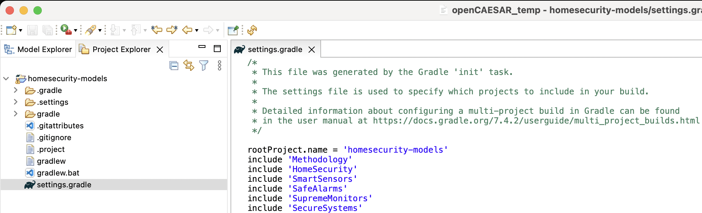

**Methodology Project**

5. In Project Explorer view, right click to choose New -> OML Project. Specify the project name as `Methodology`. 
6. Uncheck the `Use default location` box, browse to the folder of the parent project and click Open. Append `/Methodology` to the path. Click Next.
7. Specify the project properties as follows, then click Finish.
    ```
    Base IRI: http://example.com/methodology
    Bundle Kind: Vocabulary
    Bundle Namespace: http://example.com/methodology/bundle#
    Title: Methodology
    Description: This is the methodology example
    ```

Note: If you get a *Problem Occurred* message box, it's a known issue. Click on OK to simply dismiss it.

> Although we define the methodology in a single project here, it could itself be federated into multiple projects. It is also common for a methodology to extend from other established (public or private) methodologies, in which case it would declare dependencies on them.

**HomeSecurity Project**

8. In Project Explorer view, right click to choose New -> OML Project. Specify the project name as `HomeSecurity`. 
9. Uncheck the `Use default location` box, browse to the folder of the parent project and click Open. Append `/HomeSecurity` to the path. Click Next.
10. Specify the project properties as follows, then click Finish.
    ```
    Base IRI: http://example.com/homesecurity
    Bundle Kind: Description
    Bundle Namespace: http://example.com/homesecurity/bundle#
    Title: Home Security
    Description: This is the home security example
    ```
11. Expand the new `HomeSecurity` project and double click to open `build.gradle` file. 
12. Navigate to the `dependencies` section (right above `downloadDependencies` task), replace the default dependency with `oml project(':Methodology')`.

	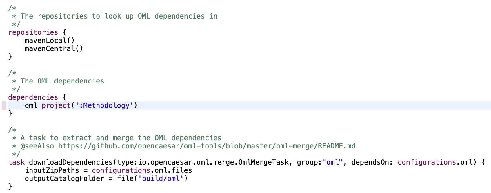

**SmartSensors Project**

13. In Project Explorer view, right click to choose New -> OML Project. Specify the project name as `SmartSensors`. 
14. Uncheck the `Use default location` box, browse to the folder of the parent project and click Open. Append `/SmartSensors` to the path. Click Next.
15. Specify the project properties as follows, then click Finish.
    ```
    Base IRI: http://example.com/smart
    Bundle Kind: Vocabulary
    Bundle Namespace: http://example.com/smart/bundle#
    Title: Smart Sensors
    Description: This is the Smart sensors example
    ```
16. Expand the new `SmartSensors` project and double click to open `build.gradle` file. 
17. Navigate to the `dependencies` section (right above `downloadDependencies` task), replace the default dependency with `oml project(':HomeSecurity')`.

**SafeAlarms Project**

18. In Project Explorer view, right click to choose New -> OML Project. Specify the project name as `SafeAlarms`. 
19. Uncheck the `Use default location` box, browse to the folder of the parent project and click Open. Append `/SafeAlarms` to the path. Click Next.
20. Specify the project properties as follows, then click Finish.
    ```
    Base IRI: http://example.com/safe
    Bundle Kind: Vocabulary
    Bundle Namespace: http://example.com/safe/bundle#
    Title: Safe Alarms
    Description: This is the Safe alarms example
    ```
21. Expand the new `SafeAlarms` project and double click to open `build.gradle` file. 
22. Navigate to the `dependencies` section (right above `downloadDependencies` task), replace the default dependency with `oml project(':HomeSecurity')`.

**SupremeMonitors Project**

23. In Project Explorer view, right click to choose New -> OML Project. Specify the project name as `SupremeMonitors`. 
24. Uncheck the `Use default location` box, browse to the folder of the parent project and click Open. Append `/SupremeMonitors` to the path. Click Next.
25. Specify the project properties as follows, then click Finish.
    ```
    Base IRI: http://example.com/supreme
    Bundle Kind: Vocabulary
    Bundle Namespace: http://example.com/supreme/bundle#
    Title: Supreme Monitors
    Description: This is the Supreme monitors example
    ```
26. Expand the new `SupremeMonitors` project and double click to open `build.gradle` file. 
27. Navigate to the `dependencies` section (right above `downloadDependencies` task), replace the default dependency with `oml project(':HomeSecurity')`.

> This is how the Project Explorer should look like now:

	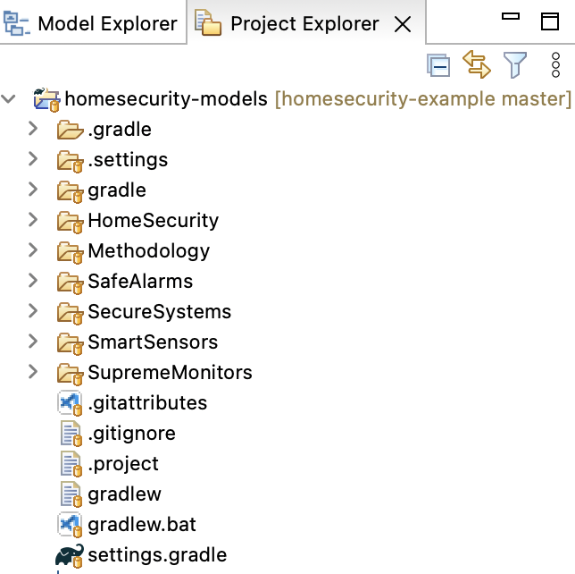

**SecureSystems Project**

28. In Project Explorer view, right click to choose New -> OML Project. Specify the project name as `SecureSystems`. 
29. Uncheck the `Use default location` box, browse to the folder of the parent project and click Open. Append `/SecureSystems` to the path. Click Next.
30. Specify the project properties as follows, then click Finish.
    ```
    Base IRI: http://example.com/secure
    Bundle Kind: Description
    Bundle Namespace: http://example.com/secure/bundle#
    Title: Secure Systems
    Description: This is the Secure systems example
    ```
31. Expand the new `SecureSystems` project and double click to open `build.gradle` file. 
32. Navigate to the `dependencies` section (right above `downloadDependencies` task), replace the default dependency with:
    ```
    oml project(':SmartSensors')
    oml project(':SafeAlarms')
    oml project(':SupremeMonitors')
    ```

> We will now do one last step, which is a workaround for a temporary issue with the Gradle plugin in Eclipse.

33. In Project Explorer, navigate to `homesecurity-models/.settings/org.eclipse.buildship.core.prefs` and open it. Clear the value for the property `connection.project.dir` attribute. It should now read:
    ```
    connection.project.dir=
    ```

## Define Modeling Methodology ## {#tutorial6-define-modeling-methodology}

In this tep, we define a very simple system modeling vocabulary that is a subset of the [IMCE Vocabularies](https://github.com/opencaesar/imce-vocabularies).

1. In Project Explorer, navigate to the folder `Methodology/src/oml/example.com/methodology`. Right click and choose New -> OML Model.
2. Specify the properties of the model as follows:
    ```
    Ontology Kind: Vocabulary
    Namespace: http://example.com/methodology/system#
    Prefix: system
    ```
3. In the open OML editor, replace the contents by the following code then save the editor.
    ```scala
    vocabulary <http://example.com/methodology/system#> as system {

      extends <http://www.w3.org/2001/XMLSchema#> as xsd

      aspect IdentifiedElement [ 
        key hasIdentifier
      ]

      concept Component < IdentifiedElement

      concept Interface < IdentifiedElement

      concept Message < IdentifiedElement

      concept Junction < IdentifiedElement

      scalar property hasIdentifier [
        domain IdentifiedElement
        range xsd:string
        functional
      ]

      relation contains [
        from Component
        to Component
        reverse isContainedIn
        inverse functional
        asymmetric
        irreflexive
      ]

      relation presents [
        from Component
        to Interface
        reverse isPresentedBy
        inverse functional
        asymmetric
        irreflexive
      ]

      relation traverses [
        from Message
        to Junction
        reverse isTraversedBy
        asymmetric
        irreflexive
      ]

      relation joins [
        from Junction
        to Interface
        reverse isJoinedIn
        asymmetric
        irreflexive
      ]

      relation transfers [
        from Interface
        to Message
        asymmetric
        irreflexive
      ]

      relation transfersIn [
        from Interface
        to Message
        asymmetric
        irreflexive
      ] < transfers

      relation transfersOut [
        from Interface
        to Message
        asymmetric
        irreflexive
      ] < transfers
    }
    ```

> The above vocabulary can be used to describe simple system architectures in terms of `Components` that can recursively contain other components. These components can present `Interfaces` that can be joined by `Junctions`, which can traverse `Messages` that are transferred in and out of those interfaces. 

Note: that vocabulary was created using the built-in vocabulary editor seen in [Tutorial 5](#tutorial5-create-oml-vocabulary).

	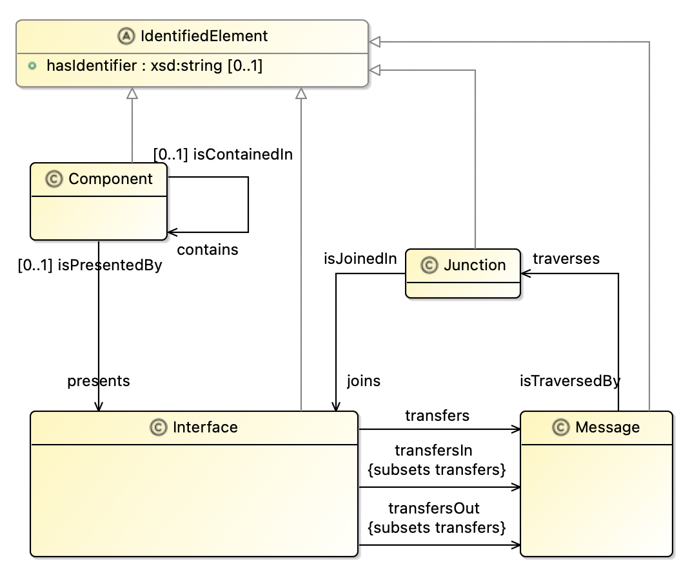

> We will now add the vocabulary to the project's vocabulary bundle.

4. In Project Explorer, navigate to the file `Methodology/src/oml/example.com/methodology/bundle.oml` and double click to open it. Replace content by the following then save the editor.
    ```scala
    vocabulary bundle <http://example.com/methodology/bundle#> as ^bundle {
	
      includes <http://example.com/methodology/system#>
    }
    ```

> Let us now verify the bundle is good by building it.

5. In the [=Gradle Tasks view=], run the task `homesecurity-models/Methodology/build/build`. The task should run successfully.

## Define System Architecture ## {#tutorial6-define-system-architecture}

Now that we have defined a vocabulary in the `Methodology` project, we can use it define a Home Security abstract architecture. This is the first glimpse of the power of OML federation. It will give the `HomeSecurity` project the ability to reuse the `system` vocabulary defined by the `Methodology` project. It will do so by leveraging the project's dependency we [have previously established](#tutorial6-create-federated-projects) to download a read-only copy of the `system` vocabulary to the `HomeSecurity` project's `build/oml` folder (where all the project's read-only OML dependencies reside).

> Let us first verify that the dependency is not already downloaded.

1. Navigate to the folder `HomeSecurity/build/oml` and verify that there is no nested folder named `example.com`.

> Now refresh the dependencies of the project using a simple menu action in the Project Explorer view. 

2. Right click on the `HomeSecurity` project and choose Gradle -> Refresh Gradle Project. This action downloads the latest version of the dependencies.

Note: An alternative is to run the `oml/downloadDependencies` task from the [=Gradle Tasks view=].

3. Right click on the folder `HomeSecurity/build/oml` and choose Refresh. Now, you can see a nested `example.com` folder. Expand it to see read-only copies of the OML files defined by the `Methodology` project including the `system` vocabulary.

> Now that we have the dependency updated, we can now define the architecture vocabulary.

4. In Project Explorer, navigate to the folder `HomeSecurity/src/oml/example.com/homesecurity` and right click. Choose New -> OML Model. Specify the following:
    ```
    Ontology Kind: Vocabulary
    Namespace: http://example.com/homesecurity/architecture#
    Prefix: hsa
    ```
5. In the open OML editor, replace the contents by the following code then save the editor.
    ```scala
      vocabulary <http://example.com/homesecurity/architecture#> as hsa {

      extends <http://example.com/methodology/system#> as system

      concept SecuritySystem < system:Component [
        restricts system:presents to exactly 1 I1
        restricts system:presents to exactly 1 I2
        restricts system:contains to min 1 Sensor
        restricts system:contains to exactly 1 AlarmSystem
        restricts system:contains to exactly 1 MonitoringSystem
      ]

      concept I1 < system:Interface [
        restricts all system:transfersOut to Panic
      ]

      concept I2 < system:Interface [
        restricts all system:transfersIn to Dispatch
      ]

      concept Sensor < system:Component [
        restricts system:presents to exactly 1 I3
      ]

      concept I3 < system:Interface [
        restricts all system:transfersOut to Event
      ]

      concept AlarmSystem < system:Component [
        restricts system:presents to exactly 1 I4
        restricts system:presents to exactly 1 I5
        restricts system:presents to exactly 1 I6
      ]

      concept I4 < system:Interface [
        restricts all system:transfersIn to Event
      ]

      concept I5 < system:Interface [
        restricts all system:transfersIn to Panic
      ]

      concept I6 < system:Interface [
        restricts all system:transfersOut to Alarm
      ]

      concept MonitoringSystem < system:Component [
        restricts system:presents to exactly 1 I7
        restricts system:presents to exactly 1 I8
      ]

      concept I7 < system:Interface [
        restricts all system:transfersIn to Alarm
      ]

      concept I8 < system:Interface [
        restricts all system:transfersOut to Dispatch
      ]

      concept Junction1 < system:Junction [
        restricts system:joins to exactly 1 I1
        restricts system:joins to exactly 1 I5
        restricts all system:isTraversedBy to Panic
      ]

      concept Junction2 < system:Junction [
        restricts system:joins to exactly 1 I8
        restricts system:joins to exactly 1 I2
        restricts all system:isTraversedBy to Dispatch
      ]

      concept Junction3 < system:Junction [
        restricts system:joins to exactly 1 I3
        restricts system:joins to exactly 1 I4
        restricts all system:isTraversedBy to Event
      ]

      concept Junction4 < system:Junction [
        restricts system:joins to exactly 1 I6
        restricts system:joins to exactly 1 I7
        restricts all system:isTraversedBy to Alarm
      ]

      concept Event < system:Message

      concept Panic < system:Message

      concept Alarm < system:Message

      concept Dispatch < system:Message
    }
    ```

> The above vocabulary describes a simple architectures for a `Security System` that consists of `Sensors` that detect and send `Event` messages to an `AlarmSystem`, which can also receive a `Panic` message from a user (e.g., through a UI). The AlarmSystem then sends an `Alarm` message to a `Monitoring System`, which responds by sending a `Dispatch` message to the Police.

Note: that vocabulary was created using the built-in vocabulary editor seen in [Tutorial 5](#tutorial5-create-oml-vocabulary).

	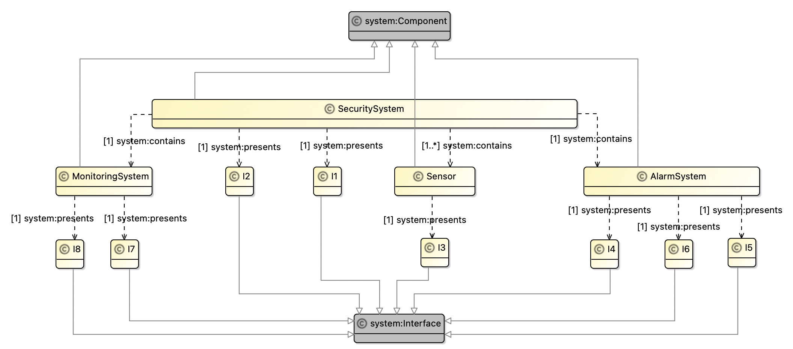
	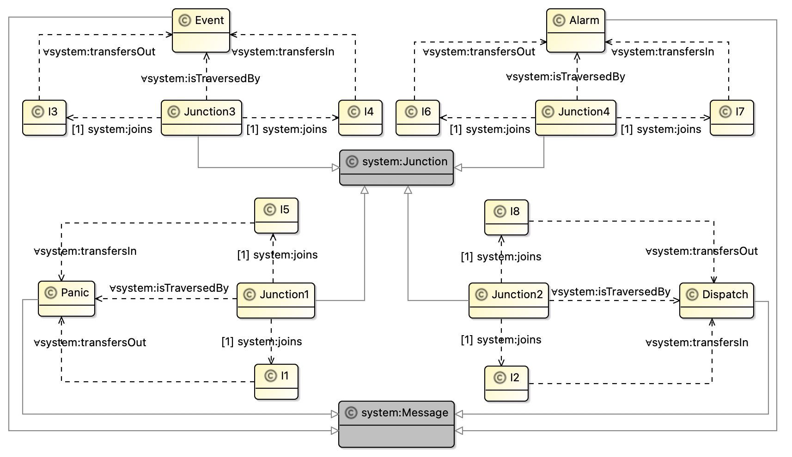

> We will now create a vocabulary bundle and add the vocabulary to it.

6. In Project Explorer, right click on `HomeSecurity/src/oml/example.com/homesecurity` and choose New -> OML Model. Specify the following:
    ```
    Ontology Kind: Vocabulary Bundle
    Namespace: http://example.com/homesecurity/v-bundle#
    Prefix: bundle
    ```

7. Replace content of `v-bundle.oml` by the following then save the editor.
    ```scala
    vocabulary bundle <http://example.com/homesecurity/v-bundle#> as ^bundle {
      
      extends <http://example.com/methodology/bundle#>
      
      includes <http://example.com/homesecurity/architecture#>
    }
    ```

> Notice that we defined the Home Security abstract architecture with a vocabulary as opposed to a description. This is to say that we do not have an individual architecture yet, but a class of such architectures that can be further specialized and constrained. However, it would be helpful to define a candidate architecture individual (or more) as a prototype to analyze.

8. In Project Explorer, right click on `HomeSecurity/src/oml/example.com/homesecurity` and choose New -> OML Model. Specify the following:
    ```
    Ontology Kind: Description
    Namespace: http://example.com/homesecurity/prototype#
    Prefix: prototype
    ```

9. Replace content of `prototype.oml` by the following then save the editor.
    ```scala
    description <http://example.com/homesecurity/prototype#> as prototype {

      uses <http://example.com/homesecurity/architecture#> as hsa

      uses <http://example.com/methodology/system#> as system

      // Security System
      instance SecuritySystem : hsa:SecuritySystem [
        system:hasIdentifier "SecuritySystem"
        system:presents I1
        system:presents I2
        system:contains Sensor
        system:contains AlarmSystem
        system:contains MonitoringSystem
      ]
      instance I1 : hsa:I1 [ system:hasIdentifier "I1" ]
      instance I2 : hsa:I2 [ system:hasIdentifier "I2" ]
      
      //  Sensor
      instance Sensor : hsa:Sensor [
        system:hasIdentifier "Sensor"
        system:presents I3
      ]
      instance I3 : hsa:I3 [ system:hasIdentifier "I3" ]

      // Alarm System
      instance AlarmSystem : hsa:AlarmSystem [
        system:hasIdentifier "AlarmSystem"
        system:presents I4
        system:presents I5
        system:presents I6
      ]
      instance I4 : hsa:I4 [ system:hasIdentifier "I4" ]
      instance I5 : hsa:I5 [ system:hasIdentifier "I5" ]
      instance I6 : hsa:I6 [ system:hasIdentifier "I6" ]

      // Monitoring System
      instance MonitoringSystem : hsa:MonitoringSystem [
        system:hasIdentifier "MonitoringSystem"
        system:presents I7
        system:presents I8
      ]
      instance I7 : hsa:I7 [ system:hasIdentifier "I7" ]
      instance I8 : hsa:I8 [ system:hasIdentifier "I8" ]

      // Junction 1
      instance Junction1 : hsa:Junction1 [
        system:hasIdentifier "Junction1"
        system:joins I1
        system:joins I5
      ]

      // Junction 2
      instance Junction2 : hsa:Junction2 [
        system:hasIdentifier "Junction2"
        system:joins I8
        system:joins I2
      ]

      // Junction 3
      instance Junction3 : hsa:Junction3 [
        system:hasIdentifier "Junction3"
        system:joins I3
        system:joins I4
      ]

      // Junction 4
      instance Junction4 : hsa:Junction4 [
        system:hasIdentifier "Junction4"
        system:joins I6
        system:joins I7
      ]
    }
    ```

> This prototype can be depicted as shown below. We used a custom viewpoint defined [here](https://github.com/opencaesar/homesecurity-example/tree/master/homesecurity-viewpoint).

	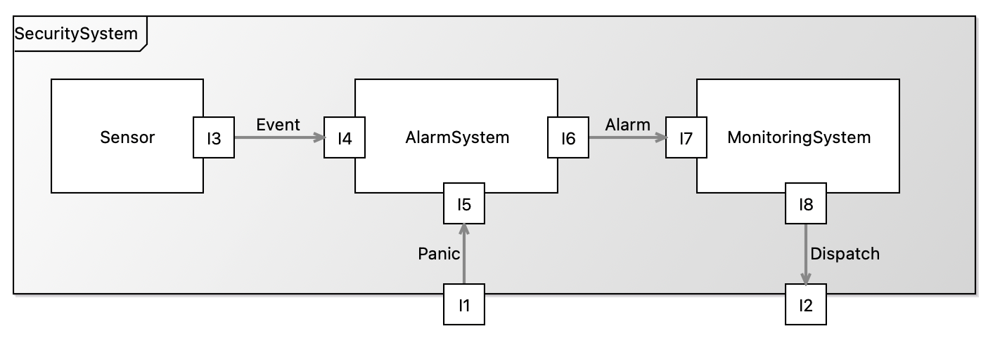

> We will now add the prototype to the project's description bundle.

10. In Project Explorer, navigate to the file `HomeSecurity/src/oml/example.com/homesecurity/bundle.oml` and double click to open it. Replace content by the following then save the editor.
    ```scala
    description bundle <http://example.com/homesecurity/bundle#> as ^bundle {
      
      uses <http://example.com/homesecurity/architecture#>
        
      includes <http://example.com/homesecurity/prototype#>
    }
    ```

> Let us now verify the bundle is good by building it.

11. In the [=Gradle Tasks view=], run the task `homesecurity-models/HomeSecurity/build/build`. The task should run successfully.

## Federate Component Realization ## {#tutorial6-federate-component-realization}

In this step, we will enable three different suppliers (`Smart`, `Safe`, and `Supreme`) to realize the subcomponents (`Sensor`, `Alarm System`, `Monitoring System`) of the home security architecture. This means, each of them, in their respective project, will refresh their dependencies to download a read-only copy of the `architceture` vocabulary so they can import it in their respective realization vocabulary.

**Smart Sensors**

This supplier builds two kinds of sensors, a smoke sensor and a motion sensor. They will provide a `sensors` vocabulary that describes how their sensors conform to the home security abstract architecture.

> Let us refresh the dependencies to get the latest copy of the architecture (and transitively the methodology).

1. In Project Explorer, right click on `homesecurity-models/SmartSensors` folder and choose Gradle -> Refresh Gradle Project.
2. Navigate to the folder `SmartSensors/build/oml/example.com` and verify it has nested `homesecurity` and `methodology` folders.

3. Right click on the folder `SmartSensors/src/oml/example.com/smart` and choose New -> OML Model. Specify the following:
    ```
    Ontology Kind: Vocabulary
    Namespace: http://example.com/smart/sensors#
    Prefix: smart
    ```

4. In the open OML editor, replace the contents by the following code then save the editor.
    ```scala
    vocabulary <http://example.com/smart/sensors#> as smart {

      extends <http://example.com/homesecurity/architecture#> as hsa

      extends <http://example.com/methodology/system#> as system

      concept SmokeSensor < hsa:Sensor [
        restricts all system:presents to I3.S
      ]

      concept I3.S < hsa:I3 [
        restricts all system:transfersOut to SmokeEvent
      ]

      concept MotionSensor < hsa:Sensor [
        restricts all system:presents to I3.M
      ]

      concept I3.M < hsa:I3 [
        restricts all system:transfersOut to MotionEvent
      ]

      concept SmokeEvent < hsa:Event

      concept MotionEvent < hsa:Event
    }
    ```

> The above vocabulary describes a `SmokeSensor` and a `MotionSensor`, both represent concrete specializations of the `Sensor` concept form the architecture. Notice also that each of them present concrete interfaces that specialize the corresponding interface of the `Sensor` concept. Moreover, each of the interfaces declare a special kind of event, `SmokeEvent` and `MotionEvent`, that they can transfer out.

Note: that vocabulary was created using the built-in vocabulary editor seen in [Tutorial 5](#tutorial5-create-oml-vocabulary).

	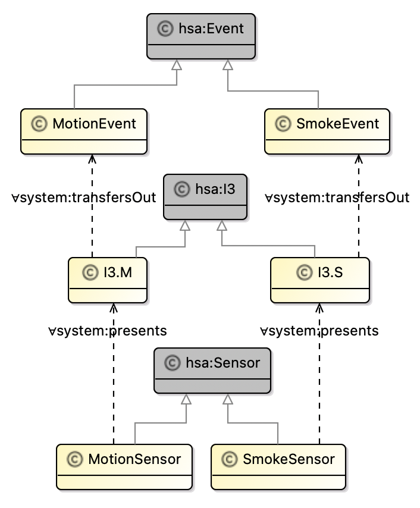

> We will now add the prototype to the project's vocabulary bundle.

5. In Project Explorer, open the file `SmartSensors/src/oml/example.com/smart/bundle.oml` and replace content by the following then save the editor.
    ```scala
    vocabulary bundle <http://example.com/smart/bundle#> as ^bundle {
      
      extends <http://example.com/homesecurity/v-bundle#>
      
      includes <http://example.com/smart/sensors#>
    }
    ```

> Let us now verify the bundle is good by building it.

6. In the [=Gradle Tasks view=], run the task `homesecurity-models/SmartSensors/build/build`. The task should run successfully.

**Safe Alarms**

This supplier builds an Alarm System for a home security architecture. They will provide an `alarms` vocabulary that describes how their system conforms to the architecture.

> Let us refresh the dependencies to get the latest copy of the architecture (and transitively the methodology).

7. In Project Explorer, right click on `homesecurity-models/SafeAlarms` folder and choose Gradle -> Refresh Gradle Project.
8. Navigate to the folder `SafeAlarms/build/oml/example.com` and verify it has nested `homesecurity` and `methodology` folders.

9. Right click on the folder `SafeAlarms/src/oml/example.com/safe` and choose New -> OML Model. Specify the following:
    ```
    Ontology Kind: Vocabulary
    Namespace: http://example.com/safe/alarms#
    Prefix: safe
    ```

10. In the open OML editor, replace the contents by the following code then save the editor.
    ```scala
    vocabulary <http://example.com/safe/alarms#> as safe {
      
      extends <http://example.com/homesecurity/architecture#> as hsa

      extends <http://example.com/methodology/system#> as system

      concept AlarmSystem < hsa:AlarmSystem [
        restricts system:presents to exactly 1 I4
        restricts system:presents to exactly 1 I5
        restricts system:presents to exactly 1 I6
        restricts system:presents to max 1 I9
      ]
      
      concept I4 < hsa:I4

      concept I5 < hsa:I5

      concept I6 < hsa:I6

      concept I9 < system:Interface [
        restricts all system:transfersOut to Sound
      ]
      
      concept Speaker < system:Component [
        restricts system:presents to exactly 1 I10
      ]
      
      concept I10 < system:Interface [
        restricts all system:transfersIn to Sound
      ]

      concept Junction5 < system:Junction [
        restricts system:joins to exactly 1 I9
        restricts system:joins to exactly 1 I10
        restricts all system:isTraversedBy to Sound 
      ]

      concept Sound < system:Message
      
    }
    ```

> The above vocabulary describes `AlarmSystem` as a concrete specialization of the abstract `AlarmSystem` concept. Notice how the concrete system present concrete interfaces that specialize the corresponding three interfaces of the abstract `Sensor`. In addition, it adds an additional interface I9 that transfers Sound out as an alarm. That interface can be joined to a Speaker component they provide too.

Note: that vocabulary was created using the built-in vocabulary editor seen in [Tutorial 5](#tutorial5-create-oml-vocabulary).

	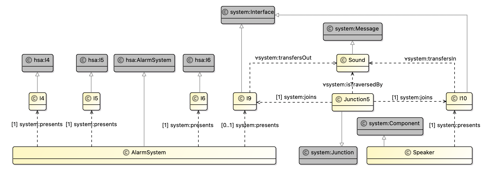

> We will now add the prototype to the project's vocabulary bundle.

11. In Project Explorer, open the file `SafeAlarms/src/oml/example.com/safe/bundle.oml` and replace content by the following then save the editor.
    ```scala
    vocabulary bundle <http://example.com/safe/bundle#> as ^bundle {
      
      extends <http://example.com/homesecurity/v-bundle#>
      
      includes <http://example.com/safe/alarms#>
    }
    ```

> Let us now verify the bundle is good by building it.

12. In the [=Gradle Tasks view=], run the task `homesecurity-models/SafeAlarms/build/build`. The task should run successfully.

**Supreme Monitors**

This supplier builds a Monitoring System for a home security architecture. They provide an `monitors` vocabulary that describes how their system conforms to the architecture.

> Let us refresh the dependencies to get the latest copy of the architecture (and transitively the methodology).

7. In Project Explorer, right click on `homesecurity-models/SupermeMonitors` folder and choose Gradle -> Refresh Gradle Project.
8. Navigate to the folder `SupermeMonitors/build/oml/example.com` and verify it has nested `homesecurity` and `methodology` folders.

9. Right click on the folder `SupermeMonitors/src/oml/example.com/supreme` and choose New -> OML Model. Specify the following:
    ```
    Ontology Kind: Vocabulary
    Namespace: http://example.com/supreme/monitors#
    Prefix: supreme
    ```

10. In the open OML editor, replace the contents by the following code then save the editor.
    ```scala
    vocabulary <http://example.com/supreme/monitors#> as ^supreme {
      
      extends <http://example.com/homesecurity/architecture#> as hsa

      extends <http://example.com/methodology/system#> as system

      concept MonitoringSystem < hsa:MonitoringSystem [
        restricts system:presents to exactly 1 I7
        restricts system:presents to exactly 1 I8
      ]
      
      concept I7 < hsa:I7
      
      concept I8 < hsa:I8
      
    }
    ```

> The above vocabulary describes `MonitoringSystem` as a concrete specialization of the abstract `MonitoringSystem` concept. Notice how the concrete system present concrete interfaces that specialize the corresponding two interfaces of the abstract `MonitoringSystem`.

Note: that vocabulary was created using the built-in vocabulary editor seen in [Tutorial 5](#tutorial5-create-oml-vocabulary).

	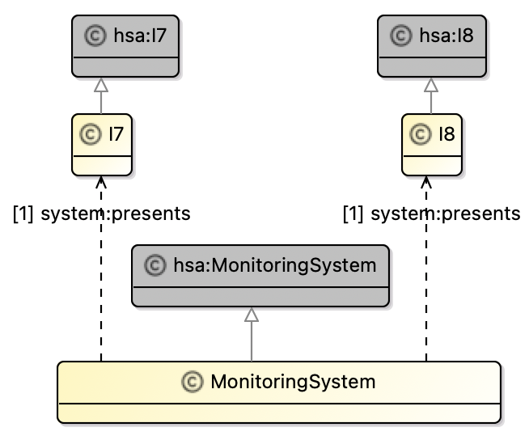

> We will now add the prototype to the project's vocabulary bundle.

11. In Project Explorer, open the file `SupremeMonitors/src/oml/example.com/supreme/bundle.oml` and replace content by the following then save the editor.
    ```scala
    vocabulary bundle <http://example.com/supreme/bundle#> as ^bundle {
      
      extends <http://example.com/homesecurity/v-bundle#>
      
      includes <http://example.com/supreme/monitors#>
    }
    ```

> Let us now verify the bundle is good by building it.

12. In the [=Gradle Tasks view=], run the task `homesecurity-models/SupremeMonitors/build/build`. The task should run successfully.

## Integrate Federated Components ## {#tutorial6-integrate-federated-components}

In this step, we will enable a system integrator (`SecureSystems`), who is also an EOM for Security Systems, to describe how it realizes the abstract home security architecture by integrating the realized components from the three suppliers above with its own top level security system to get a conforming realization architecture.

**Secure Systems**

> Let us refresh the dependencies to get the latest copy of the realized components (and transitively the architecture and the methodology).

1. In Project Explorer, right click on `homesecurity-models/SecureSystems` folder and choose Gradle -> Refresh Gradle Project.
2. Navigate to the folder `SecureSystems/build/oml/example.com` and verify it has nested folders: `methodology`, `homesecurity`, `smart`, `safe`, and `supreme`.

> Now that the integrator has all the dependencies it needs, it can proceed to describe the realization architecture.

3. In Project Explorer, navigate to the folder `SecureSystems/src/oml/example.com/secure` and right click. Choose New -> OML Model. Specify the following:
    ```
    Ontology Kind: Vocabulary
    Namespace: http://example.com/secure/architecture#
    Prefix: secure
    ```
4. In the open OML editor, replace the contents by the following code then save the editor.
    ```scala
    vocabulary <http://example.com/secure/architecture#> as secure {

      extends <http://example.com/methodology/system#> as system

      extends <http://example.com/homesecurity/architecture#> as hsa

      extends <http://example.com/smart/sensors#> as smart

      extends <http://example.com/safe/alarms#> as safe

      extends <http://example.com/supreme/monitors#> as supreme

      concept SecuritySystem < hsa:SecuritySystem [
        restricts system:presents to exactly 1 I1
        restricts system:presents to exactly 1 I2
        restricts system:contains to min 2 smart:SmokeSensor
        restricts system:contains to min 1 smart:MotionSensor
        restricts system:contains to exactly 1 safe:AlarmSystem
        restricts system:contains to exactly 1 supreme:MonitoringSystem
      ]

      concept I1 < hsa:I1

      concept I2 < hsa:I2

      // Junction 1
      concept Junction1 < hsa:Junction1 [
        restricts system:joins to exactly 1 I1
        restricts system:joins to exactly 1 safe:I5
      ]

      // Junction 2
      concept Junction2 < hsa:Junction2 [
        restricts system:joins to exactly 1 supreme:I8
        restricts system:joins to exactly 1 I2
      ]

      // Junction 3
      concept Junction3.S < hsa:Junction3 [
        restricts system:joins to exactly 1 smart:I3.S
        restricts system:joins to exactly 1 safe:I4
      ]

      concept Junction3.M < hsa:Junction3 [
        restricts system:joins to exactly 1 smart:I3.M
        restricts system:joins to exactly 1 safe:I4
      ]

      // Junction 4
      concept Junction4 < hsa:Junction4 [
        restricts system:joins to exactly 1 safe:I6
        restricts system:joins to exactly 1 supreme:I7
      ]
    }
    ```

> The above vocabulary describes a concrete realization architecture for the abstract `SecuritySystem`. That concrete system uses `Smart` sensors (a minimum of 2 smoke sensors and one motion sensor), `a Safe` alarm system, and a `Supreme` monitoring system. In addition, it provides its own realization of the two `SecuritySystem` interfaces and all the junctions that connect the various realized interfaces together based on the abstract architecture.

Note: that vocabulary was created using the built-in vocabulary editor seen in [Tutorial 5](#tutorial5-create-oml-vocabulary).

	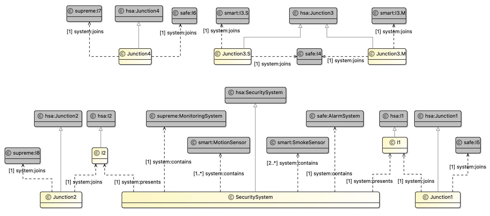

> We will now create a vocabulary bundle and add the vocabulary to it.

5. In Project Explorer, right click on `SecureSystems/src/oml/example.com/secure` and choose New -> OML Model. Specify the following:
    ```
    Ontology Kind: Vocabulary Bundle
    Namespace: http://example.com/secure/v-bundle#
    Prefix: bundle
    ```

6. Replace content of `v-bundle.oml` by the following then save the editor.
    ```scala
    vocabulary bundle <http://example.com/secure/v-bundle#> as ^bundle {

      extends <http://example.com/smart/bundle#>	
      extends <http://example.com/safe/bundle#>
      extends <http://example.com/supreme/bundle#>
      
      includes <http://example.com/secure/architecture#>
    }
    ```

> Again, it would be helpful to define a prototype description (or more) to analyze this specific realization architecture.

7. In Project Explorer, right click on `SecureSystems/src/oml/example.com/secure` and choose New -> OML Model. Specify the following:
    ```
    Ontology Kind: Description
    Namespace: http://example.com/secure/prototype#
    Prefix: prototype
    ```

8. Replace content of `prototype.oml` by the following then save the editor.
    ```scala
    description <http://example.com/secure/prototype#> as prototype {

      uses <http://example.com/methodology/system#> as system

      uses <http://example.com/smart/sensors#> as smart

      uses <http://example.com/safe/alarms#> as safe

      uses <http://example.com/supreme/monitors#> as supreme

      uses <http://example.com/secure/architecture#> as secure

      // Security System
      instance SecuritySystem : secure:SecuritySystem [
        system:hasIdentifier "Secure-01"
        system:presents I1
        system:presents I2
        system:contains SmokeSensor1
        system:contains SmokeSensor2
        system:contains MotionSensor
        system:contains AlarmSystem
        system:contains MonitoringSystem
      ]

      instance I1 : secure:I1 [
        system:hasIdentifier "Secure-02"
      ]

      instance I2 : secure:I2 [
        system:hasIdentifier "Secure-03"
      ]

      // Smart Smoke Sensor
      instance SmokeSensor1 : smart:SmokeSensor [
        system:hasIdentifier "Smart-01"
        system:presents I3.S1
      ]

      instance I3.S1 : smart:I3.S [
        system:hasIdentifier "Smart-02"
      ]

      instance SmokeSensor2 : smart:SmokeSensor [
        system:hasIdentifier "Smart-03"
        system:presents I3.S2
      ]

      instance I3.S2 : smart:I3.S [
        system:hasIdentifier "Smart-4"
      ]

      // Smart Motion Sensor
      instance MotionSensor : smart:MotionSensor [
        system:hasIdentifier "Smart-05"
        system:presents I3.M
      ]

      instance I3.M : smart:I3.M [
        system:hasIdentifier "Smart-06"
      ]

      // Safe Alarm System
      instance AlarmSystem : safe:AlarmSystem [
        system:hasIdentifier "Safe-01"
        system:presents I4
        system:presents I5
        system:presents I6
      ]

      instance I4 : safe:I4 [
        system:hasIdentifier "Safe-02"
      ]

      instance I5 : safe:I5 [
        system:hasIdentifier "Safe-03"
      ]

      instance I6 : safe:I6 [
        system:hasIdentifier "Safe-04"
      ]

      // Secure Monitoring System
      instance MonitoringSystem : supreme:MonitoringSystem [
        system:hasIdentifier "Supreme-01"
        system:presents I7
        system:presents I8
      ]

      instance I7 : supreme:I7 [
        system:hasIdentifier "Supreme-02"
      ]

      instance I8 : supreme:I8 [
        system:hasIdentifier "Supreme-03"
      ]

      // Junction 1
      instance Junction1 : secure:Junction1 [
        system:hasIdentifier "Secure-04"
        system:joins I1
        system:joins I5
      ]

      // Junction 2
      instance Junction2 : secure:Junction2 [
        system:hasIdentifier "Secure-05"
        system:joins I8
        system:joins I2
      ]

      // Junction 3
      instance Junction3.S1 : secure:Junction3.S [
        system:hasIdentifier "Secure-06"
        system:joins I3.S1
        system:joins I4
      ]

      instance Junction3.S2 : secure:Junction3.S [
        system:hasIdentifier "Secure-07"
        system:joins I3.S2
        system:joins I4
      ]

      instance Junction3.M : secure:Junction3.M [
        system:hasIdentifier "Secure-08"
        system:joins I3.M
        system:joins I4
      ]

      // Junction 4
      instance Junction4 : secure:Junction4 [
        system:hasIdentifier "Secure-09"
        system:joins I6
        system:joins I7
      ]
    }
    ```

> This prototype can be depicted as shown below. We used a custom viewpoint defined [here](https://github.com/opencaesar/homesecurity-example/tree/master/homesecurity-viewpoint).

	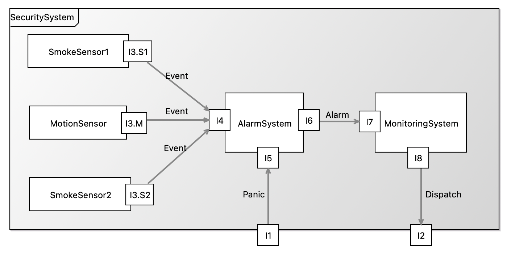

> We will now add the prototype to the project's description bundle.

9. In Project Explorer, navigate to the file `SecureSystems/src/oml/example.com/secure/bundle.oml` and double click to open it. Replace content by the following then save the editor.
    ```scala
    description bundle <http://example.com/secure/bundle#> as ^bundle {

      uses <http://example.com/secure/v-bundle#>	
      
      includes <http://example.com/secure/prototype#>
    }
    ```

> Let us now verify the bundle is good by building it.

10. In the [=Gradle Tasks view=], run the task `homesecurity-models/SecureSystems/build/build`. The task should run successfully.

Note: the reference [repository](https://github.com/opencaesar/homesecurity-example) contains the state of the models up to this point only.

## Run Federation Scenarios ## {#tutorial6-perform-federated-analyses}

So far, we have seen the happy path for federation where upstream dependencies do not change and downstream dependencies always conform. Notice that change can always safely occur in any of the federated projects without impact as long as their downstream dependencies do not refresh their upstream dependencies. This is a great benefit of federation which allows projects to control the rate of update for their dependencies.

In this step, we will run other common federation scenarios to see the ability of OML to handle them. We will always undo the changes at the end of each scenario.

**Scenario 1: Non-Breaking Methodology Change**

In this scenario, we make a non-breaking change to the `system` methodology vocabulary.

1. Open the file `Methodology/src/oml/example.com/methodology/system.oml` and change the `contains` relation by removing the `irreflexive` flag (a non-breaking change). Thew new relation looks like this:
    ```scala
    relation contains [
      from Component
      to Component
      reverse isContainedIn
      inverse functional
      asymmetric
    ]
    ```
2. Right click on the project `homesecurity-models` and select Grade -> Refresh Grade Project. (Note the progress of this operation in the bottom-right corner of the IDE.)

> Since we ran the action on a parent project, it runs on every nested project recursively resulting in all projects refreshing their dependencies. Since we changed the `Methodology` project, which is the most upstream dependency, all the other projects should get an updated version of that `system` vocabulary.

3. Navigate to and open the read-only `SecureSystems/build/oml/example.com/methodology/system.oml`. Verify that the `contains` relation was modified.
4. In [=Gradle Tasks view=], run `homesecurity-models/SecureSystems/build/build` and verify that it still builds correctly.
5. Undo the change in `Methodology/src/oml/example.com/methodology/system.oml` and right click on `homesecurity-models` and select Gradle -> Refresh Gradle Project.

**Scenario 2: Breaking Methodology Change**

In this scenario, we make a breaking syntax change to the `system` methodology vocabulary.

1. Open the file `Methodology/src/oml/example.com/methodology/system.oml` and rename the `contains` relation to `composes` flag (a breaking change). Thew new relation looks like this:
    ```scala
    relation composes [
        from Component
        to Component
        reverse isContainedIn
        inverse functional
        asymmetric
        irreflexive
      ]
    ```
2. Right click on the project `homesecurity-models` and select Grade -> Refresh Grade Project.

> Verify that all the other projects show compile errors. Inspect the Problem view and should see many errors.

3. Undo the change in `Methodology/src/oml/example.com/methodology/system.oml` and right click on `homesecurity-models` and select Gradle -> Refresh Gradle Project.

> You should observe that the problems get resolved.

**Scenario 3: Breaking Architectural Change**

In this scenario, we make a breaking semantic change to the abstract `architecture` vocabulary.

1. Open the file `HomeSecurity/src/oml/example.com/homesecurity/architecture.oml` and change the `SecuritySystem` concept to strenghten the restriction on the number of Sensors to be `exactly 1 Sensor` (a breaking change). Thew new concept looks like this:
    ```scala
    concept SecuritySystem < system:Component [
      restricts system:presents to exactly 1 I1
      restricts system:presents to exactly 1 I2
      restricts system:contains to exactly 1 Sensor
      restricts system:contains to exactly 1 AlarmSystem
      restricts system:contains to exactly 1 MonitoringSystem
    ]
    ```
2. Right click on the project `homesecurity-models` and select Grade -> Refresh Grade Project.
3. In [=Gradle Tasks view=], run `homesecurity-models/SecureSystems/build/build` and verify that it gives an error.
4. Double click to open the file `SecureSystems/build/reports/reasoning.xml`. You should see the following:

	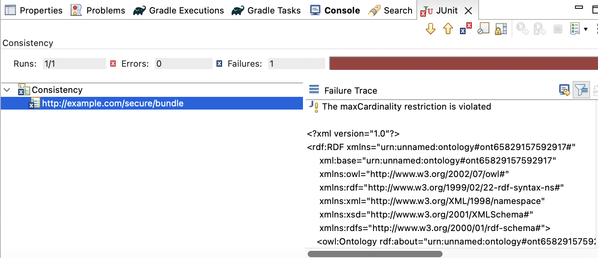

> The error indicates that a max cardinality restriction is violated. This is nice because now the integrator `SecureSystems` gets alerted to the architectural change that calls for exactly 1 sensor, which is inconsistent with its realization architecture which calls for multiple sensors (see the code below).
    ```scala
    // Realization SecuritySystem
    concept SecuritySystem < hsa:SecuritySystem [
      restricts system:presents to exactly 1 I1
      restricts system:presents to exactly 1 I2
      restricts system:contains to min 2 smart:SmokeSensor
      restricts system:contains to min 1 smart:MotionSensor
      restricts system:contains to exactly 1 safe:AlarmSystem
      restricts system:contains to exactly 1 supreme:MonitoringSystem
    ]
    ```

5. Undo the change in `HomeSecurity/src/oml/example.com/homesecurity/architecture.oml` and right click on `homesecurity-models` and select Gradle -> Refresh Gradle Project.

**Scenario 4: Breaking Component Realization**

In this scenario, we make a breaking semantic change in one of the realization components that gets detected at the integrated level.

1. Open the file `SafeAlarms/src/oml/example.com/safe/alarms.oml` and change the `AlarmSystem` concept by changing the restriction on the I9 interface (for sound) to `exactly 1`. Thew new concept looks like this:
    ```scala
      concept AlarmSystem < hsa:AlarmSystem [
        restricts system:presents to exactly 1 I4
        restricts system:presents to exactly 1 I5
        restricts system:presents to exactly 1 I6
        restricts system:presents to exactly 1 I9
      ]
    ```
2. Right click on the project `homesecurity-models` and select Grade -> Refresh Grade Project.
3. In [=Gradle Tasks view=], run `homesecurity-models/SecureSystems/build/build` and verify that it gives an error.
4. Double click to open the file `SecureSystems/build/reports/reasoning.xml`. You should see the following:

	

> The inconsistency in this case is a result of the prototype not incorporating the required sound interface. Note that such requirement is not called for in the abstract architecture but comes from the realization. This would be an opportunity for a conversation between all parties: the architect, the supplier, and the acquirer (the integrator).

5. Undo the change in `SafeAlarms/src/oml/example.com/safe/alarms.oml` and right click on `homesecurity-models` and select Gradle -> Refresh Gradle Project.

## Publish with Semantic Versions ## {#tutorial6-publish-with-semantic-versions}

We hope that the previous section convinced you that having proper support for federation is paramount. This is especially true in change scenarios. Controlling when to adopt a breaking change in your upstream dependencies gives you time to plan for the impact (the needed changes). But how can you tell if the change is breaking or not. The software industry has developed a very smart convention for this problem called semantic versions (for software libraries), where a major revision for indicates large breaking change, a minor revision indicates large non-breaking changes, and a patch revision indicates minor changes and/or bug fixes. In openCAESAR, we adopt the same approach of publishing OML models with semantic versions. This works really nice with the way OML projects declare their dependencies as [Maven](https://maven.apache.org/guides/introduction/introduction-to-dependency-mechanism.html) dependencies.

In this step, we will first publish all the projects to Maven Local (on the local machine). Then, we will convert one of the direct dependencies we declared before into a Maven-based one with a semantic version. This will be the dependency of the `SecureSystems` project on the `SafeAlarm` project.

> Maven Local is a convenient playground for publishing Maven dependencies since it is only visible on that machine. Once a version is good and needs to be published more widely, it could be pushed to a remote accessible Maven repository (like Maven Central or an enterprise Maven repository).

1. In [=Gradle Tasks view=], run `homesecurity-models/publishing/publishToMavenLocal` and verify that it runs successfully. 

> Now, all the projects have published their OML models to Maven Local using the default 1.0.0 version.

2. On your computer, navigate to your [local Maven repository](https://www.baeldung.com/maven-local-repository) typically named `.m2`. Expand the nested path `repository/com/example` and you should see all the 1.0.0 project artifacts published there.

	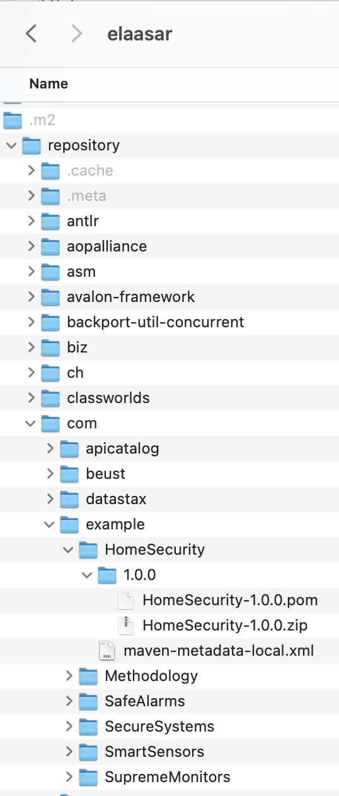

3. Back in Rosetta, open the file `SecureSystems/build.gradle` and navigate to the dependencies section and change it as follows:
    ```
    /*
    * The OML dependencies
    */
    dependencies {
        oml project(':SmartSensors')
        //oml project(':SafeAlarms')
        oml "com.example:SafeAlarms:1.0.0"
        oml project(':SupremeMonitors')
    }
    ```
    
> This pins the version of `SafeAlarms` that the integrator `SecureSystems` downloads to exactly 1.0.0. This means any future version of `SafeAlarms` will not be downloaded. Let's test this.

4. Open the file `SafeAlarms/src/oml/example.com/safe/alarms.oml`, find the concept `AlarmSystem` and change the I9 restriction to `max 2 I9`, which is a non-breaking change.

> Since it created a non-breaking small change, `SafeAlarm` decided to change its version to `1.0.1` i.e, create a patch revision.

5. Open the file `SafeAlarms/build.gradle` and change the version at the top from `1.0.0` to `1.0.1`. Save the editor.

> Now we need to publish the new revision to Maven Local again.

6. In [=Gradle Tasks view=], run `homesecurity-models/publishing/publishToMavenLocal` and verify that it runs successfully. 

> Inspect the new version in your Maven Local folder just to double check.

	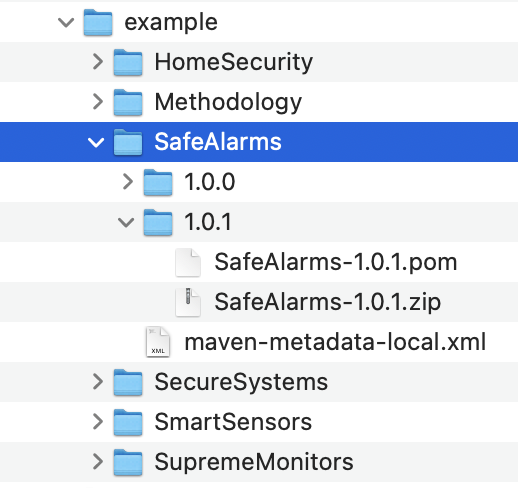

5. Right click on the project `homesecurity-models` and select Grade -> Refresh Grade Project.

> Since `SecureSystems` pinned the version of its dependency to `1.0.0` it will not get this revision.

6. Open the file `SecureSystems/build/oml/example.com/safe/alarms.oml` and verify that the I9 restriction is still `max 1 I9`.

> This is unfortunate since `SecureSystems` should really get those patch revisions regularly because they may contain important bug fixes from `SafeAlarm`. Let's relax their semantic version dependency to `1.0.+` instead. Note that `+` is a dynamic version that means the latest. So this will still pin the major.minor versions to `1.0` but will get the latest patch version.

7. Oen the file `SecureSystems/build.gradle` and change the version of `SafeAlarms` to `1.0.+`.
8. Right click on the project `homesecurity-models` and select Grade -> Refresh Grade Project.
9. Open the file `SecureSystems/build/oml/example.com/safe/alarms.oml` again and verify that the I9 restriction is now `max 2 I9`. Yay!

> In fact, `SecureSystems` may want to pin the version to `1.+` instead, i.e. fix the major revision but adopt the latest minor/patch revisions. This may be reasonable to protect against breaking changes but still allow non-breaking changes to be retrieved. Let's test that.

10. Open the file `SecureSystems/build.gradle` and change the version of `SafeAlarms` to `1.+`.

11. Open the file `SafeAlarms/src/oml/example.com/safe/alarms.oml`, find the concept `AlarmSystem` and change the I9 restriction to `min 2 I9`, which is a breaking change.

> Since it created a breaking change, `SafeAlarm` changes its version to `2.0.0` i.e, create a major revision.

12. Open the file `SafeAlarms/build.gradle` and change the version at the top from `1.0.0` to `2.0.0`. Save the editor.

> Now we need to publish the new revision to Maven Local again.

13. In [=Gradle Tasks view=], run `homesecurity-models/publishing/publishToMavenLocal` and verify that it runs successfully. 
14. Right click on the project `homesecurity-models` and select Grade -> Refresh Grade Project.
15. Open the file `SecureSystems/build/oml/example.com/safe/alarms.oml` and verify that the I9 restriction is still `max 2 I9`.

> It is great that `SecureSystems` did not get the new `2.0.0` revision of `SafeAlarm` as this would have broken their architecture possibly at an inconvenient time. Later, when they have more time in their schedule to deal with this major revision, they can explicitly specify that in their dependencies. Let's test that.

16. Open the file `SecureSystems/build.gradle` and change the version of `SafeAlarms` dependency to `2.+`.
17. Right click on the project `homesecurity-models` and select Grade -> Refresh Grade Project.
18. Open the file `SecureSystems/build/oml/example.com/safe/alarms.oml` and verify that the I9 restriction is now `min 2 I9` (the breaking change). Awesome!

In conclusion, the discussion above showed how semantic versions can be a powerful tool to enable more control over change propagation in a federation scenario. This is especially important when the two sub projects are not working closely together. When projects collaborate closely (federation style 1), they can simply use the version-less sub project dependencies, which will always retrieve the latest. If they decide go with any other federation style but still like to synchronize closely, they can specify a semantic version of `+` which literally means the latest.

## Summary ## {#tutorial6-summary}

This tutorial comprehensively introduced and showcased the robust federation support provided by openCAESAR for OML models. It not only introduced the concept but also delved into various federation styles that are supported. Furthermore, it provided a step-by-step walkthrough on configuring a federation of OML models across different projects.

To illustrate the power of this federation support, the tutorial utilized a motivating example, depicting an abstract home security system architecture. This abstraction allows multiple suppliers to contribute to its realization. Subsequently, an integrator (acquirer) assembles this realized architecture from various components and conducts a comprehensive compliance analysis against the original abstract architecture.

Additionally, the tutorial highlighted several common scenarios where federation proves invaluable, showcasing how the openCAESAR platform adeptly caters to these requirements. Notably, it demonstrated the control mechanism for change propagation within a federation using semantic versions. It's important to note that this control relies on sub-projects within the federation correctly classifying their revisions. This level of precision empowers downstream dependencies to determine when to adopt various types of upstream changes.

With openCAESAR's robust support for OML federation, modeling becomes a truly scalable enterprise-level endeavor, fostering collaboration and efficiency in complex projects.